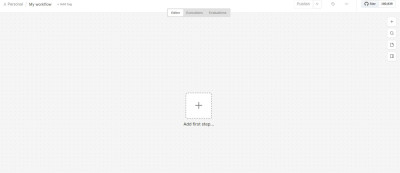
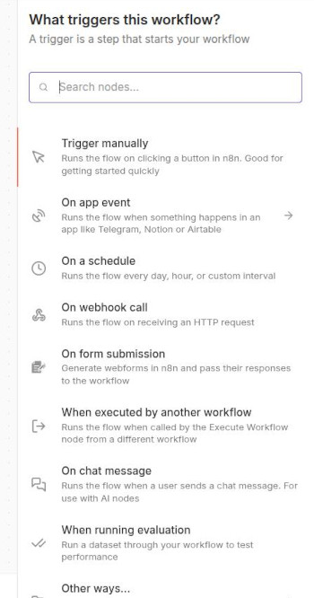
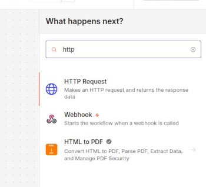

---
# Informació general del document
title: Big Data Aplicat 
subtitle: Annex - n8n
authors: 
    - Departament d'informàtica
lang: ca
page-background: img/bg.png

# Portada
titlepage: true
titlepage-rule-height: 0
# titlepage-rule-color: AA0000
# titlepage-text-color: AA0000
titlepage-background: img/portada.png
# logo: img/logotext.png

# Taula de continguts
toc: true
toc-own-page: true
toc-title: Continguts

# Capçaleres i peus
header-left: Big Data Aplicat. Annex n8n
header-right: Curs 2025-2026
footer-left: IES Jaume II El Just
footer-right: \thepage/\pageref{LastPage}

# Imatges
float-placement-figure: H
caption-justification: centering

# Llistats de codi
listings-no-page-break: false
listings-disable-line-numbers: false

header-includes:
     - \usepackage{lastpage}
---

# Què és n8n?

**n8n** és una eina per automatizar fluxos de treball. En eixe sentit és semblant a **NodeRED**, però més especialitzat en integració de serveis, més orientat a empreses i amb suport natiu per IA. Se sembla a NodeRED perquè n8n també utilitza un editor visual amb el qual anem creant nodes i connectant-los per formar procesos que se poden llançar de moltes maneres diferents. 

n8n és també ***open source***, encara que hi ha plans de pagament amb escalabilitat avançada, suport dedicat i altres característiques que nosaltres, en un entorn no empresarial, no necessitarem.

## Instal·lació i utilització de n8n

n8n se pot provar en el núvol, accedint a la pàgina oficial (n8n.io) i fent clic en ***Get started for free**. Ens redirigirà a `app.n8n.cloud` i ens demanarà crear un compte. Així podreu fer proves, veure tutorials, etc. De totes formes nosaltres anem a instal·lar-lo localment utilitzant **Docker**. 

### docker-compose

En el nostre `docker-compose.yml` (en qualsevol d'ells, o en un nou si no necesitem més serveis) afegirem el següent servei:

```yaml
n8n:
    image: docker.n8n.io/n8nio/n8n:latest
    container_name: n8n
    restart: unless-stopped
    ports:
      - "5678:5678"
    environment:
      - GENERIC_TIMEZONE=Europe/Madrid
      - TZ=Europe/Madrid
      - N8N_ENFORCE_SETTINGS_FILE_PERMISSIONS=true
      - N8N_RUNNERS_ENABLED=true
      - N8N_ENCRYPTION_KEY=poseu_una_clau_segura
    volumes:
      - n8n_storage:/home/node/.n8n
    depends_on:
      elasticsearch:
        condition: service_healthy
    networks:
      - elk
```

On posa "poseu una clau segura" heu de posar una cadena que s'utilitzarà per xifrar les credencials. Podeu generar-la des del terminal de Linux amb `openssl rand -base64 32`. Guardeu-la en un arxiu segur.

Podeu accedir a l'aplicació des del navegador a `http://localhost:5678`. La primera vegada que accediu us demanarà crear un usuari i contrasenya. Després d'això ja podreu començar a crear els vostres fluxos de treball.

## Conceptos principals

Anem a veure les característiques més importants de n8n, especialment les que són més rellevants per a vosaltres com a usuaris que veniu de NodeRED.

### Interfície

L'editor ens ofereix un llenç (***canvas***) en blanc on podem anar afegint nodes i connectant-los. El concepte és molt semblant al de NodeRED. Els elements principals de la interfície són:

- **Nodes**: blocs d'acció. Cadascun representa un pas en el flux de treball
- **Connexions**: línies que connecten nodes i permeten passar informació d'un node al següent
- **Credencials**: panel lateral on guardem de forma segura claus d'APIs, tokens OAuth, etc., per poder-los tornar a utilitzar en altres fluxos de treball
- **Panell d'execució**: mostra el resultat de cada node després d'una execució de prova. Es com els nodes debug de NodeRED, molt útil per depurar i veure què està passant en cada pas del flux de treball.



### Triggers

Podeu veure que en la pantalla inicial ens apareix un botó per afegir un primer pas del flux. En el botó posa **Add first step...**. Este primer node és molt important perquè serà el que desencadene el flux de treball, com en el cas dels injectors en NodeRED. En n8n este node inicial es coneix com a **Trigger** i determina com i quan s'executarà el flux de treball. Hi ha molts tipus de Triggers disponibles, i cada un està dissenyat per a un cas d'ús diferent.

Quan feu clic en el botó per afegir el primer node, veureu una llista de triggers disponibles en la part dreta de la pantalla.



Alguns tipus de triggers comuns són:

| Trigger | Descripció |
| :-- | :-- |
| **Manual** | S'executa fent clic en un botó. Útil per fer proves. | 
| **Schedule** | S'executa cada X temps o en moments concrets |
| **Webhook** | S'executa quan arriba una petició HTTP (semblant als nodes `http in` de Node-RED) |
| **App event** | S'activa per un event en una app concreta (nou email en Gmail, un missatge en Telegram...) |
| **Form submission** | S'executa quan algú envia un formulari creat amb n8n Forms |
| **Executed by another workflow** | Permet encadenar que un flux de treball cride a un altre |
| **On chat message** | S'activa quan arriba un missatge a un xat. En general s'utilitza amb nodes IA |

Si creem un primer node que siga un trigger manual, podrem executar el flux de treball fent clic en un botó. 

Quan tenim el nostre primer node, si fem clic en el botó +, en el mateix node o a la dreta de la pantalla, podem anar afegint nodes nous. Ens apareixerà un despleglable amb uns quants nodes més comuns. Com en el template de NodeRED, hi ha un buscador on podem escriure el nom del node que volem afegir. Per exemple, si volem afegir un node que faça una petició HTTP a una API externa, podem escriure "HTTP Request" i ens apareixerà el node corresponent.

Si en el buscador ens apareix una categoria, fent clic podem veure quines accions específiques hi ha disponibles. Per exemple, si escrivim "Google Sheets", veurem que hi ha nodes per crear una fila nova, actualitzar una fila, llegir dades, etc. Això és molt útil perquè ens estalvia haver de configurar manualment les peticions HTTP i les credencials per a cada servei.



### Nodes de lògica i control de flux

Entre altres, els més importants són:

- **if / switch**: bifurcacions condicionals 
- **Merge**: uneix diferents branques del flux en una única branca
- **Loop over items**: itera sobre una llista d'elements, executant un sub-flux per a cada element
- **Filter**: filtra elements d'una llista segons una condició
- **Wait**: pausa l'execució durant un temps o fins que es complisca una condició
- **Execute sub-workflow**: crida a un altre workflow


### Expressions i manipulació de dades

En molts camps d'un node se poden utilitzar expressions Javascript amb la sintaxis `{{ }}`. Per exemple:

```js
{{ $json.body.email.split('@')[^1] }}   // extrau el domini d'un email
{{ $json.nombre.toUpperCase() }}       // converteix a majúscules
```

Es com utilitzar els **Function nodes** de Node-RED, però se pot integrar codi dins de pràcticament qualsevol lloc.

### Cluster nodes

Els **Cluster Nodes** són grups de nodes que treballen junts per aportar alguna funcionalitat al flux de treball. Consten d'un node arrel i un o més subnodes que afegeixen funcionalitats addicionals. Per exemple, el node **HTTP Request** és un cluster node que té un node arrel per configurar la URL i el mètode HTTP, i subnodes per configurar les capçaleres, el cos de la petició, les credencials, etc. Això permet una configuració més organitzada i modular dels nodes.

### Gestió d'errors

n8n permet configurar una branca d'error en qualsevol node. Si hi ha un error, podem:

- Enviar una notificació a Slack amb els detalls de l'error
- Reintentar l'operació amb el node **Wait**
- Guardar les dades en una base de dades per tornar a processar-les més endavant


### Sub-workflows

El node **Execute Workflow** permet encapsular lògica complexa i reutilitzar-la des de múltiples fluxos. Per exemple, si tenim un procés que crida a una API externa i maneja errors, podem crear un sub-flux amb aquesta lògica i després cridar-lo des de diferents fluxos quan necessitem fer aquesta operació.

## Buscar nodes i integracions

Hi ha molts tipus de nodes, categories i integracions disponibles en n8n. Podeu utilitzar el buscador per trobar nodes específics o explorar categories, però si no sabeu exactament què voleu fer és molt complicat.

Les **integracions** en n8n són conjunts de nodes preconfigurats per a un servei concret. Per exemple, hi ha integracions amb agents IA, amb Gmail, Slack, Telegram, Postgres, Discord... 

Hi ha una manera d'accedir a una llista completa de nodes i integracions disponibles, d'una forma molt visual. Accediu a `https://n8n.io/integrations` i podreu veure totes les integracions disponibles, ordenades per categories. Si feu clic en una integració, podreu veure quins nodes té disponibles i com configurar-los. Això és molt útil per descobrir què es pot fer amb n8n i trobar inspiració per als vostres fluxos de treball.

En la mateixa web, si feu clic en la pestanya "Trigger", o en "Core", podeu veure altres tipus de nodes i categories que no són exactament integracions.

També teniu les integracions disponibles en la documentació oficial de la web.

[Documentació integracions](https://docs.n8n.io/integrations/)

## Integració amb IA

n8n té integracions amb diversos agents IA, com ChatGPT, Gemini, Claude, etc. Això permet utilitzar IA en els vostres fluxos de treball de manera molt senzilla. Per exemple, podeu crear un flux que rep un email, extrau informació rellevant amb IA i després la guarda en una base de dades o la envia a un canal de Slack.

Teniu diversos tutorials al respecte en la web oficial.

[IA en n8n](https://docs.n8n.io/advanced-ai/)

## Practicar amb n8n

La millor forma és anar provant coses. Podeu seguir els exemples i tutorials que hi ha la web oficial. 

[Documentació oficial de n8n](https://docs.n8n.io/)