# n8n

## Què és n8n?

**n8n** (pronunciat "n-eight-n") és una ferramenta d'automatització de fluxos de treball (*workflow automation*) de codi obert que permet connectar diferents serveis i aplicacions per automatitzar tasques repetitives. L'eina utilitza una interfície visual on els usuaris poden crear fluxos de treball mitjançant la connexió de nodes, sense necessitat de programar codi complex. En eixe sentit és prou semblant a **Node-RED**, que ja hem vist a classe.

### Filosofia i característiques

n8n es fonamenta en tres pilars:

- **Codi obert**: El projecte és completament obert, permetent que qualsevol puga contribuir amb millores. La versió gratuïta inclou la majoria de funcionalitats.

- **Flexibilitat**: Es pot utilitzar de tres maneres diferents:
  - **Cloud**: Servei allotjat per n8n.io, amb plans gratuïts i de pagament
  - **Self-hosted**: Instal·lació pròpia amb Docker o npm
  - **Desktop**: Aplicació per a Windows, Mac i Linux

- **IA nativa**: Des de la versió 1.0, n8n incorpora nodes específics per treballar amb models d'IA com Claude, GPT-4 o Gemini, permetent crear agents intel·ligents.

### Comparativa amb Node-RED

Com hem comentat, n8n és un producte similar a Node-RED pel que fa a la forma de treballar. La taula següent mostra les diferències principals:

| Característica | n8n | Node-RED |
|----------------|-----|----------|
| **Llicència** | Apache 2.0 | Apache 2.0 |
| **Interfície** | Més polida, similar a disseny modern | Funcional però més austera |
| **Integració IA** | Nativa amb nodes específics | Requereix nodes externs |
| **Focus principal** | Integració de serveis, API | IoT, sensors |
| **Preu** | Gratuït (self-hosted) | Totalment gratuït |
| **Escalabilitat** | Workers per a alta càrrega | Limitada |
| **Gestió d'errors** | Error workflows centralitzats | Nodes catch |
| **Sub-workflows** | Execute Workflow natiu | Link nodes |


### Casos d'ús principals

n8n s'utilitza habitualment per a:

- **Integració d'aplicacions**: Connectar serveis com Salesforce amb Slack, o Gmail amb Google Sheets
- **Automatització de processos**: Notificar equips quan es rep un formulari web
- **ETL (Extract, Transform, Load)**: Migrar dades entre sistemes diferents
- **Monitorització**: Alertar d'incidències detectades automàticament
- **Chatbots**: Crear respostes automàtiques amb IA
- **Processament de dades**: Analitzar, filtrar i transformar dades de sensors o APIs

---

## Instal·lació i Configuració

### Requisits previs

Per instal·lar n8n amb Docker, necessiteu:

- **Docker** instal·lat i en execució
- **Docker Compose** (o usar `docker compose` sense guions)
- Com a mínim 2 GB de RAM
- 5 GB d'espai en disc

### Instal·lació amb Docker Compose

Podem incloure **n8n** en el nostre entorn Docker afegint el següent servei a un fitxer `docker-compose.yml`:

```yaml
n8n:
    image: docker.n8n.io/n8nio/n8n:latest
    container_name: n8n
    restart: unless-stopped
    ports:
      - "5678:5678"
    environment:
      - GENERIC_TIMEZONE=Europe/Madrid
      - TZ=Europe/Madrid
      - N8N_ENFORCE_SETTINGS_FILE_PERMISSIONS=true
      - N8N_RUNNERS_ENABLED=true
      - N8N_ENCRYPTION_KEY=POSEU_UNA_CLAU_SEGURA_64_CARÀCTERS
    volumes:
      - n8n_storage:/home/node/.n8n
```

Com sempre, si volem utilitzar n8n juntament amb altres serveis que tenim dockeritzats caldrá incloure'ls tots en la mateixa xarxa.

>En Aules teniu un docker-compose preparat amb n8n, Kafka, Elasticsearch i Kibana. Podeu utilitzar-lo com a base per a les vostres pràctiques.

### Variables d'entorn importants

| Variable | Descripció | Requerit |
|----------|------------|----------|
| `N8N_ENCRYPTION_KEY` | Clau de 64 caràcters per xifrar credencials | Sí |
| `GENERIC_TIMEZONE` | Zona horària per defecte | No |
| `N8N_RUNNERS_ENABLED` | Habilita executors d'IA | No |
| `WEBHOOK_URL` | URL pública per a webhooks (producció) | No |
| `EXECUTIONS_MODE` | `regular` o `queue` | No |
| `N8N_LOG_LEVEL` | Nivell de log: debug, info, warn, error | No |

### Generar una clau d'encriptació

Executeu esta comanda per generar una clau segura:

```bash
openssl rand -hex 32
```

El resultat serà una cadena de 64 caràcters hexadecimals que podeu copiar a la variable `N8N_ENCRYPTION_KEY`.

### Accés a n8n

1. Inicieu els serveis amb `docker-compose up -d`
2. Obriu el navegador a `http://localhost:5678`
3. La primera vegada us demanarà crear un usuari i contrasenya
4. Un cop creat, podreu veure el canvas principal


---

## Interfície d'Usuari

L'editor visual de n8n és on es dissenyen i modifiquen els fluxos de treball. Es tracta d'un canvas interactiu on podeu arrossegar, connectar i configurar nodes.

### Elements de la interfície

La interfície es divideix en les següents zones:

- **Canvas (centre)**: Àrea principal on es visualitzen i editen els nodes
- **Panell de nodes (esquerra)**: Cercador i llista de nodes disponibles
- **Panell de configuració (dreta)**: Propietats del node seleccionat
- **Barra superior**: Accions generals (executar, guardar, compartir)
- **Barra inferior**: Informació de l'estat i execucions recents

### Navegació pel canvas

| Acció | Ratolí | Teclat |
|-------|--------|--------|
| Moure el canvas | Clic mig + arrastrar | - |
| Zoom | Rodeta del ratolí | `Ctrl + +` / `Ctrl + -` |
| Seleccionar node | Clic simple | `Tab` per navegar |
| Seleccionar múltiples | `Shift + clic` | - |
| Moure nodes | Arrosegar | Fletxes |

### Afegir nodes al canvas

1. Feu clic al botó **+** blau o polseu `Ctrl + A`
2. Es mostrarà el cercador de nodes
3. Escriviu el nom del node o navegueu per categories
4. Feu clic per afegir-lo al canvas

## Elements principals de n8n

n8n utilitza quatre elements fonamentals per construir fluxos de treball:

### Triggers (Disparadors)

En n8n tenim nodes que inicien el flux de treball, nodes que executen accions, que se connecten a altres aplicacions, que treballen amb agents IA, etc.

Un **trigger** és el node inicial que inicia l'execució del flux. Sense trigger, un workflow no s'executarà mai automàticament.

**Tipus de triggers:**
- **Manual**: S'executa quan se fa clic en un botó
- **Schedule**: S'executa segons una planificació (cron)
- **Webhook**: S'executa en rebre una petició HTTP
- **App Event**: S'activa per esdeveniments d'aplicacions (Gmail, Telegram, etc.)
- **Form**: S'executa quan un usuari ompli un formulari


#### Manual Trigger

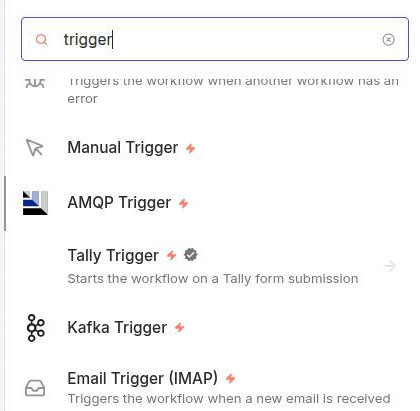

El trigger manual és el més senzill. Permet executar el flux fent clic en un botó des de la interfície de n8n.

**Utilització:**

- Provar fluxos en desenvolupament
- Fluxos que es volen executar sota demanda
- Integració amb altres workflows via "Execute Workflow"

**Configuració:**

1. Afegiu el node "Manual Trigger"
2. El node no té opcions de configuració
3. Feu clic a "Test workflow" per executar

Lògicament, si el node disparador no va enganxat a nodes d'acció, no farà res.

#### Schedule Trigger

Permet executar el flux de manera periòdica segons una planificació. Funciona per regles cron o intervals fixos.

En esta captura de pantalla podeu veure un `Trigger Schedule` configurat per executar-se cada 30 segons. També es pot configurar per executar-se cada dia a una hora concreta, o cada setmana, etc. Per a expressions cron, en `Trigger interval` hem de seleccionar `Custom (Cron)`.

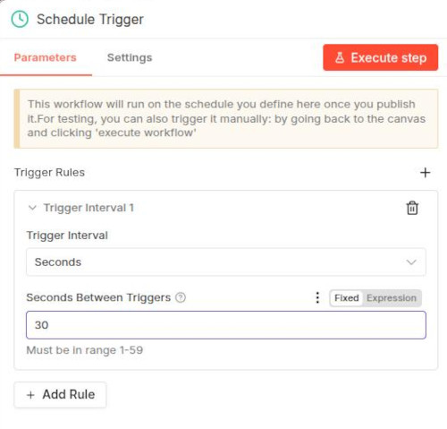

**Utilització:**

- Tasques de manteniment diàries
- Sincronització de dades cada cert temps
- Reports programats

**Configuració:**

| Paràmetre | Descripció | Exemple |
|-----------|------------|---------|
| Rule | Expressió cron o interval | `0 * * * *` |
| Timezone | Zona horària | `Europe/Madrid` |

**Formats de planificació:**

1. **Interval fix**: Executa cada X temps
   - Cada minut, hora, dia, setmana, mes

2. **Expressió Cron**: Més control sobre el temps
   - `0 9 * * 1-5` → Dilluns a divendres a les 9:00
   - `*/15 * * * *` → Cada 15 minuts
   - `0 0 1 * *` → Primer dia de cada mes

**Eines per construir expressions cron:**

- [Crontab.guru](https://crontab.guru) - Permet visualitzar expressions cron

#### Webhook Trigger

Permet iniciar el flux quan arriba una petició HTTP a una URL específica (que genera el propi node Webhook). És ideal per integrar amb serveis externs.

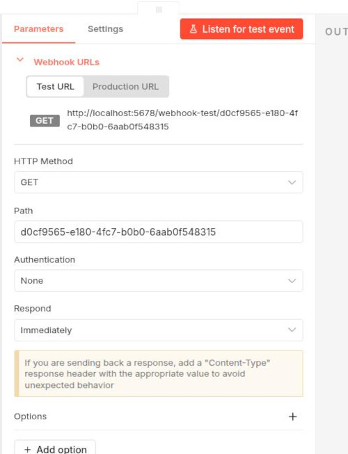

**Utilització:**

- Rebre notificacions de serveis externs
- Crear APIs personalitzades
- Integració amb formularis web
- Webhooks de GitHub, Stripe, etc.

**Configuració:**

| Paràmetre | Descripció |
|-----------|------------|
| Path | Camí de la URL |
| HTTP Method | GET, POST, PUT, DELETE, etc. |
| Response Mode | Quan retornar la resposta |
| Response Data | Dades a retornar |

**URL del Webhook:**

Quan afegiu un Webhook Trigger, n8n genera una URL única. Per exemple (en test):

```
http://localhost:5678/webhook-test/5ab28b3a-22fb-4204-9c56-4f60b835b95a
```

Quan enviem una petició a eixa URL, el flux s'executarà.

Hi ha diferents modes de resposta: `immediately` (respon tan aviat com arriba la petició), `when last node finishes` (espera que l'últim node acabe i retorna la seua eixida), `using Respond to Webhook node` (la resposta està definida en un node `Respond to webhook`) o `streaming` (torna dades en temps real). També podem configurar les dades que volem retornar en la resposta (`add option`).

És molt senzill fer una prova. Podeu crear un node `Webhook` en tots els valors per defecte (HTTP method GET), poseu-lo en modo listening, preneu nota de la URL que genera i feu una petició des del navegador o amb curl. Veure la resposta predefinida:

```json
{"message":"Workflow has started"}
```

A classe veurem algun exemple senzill. 

#### App Event Triggers

Els triggers d'aplicacions permeten iniciar el flux quan passa un esdeveniment en un servei extern. Hi ha molts, si vols veure'ls tecleja `Trigger` en el cercador de nodes que hi ha a la dreta del canvas.

Alguns triggers d'aplicació disponibles són:

| Aplicació | Esdeveniments |
|-----------|---------------|
| **Gmail** | Nou email, email etiquetat |
| **Telegram** | Nou missatge, callback query |
| **Slack** | Nou missatge, reaccions |
| **GitHub** | Push, PR, issue, release |
| **Notion** | Pàgina creada, actualitzada |
| **Stripe** | Pagament rebut, client nou |
| **Shopify** | Comanda rebuda, producte actualitzat |
| **Airtable** | Registre creat, modificat |

**Configuració general:**

1. Afegiu el trigger de l'aplicació
2. Autenticació amb credencials (API key, OAuth, etc.)
3. Seleccioneu l'esdeveniment a escoltar
4. Configureu filtres opcionals

#### Form Trigger

Permet crear formularis web que inicien el flux quan un usuari els envia.

**Tipus de camps:**

| Tipus | Descripció |
|-------|------------|
| Text | Camp de text curt |
| Textarea | Camp de text llarg |
| Number | Camp numèric |
| Date | Selector de data |
| Select | Llista desplegable |
| Multi-select | Selecció múltiple |
| File | Càrrega de fitxers |

**Configuració:**

1. Afegiu el Form Trigger
2. Afegiu camps amb el botó "Add Field"
3. Configureu cada camp (nom, tipus, requerit, etc.)
4. Personalitzeu el formulari (títol, descripció)

**URL del formulari:**

El formulari estarà accessible a:

```
https://seu-n8n.io/form/{id-workflow}
```

>Comproveu que la url és correcta, en alguns casos el domini pot ser diferent

### Nodes

Els nodes són blocs que realitzen operacions específiques. Cada node:

- Rep dades d'entrada (o les genera)
- Processa les dades
- Produeix dades de sortida

**Categories de nodes:**

- **Core**: Nodes bàsics inclosos amb n8n
- **App**: Nodes per a aplicacions externes (Slack, Gmail, etc.)
- **AI**: Nodes per a integració amb models d'IA

El workflow comença amb un trigger. Per exemple, podem crear un trigger manual (això implica que el flux de treball el llançarem manualment). Si ara fem clic en el botó `+` que té a la dreta, ens demanarà si volem afegir un altre node. Apareixerà un buscador i podem triar quin node volem afegir. 


### Connexions

Les connexions lliguen nodes entre si, permetent que les dades passen d'un node a un altre. Cada node pot tindre múltiples connexions d'eixida.

A n8n, les dades es passen entre nodes en format **JSON**. Cada execució genera un o més **items** (elements) que contenen:

- **json**: Dades estructurades en format clau-valor
- **binary**: Dades binaries (fitxers, imatges, etc.) - opcional

```json
{
  "json": {
    "nom": "Maria",
    "email": "maria@example.com",
    "edat": 25
  },
  "binary": {}
}
```

>Els nodes que estan connectats entre sí tenen un INPUT (informació que arriba del node anterior) i un OUTPUT (informació que s'envia al node següent). Eixa informació està disponible en edició si feu clic sobre un node qualsevol. A l'esquerra del canvas apareix l'input, i la dreta l'output.

### Credencials

Les credencials guarden de forma segura les claus d'API, tokens i contrasenyes necessàries per autenticar-se a serveis externs.

## El panell d'execució

Quan executeu un flux manualment, el panell d'execució mostra el resultat de cada node. Això és molt útil per:

- Veure quines dades produeix cada node
- Identificar errors
- Depurar el flux

Podeu accedir a les execucions en la part superior del canvas, en l'opció `Executions`. 

Des del panell d'execució podeu veure a l'esquerra totes les execucions recents. En el canvas podeu fer clic en un node i veure les dades d'entrada i eixida d'eixe node en particular. Això és molt útil per depurar i entendre com flueixen les dades.

En la part inferior, fent clic en logs, se veu més informació sobre l'execució de cada node que seleccionem.

Fent clic en una execució també veiem les dades corresponents (input i output dels nodes que seleccionem). Això és especialment útil si utilitzem un Schedule Trigger que envie dades cada x temps. En la llista d'execucions podem veure si s'està executant periòdicament o no, i el resultat de cada execució.

Si volem executar tot el flux, farem sempre clic en el botó `Execute workflow`. Hem de tindre en compte que no podem tindre dos workflows en el mateix canvas. Pot funcionar bé en alguns casos, però en altres no. Si tenim dos workflows en 2 canvas diferents i volem que continuen executant-se quan eixim d'un canvas i anem a l'altre, els haurem de posar en producció (botó Publish en la part superior del canvas).

### Executar nodes individuals

Podeu executar un node específic sense executar tot el flux:

1. Seleccioneu el node fent doble clic.
2. Feu clic a **Execute step** (nom del node → Test step)
3. S'executarà només este node

Com hem comentat abans, a l'esquerra del panell podem veure l'input del node que estem executant, i a la dreta el seu output.

### Organització del canvas

Per millorar la llegibilitat dels fluxos complexos:

- **Sticky Notes**: Afegiu notes adhesives amb `Shift + N`
- **Tags**: Assigneu tags als workflows per organitzar-los
- **Alineació**: Seleccioneu múltiples nodes i useu les opcions d'alineació
- **Colors**: Podeu assignar colors als nodes per categories

### Dreceres de teclat generals

| Acció | Drecera |
|-------|---------|
| Guardar workflow | `Ctrl + S` |
| Executar workflow | `Ctrl + Enter` |
| Tancar editor | `Esc` |
| Obrir cercador de nodes | `Ctrl + A` |
| Cercar workflow | `Ctrl + F` |
| Desfer | `Ctrl + Z` |
| Refer | `Ctrl + Shift + Z` |

### Dreceres de teclat del canvas

| Acció | Drecera |
|-------|---------|
| Zoom in | `Ctrl + +` |
| Zoom out | `Ctrl + -` |
| Zoom reset | `Ctrl + 0` |
| Seleccionar tots | `Ctrl + A` |
| Copiar | `Ctrl + C` |
| Enganxar | `Ctrl + V` |
| Eliminar seleccionat | `Supr` |
| Duplicar | `Ctrl + D` |
| Afegir sticky note | `Shift + N` |

### Navegació

| Acció | Drecera |
|-------|---------|
| Següent node | `Tab` |
| Node anterior | `Shift + Tab` |
| Obrir configuració | `Enter` |
| Tancar configuració | `Esc` |

## Dades i Expressions

Anem a veure algunes estructures de dades i expressions que podem utilitzar en n8n.

### Items i JSON

A n8n, les dades flueixen com a **items**. Cada item conté:

```json
{
  "json": {
    "id": 1,
    "nom": "Maria",
    "email": "maria@example.com"
  },
  "binary": {}
}
```

### Arrays

Els arrays contenen múltiples elements:

```json
[
  { "json": { "id": 1 } },
  { "json": { "id": 2 } },
  { "json": { "id": 3 } }
]
```

### Dades niuades

Els objectes poden contindre objectes o arrays:

```json
{
  "json": {
    "usuari": {
      "nom": "Joan",
      "adreca": {
        "carrer": "Carrer Major",
        "ciutat": "València"
      }
    },
    "comandes": [
      { "id": 1, "producte": "Llibre" },
      { "id": 2, "producte": "Bolígraf" }
    ]
  }
}
```

### Expressions

Les expressions permeten accedir i manipular dades dinàmicament.

#### Sintaxi

Les expressions s'escriuen entre `{{ }}`:

```javascript
{{ $json.camp }}
{{ $json.usuari.nom }}
{{ $vars.variable }}
{{ $node "NodeName" }}
```

#### Variables especials

| Variable | Descripció |
|----------|------------|
| `$json` | Dades JSON de l'item actual |
| `$input` | Tots els items d'entrada |
| `$node` | Dades d'un node específic |
| `$vars` | Variables de workflow |
| `$execution` | Dades de l'execució actual |
| `$parameter` | Paràmetres del node |
| `$workflow` | Propietats del workflow |
| `$now` | Data/hora actual |
| `$today` | Data d'avui |
| `$json.meuCamp || "valorPerDefecte"` | Valor per defecte |

#### Funcions útils

**Strings:**

```javascript
{{ $json.nom.toUpperCase() }}                    // Majúscules
{{ $json.nom.toLowerCase() }}                    // Minúscules
{{ $json.email.split('@')[0] }}                   // Part abans de @
{{ $json.nom.trim() }}                           // Eliminar espais
{{ $json.nom.length }}                           // Longitud
{{ $json.nom.includes('test') }}                 // Conté 'test'
```

**Dates (Luxon):**

```javascript
{{ $now.toISO() }}                               // ISO 8601
{{ $now.toFormat('dd/MM/yyyy') }}                // Format dia/mes/any
{{ $now.minus({ days: 7 }).toISO() }}            // Fa 7 dies
{{ $now.plus({ hours: 2 }).toFormat('HH:mm') }} // D'aquí 2 hores
```

**Arrays:**

```javascript
{{ $json.elements[0] }}                          // Primer element
{{ $json.elements.length }}                      // Nombre d'elements
{{ $json.elements.join(', ') }}                  // Unir elements
```

**Condicionals:**

```javascript
{{ $json.edat >= 18 ? 'Adult' : 'Menor' }}
```

### Convertir tipus

Amb el node **Code** (el veure més endavant, és un node que permet executar codi):

```javascript
// String a number
parseInt($json.edat, 10)

// Number a string
String($json.id)

// String a boolean
$json.actiu === 'si' || $json.actiu === true

// String a data
new Date($json.data).toISOString()
```

### Aplanar objectes

```javascript
// Aplanar objecte niuat
const aplanat = {};
for (const [clau, valor] of Object.entries($input.first().json)) {
  if (typeof valor === 'object' && valor !== null) {
    for (const [subclau, subvalor] of Object.entries(valor)) {
      aplanat[`${clau}_${subclau}`] = subvalor;
    }
  } else {
    aplanat[clau] = valor;
  }
}
return { json: aplanat };
```

## Nodes core

Hi ha molts tipus de nodes i moltes opcions per crear fluxos de treball. No és factible anar veient tots els nodes un a un, així que intentarem familiaritzar-nos amb alguns dels més utilitzats.

### Code Node

El node Code permet executar codi JavaScript (o Python) personalitzat per transformar dades.

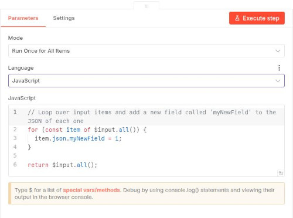

En l'apartat `Mode` per defecte tenim `Run once for all items`. Això vol dir que el node amb el codi s'executarà **una vegada només** quan li arriba l'input. Si en l'input hi arriben molts valors, i volem que el codi s'execute per cada un d'ells, seleccionarem l'opció `Run once for each item`. En este cas, el codi s'executarà **una vegada per cada item** que arribe a l'input.

```javascript
// Les dades d'entrada estan a items
const dades = $input.all();

return dades.map(item => ({
  json: {
    // Modifiqueu les dades ací
    nouCamp: item.json.camp * 2,
    processat: true
  }
}));
```

>Penseu en els nodes Code de n8n com si foren els nodes Function de Node-RED.

#### Accés a les dades de l'input

| Variable | Descripció |
|----------|------------|
| `$input.all()` | Tots els items d'entrada |
| `$input.first()` | Primer item |
| `$input.last()` | Últim item |
| `$node("NomNode")` | Dades d'un node específic |
| `$json` | Item actual (sintaxi curta) |

#### Casos pràctics de Code

**Exemple 1: Transformar dades**

```javascript
// Afegir camps calculats
return $input.all().map(item => ({
  json: {
    nom: item.json.nom,
    email: item.json.email.toLowerCase(),
    data_creacio: new Date().toISOString(),
    hash: require('crypto')
      .createHash('md5')
      .update(item.json.email)
      .digest('hex')
  }
}));
```

**Exemple 2: Filtrar dades**

```javascript
// Filtrar només majors d'edat
return $input.all().map(item => {
  if (item.json.edat >= 18) {
    return { json: item.json };
  }
}).filter(item => item !== undefined);
```

**Exemple 3: Agrupar dades**

```javascript
// Agrupar per categoria
const grups = {};

for (const item of $input.all()) {
  const cat = item.json.categoria;
  if (!grups[cat]) grups[cat] = [];
  grups[cat].push(item.json);
}

return Object.entries(grups).map(([categoria, items]) => ({
  json: { categoria, quantitat: items.length, items }
}));
```

#### Llibreries disponibles

Podeu utilitzar els següents mòduls de Node.js:

```javascript
// Crypto
const crypto = require('crypto');

// Date/Time
const avui = new Date();
const faUnaSetmana = new Date(Date.now() - 7 * 24 * 60 * 60 * 1000);

// Utils
const _ = require('lodash'); // Si està disponible
```

### Set Node

El node `Set` permet assignar valors a camps nous o existents sense haver d'escriure codi en JavaScript / Python. És molt útil per a transformacions senzilles. Podem crear els camps en format JSON, o anar definint-los un a un.

#### Modes d'operació

| Mode | Descripció |
|------|------------|
| Keep Only Set | Elimina tots els camps excepte els especificats |
| Set All | Assigna valors a camps específics (no elimina els altres) |

#### Assignar valors

Podeu assignar:

**Valors fixos:**

```yaml
nom: "Joan"
actiu: true
quantitat: 42
```

>Recordeu que els valors fixos poden afegir-se d'un en un, o en format JSON. Si seleccionen l'opció `Manual Mapping` els anirem afegint d'un en un en el requadre que podem veure en la imatge següent.

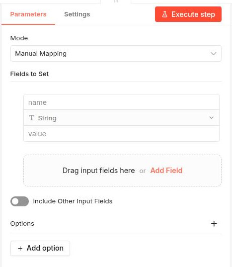

**Expressions (dinàmiques):**

Per assignar valors basats en expressions, hem de fer clic en el botó `Expression` que hi ha a la dreta del quadre de text `Value`. Per definir expressions utilitzarem la sintaxi `{{ }}`. Per exemple:

```javascript
{{ $json.camp }}           // Valor d'un camp
{{ $now.toISO() }}         // Data actual
{{ $vars.variable }}       // Variable de workflow
```

### Filter Node

El node Filter permet filtrar elements segons condicions. Les condicions s'aniran afegint una a una tal com se veu en la imatge.

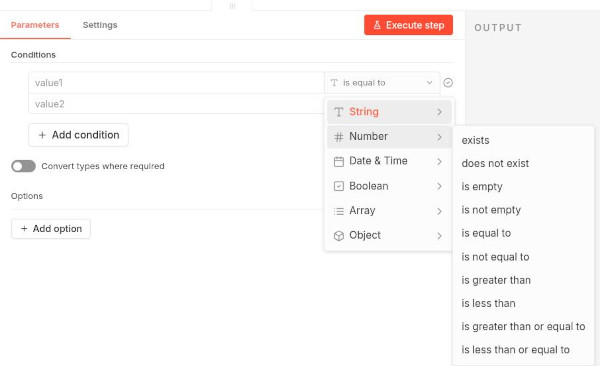

#### Operadors disponibles

Els operadors disponibles estaran en funció del tipus del valor amb el que treballem. Per exemple, si el valor és un string, els operadors disponibles seran diferents que si el valor és un número. A continuació teniu una taula amb els operadors més comuns:

| Operador | Descripció | Exemple |
|----------|------------|---------|
| Equals | Exactament igual | `nom` equals `Joan` |
| Not Equals | Diferent | `actiu` not equals `false` |
| Contains | Conté el text | `email` contains `@example` |
| Not Contains | No conté | `nom` not contains `test` |
| Starts With | Comença amb | `nom` starts with `Dr.` |
| Ends With | Acaba amb | `email` ends with `.com` |
| Greater Than | Major que | `edat` > 18 |
| Less Than | Menor que | `edat` < 65 |
| Is Empty | Està buit | `nom` is empty |
| Is Not Empty | No està buit | `email` is not empty |
| Regex | Expressió regular | `telefon` matches `^\d{9}$` |

#### Condicions combinades

Podeu combinar condicions amb **AND** o **OR**:

```
( edat > 18 ) AND ( actiu = true )
```

```
( pais = "Espanya" ) OR ( pais = "Portugal" )
```

## Integració amb altres serveis

Anem a veure alguns nodes que permeten connectar el nostre flux de treball amb serveis o aplicacions externes.

Hi ha moltíssimes opcions, així que en veurem unes quantes per a familiaritzar-nos amb el procés de connexió. 

### Connexió amb Kafka

Com ja sabeu, **Apache Kafka** és un broker de missatges distribuït dissenyat per a pipelines de dades en temps real d'alt rendiment. Tal com hem vist en altres unitats, **Kafka** té ***producers*** i ***consumers***. Al igual que **Node-RED**, **n8n** també té nodes per treballar amb Kafka.

Anem a crear un flux senzill on enviem dades a Kafka i després les llegim.

**Producer**

Primer creem un node `Edit Fields (set)` per crear unes dades que enviarem a Kafka. Podem triar fer-ho directament en format JSON, però per poder utilitzar expressions per a la data triarem l'opció `Manual mapping`. Anem afegint camps especificant nom, tipus i valor. Per exemple:

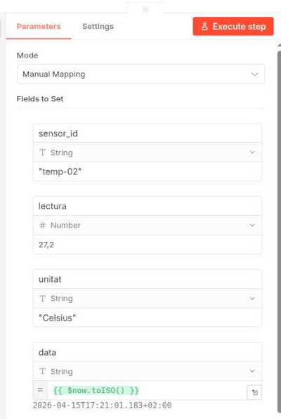

L'eixida del node `set` la podem enviar a un node `Kafka` que guarde la informació en un topic que anomenem, per exemple, **my-topic**.

El node Kafka permet enviar missatges a un topic. El posem a l'eixida del node `set` i el configurem amb les dades del nostre broker Kafka a l'apartat `Credential`. En el nostre cas, com estem dockeritzant Kafka, el broker serà `broker:29092`. Les opcions `ssl` i `authentication` les deixarem deshabilitades perquè el nostre Kafka no té seguretat habilitada.

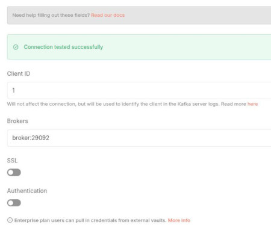

Quan ja creem la credencial només queda definir el nom del topic i activar l'opció `Send Input Data`. Això farà que el node Kafka envie les dades que li arriben del node `set` al topic especificat.

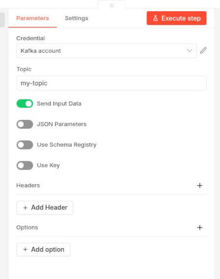

**Consumer**

Per a llegir la informació de Kafka utilitzem un node `Kafka trigger`. Utilitzem la mateixa credencial que abans i configurem el node amb les dades del topic que volem consumir. Tenim l'opció de llegir cada vegada des del principi del topic (des del primer missatge) o només els missatges nous. També tenim l'opció de parsejar directament els missatges a JSON.

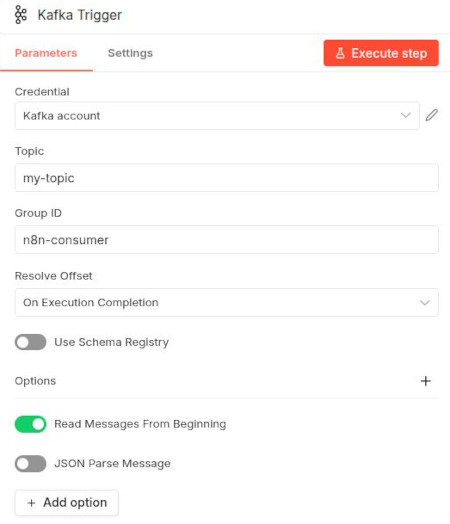

Si no funciona correctament el flux, proveu a posar el Kafka productor en un canvas i el Kafka consumidor (Kafka Trigger) en un altre. Publiqueu (botó Publish) els dos fluxos, i comproveu que s'estan executant tal com hem vist abans.

Un flux típic per processar dades de sensors podria ser el següent:

```
Schedule (cada 10s) → Code (generar dades) → Kafka (produce)
                                         ↓
Kafka (consume) → Code (validar) → IF (és vàlid?) → Elasticsearch (index)
                        ↓
                  (no vàlid) → Set (marcar error) → Logstash (enviar a errors)
```

El flux senzill que hem fet quedaria així:

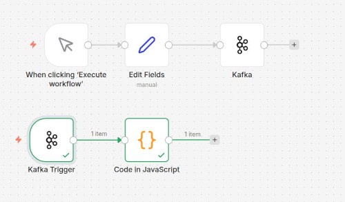

>Torne a insistir: comproveu si vos funciona tot bé, i si no funciona correctament separeu els dos workflows en canves diferents i publiqueu-los (Botó Publish). A classe veurem un exemple més complet i comprovat.

### Conexió amb Telegram

n8n té nodes per a moltes aplicacions externes. Per exemple, podem connectar amb Telegram per enviar missatges o rebre notificacions.

En el cas de Telegram, haurem de crear un bot a Telegram i obtenir el token d'API. Després, en n8n, crearem una credencial de tipus `Telegram` on introduirem el token per crear la connexió. També necessitarem saber el nostre chatID, cosa que podeu fer posant en el navegador la següent URL (substituïnt `TOKEN` pel token del vostre bot):

```
https://api.telegram.org/botTOKEN/getUpdates
```

#### Enviar missatges a Telegram

Una prova senzilla seria fer un webhook que envie missatges a Telegram cada vegada que rep una petició.

El node webhook quedaria així:

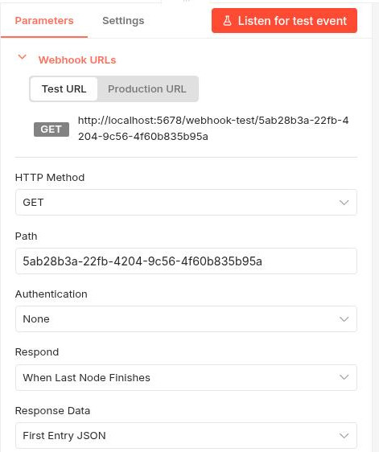

Connectem a l'eixida del webhook un node Telegram que quedaria així (se suposa que ha heu creat la credencial de Telegram amb el token del vostre bot i la URL https://api.telegram.org):

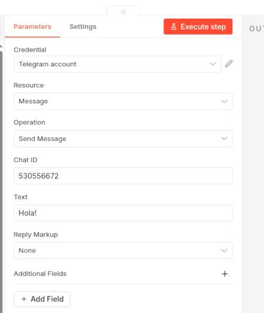

El flux complet queda així:

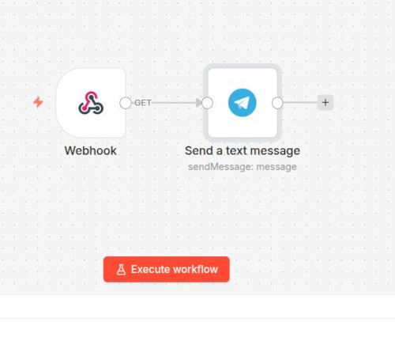

Ara si executem el flux, i des del navegador fem una petició a la URL del webhook, hauriem de rebre una notificació en el nostre bot de Telegram.

>A classe farem una pràctica guiada (la tindreu en Aules) de com connectar Kafka i Telegram per rebre una notificació a Telegram quan arribe un missatge a Kafka que compleix una condició determinada.

### HTTP Request Node

El node **HTTP Request** és un dels més versàtils, permetent fer peticions a qualsevol API REST (igual que el node HTTP Request de Node-RED).

Admet els mètodes habituals:

| Mètode | Ús |
|--------|-----|
| GET | Recuperar dades |
| POST | Crear recursos |
| PUT | Actualitzar recursos |
| PATCH | Modificació parcial |
| DELETE | Eliminar recursos |

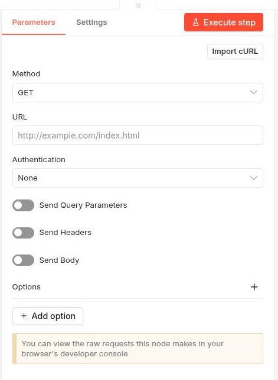

Com veieu, podem seleccionar el mètode HTTP corresponent, la URL, mètode d'autenticació si és necessari, i altres opcions com headers, query parameters, body, etc. Fent clic en el botó `Add option` podem accedir a més opcions de configuració.

#### Headers

Els headers proporcionen informació addicional a la petició:

| Header | Valor | Descripció |
|--------|-------|------------|
| Content-Type | application/json | Format de les dades |
| Authorization | Bearer TOKEN | Token d'autenticació |
| Accept | application/json | Format esperat de resposta |

#### Query Parameters

Podeu afegir paràmetres de cerca a la URL:

```yaml
URL: https://exemple.api.com
Query Parameters:
  - name: limit
    value: 10
  - name: offset
    value: 0
```

Resultat: `https://exemple.api.com/usuaris?limit=10&offset=0`

>Teniu en compte que la URL `https://exemple.api.com/` no existeix, és per posar un exemple.

#### Body

Per a peticions POST/PUT/PATCH, el cos de la petició conté les dades:

```json
{
  "nom": "Joan",
  "email": "joan@example.com",
  "edat": 30
}
```

#### Autenticació

El node HTTP Request suporta diversos tipus d'autenticació:

**Basic Auth (Usuari i contrasenya):**
```yaml
Authentication: Basic Auth
User: usuari
Password: contrasenya
```

**Header Auth (API Key):**
```yaml
Authentication: Header Auth
Name: X-API-Key
Value: la-vostra-clau-api
```

**OAuth2:**
```yaml
Authentication: OAuth2 API
Client ID: ...
Client Secret: ...
Authorization URL: ...
Access Token URL: ...
Scope: read write
```

## Nodes de control de flux

Anem a veure alguns nodes que modifiquen la lògica del flux.

### IF Node

Bifurca el flux en dues branques: veritat (true) o fals (false).

En l'apartat `Conditions` podem anar afegint condicions una a una. Per exemple, podem afegir una condició que compare el valor d'un camp amb un valor fix, o que compare el valor d'un camp amb el valor d'un altre camp, etc.

Si posem més d'una condició, podem seleccionar si volem que es connecte amb les altres amb AND o amb OR.

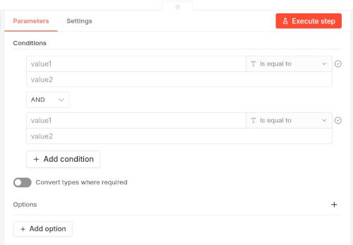

El node `IF` té una eixida per a la branca de veritat (true) i una altra per a la branca de fals (false). Així, podem connectar diferents nodes a cada branca segons el resultat de les condicions.

>Si només volem comprovar que l'IF funciona, i mostrar les dades que trau com a output, podem afegir a les dues eixides nodes de tipus `No Operation` (que no fan res) i així veurem les dades que passen per cada branca. Seria com els nodes `Debug` de Node-RED.

### Switch Node

Bifurca el flux en múltiples branques segons unes regles que anirem afegint. Cada regla genera una eixida del node a la qual li podem connectar altres nodes.

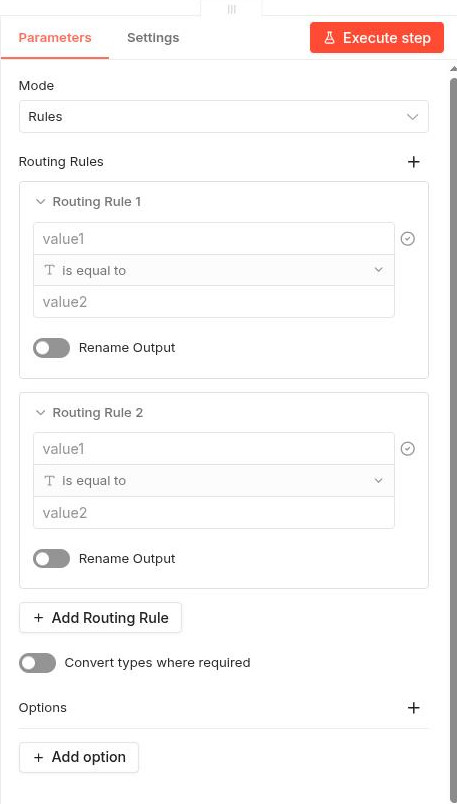

### Loop Over Items Node

Permet iterar sobre cada element d'un array i executar un sub-flux per a cadascun.

**Funcionament**

1. El node rep un array d'items
2. Per a cada item, executa el sub-flux connectat
3. Recull els resultats de cada iteració
4. Retorna tots els resultats

**Exemple**

```javascript
// Dades d'entrada (array)
[
  { json: { id: 1, nom: "Maria" } },
  { json: { id: 2, nom: "Joan" } },
  { json: { id: 3, nom: "Anna" } }
]
```

El node Loop processarà cada element individualment.

>En principi no necessitarem nodes `Loop` perquè molts nodes de n8n ja tenen l'opció, per defecte o a escollir per l'usuari, de processar cada ítem d'entrada de forma individual. Tot i això, en alguns casos pot ser útil per a iterar sobre arrays que arriben com a camp d'un item, o per a executar un sub-flux complex per a cada element.

### Merge Node

El node **Merge** permet unir múltiples branques en una única execució. Té diferents modes:

| Mode | Descripció |
|------|------------|
| Append | Junta tots els items seqüencialment |
| Combine | Combina tots els items en un únic item (útil si hi ha valors duplicats en les diferents branques) |
| SQL Query | Podem crear una query SQL per definir com se fusionaran les dades |
| Choose branch | Permet seleccionar una branca específica per a la sortida |

```
Branca A ─┐
           ├─→ Merge ─→ Sortida
Branca B ─┘
```

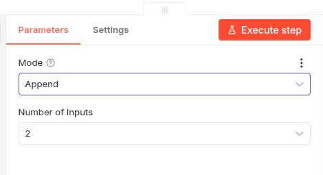

Dins d'un flux podríem tindre per exemple 2 nodes que generen dades de fonts diferents, i un merge per unir-les totes i poder-les processar conjuntament.

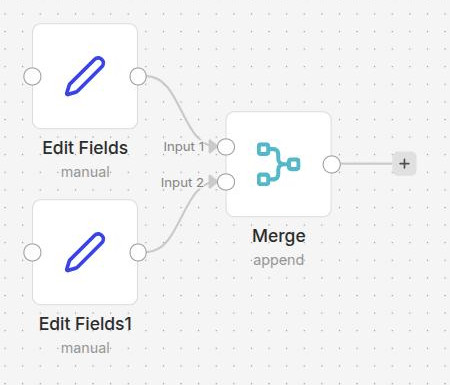

### Wait Node

El node Wait permet pausar l'execució del flux durant un temps determinat.

**Tipus de pausa**

| Tipus | Descripció |
|-------|------------|
| After time initerval | Pausa durant un temps fix |
| At specified time | Pausa fins a una hora específica |
| On Webhook call | Pausa fins a rebre una crida webhook |
| On Form submitted | Pausa fins a rebre dades d'un formulari |

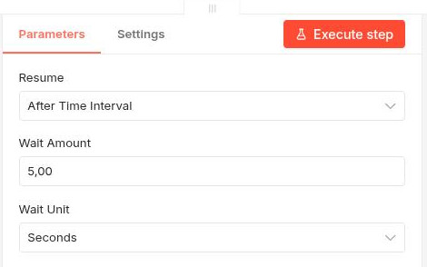

## Credencials

Les credencials emmagatzemen de forma segura les claus d'API, tokens i contrasenyes necessàries per autenticar-se a serveis externs.

Podeu veure les credencials en cada node on s'utilitzen, amb el botó d'editar (icona de llapis) que hi ha a la dreta de l'apartat d'autenticació. 

També podeu gestionar totes les credencials si aneu a la pantalla principal de n8n i feu clic a **Credentials**.

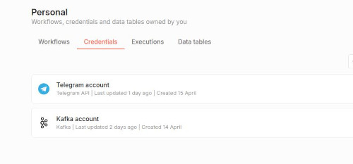

### Crear credencials

1. Quan configureu un node, feu clic a **"Create New Credential"**
2. Seleccioneu el tipus d'autenticació
3. Ompliu els camps requerits
4. Feu clic a **"Save"**

### Tipus d'autenticació

| Tipus | Utilització |
|-------|-------------|
| **API Key** | Claus d'API simples |
| **Basic Auth** | Usuari i contrasenya |
| **OAuth2** | Autenticació amb proveïdors OAuth |
| **Header Auth** | Clau en capçalera HTTP |
| **Custom Auth** | Autenticació personalitzada |

### Bones pràctiques

1. **No compartiu credencials** entre múltiples nodes si no és necessari
2. **Utilitzeu credencials compartides** per a fluxes relacionats
3. **Roteu les claus periòdicament** segons la política de seguretat
4. **No incloeu claus en expressions** visibles als logs
5. **Verifiqueu l'accessibilitat** de les credencials per projecte

### Autenticació HTTP

Podeu configurar autenticació global per al node HTTP Request:

**Basic Auth:**
```yaml
Credential for Basic Auth:
  Name: usuari
  Password: contrasenya
```

**Bearer Token:**
```yaml
Credential for Header Auth:
  Name: Authorization
  Value: Bearer TOKEN_AQUÍ
```

## Variables i Memòria

### Workflow Variables

n8n permet definir i utilitzar variables de workflow per emmagatzemar dades temporals que es poden compartir entre nodes. Ara bé, eixa opció no està disponible en la versió autoinstal·lada gratuita.

### Memory Nodes

Els nodes de memòria emmagatzemen dades entre execucions, essencials per a AI Agents amb context.

>Si busqueu "Memory" en el cercador de nodes, no vos apareixeran els `Memory Nodes` perquè només poden utilitzar-se des d'un node que interactue amb un agent.

#### Buffer Memory

Emmagatzema els últims N missatges de la conversa:

```yaml
Window Size: 10
```

Útil per a chatbots que necessiten context recent.

#### Window Memory

Similar a Buffer, però amb finestres temporals:

```yaml
Window Size: 10
Session Key: "{{ $json.session_id }}"
```

#### Vector Store Memory

Emmagatzema vectors per a cerques semàntiques (requereix integració amb base de dades vectorial com Pinecone o Weaviate).

#### Integració amb AI Agents

La memòria s'utilitza principalment amb AI Agents per mantindre context:

```
User Input → Chat Agent (amb Memory) → Response
                         ↓
                  Buffer Memory
```

#### Configuració

1. Afegiu el node **Chat Agent**
2. Connecteu un node de memòria a l'entrada "Memory"
3. Configureu la mida de la finestra

#### Exemple: Chatbot amb memòria

```yaml
Agent: Conversational Agent
Memory: Buffer Memory (Window: 5)
Model: Claude
```

El bot recordarà els últims 5 missatges de la conversa.

## Sub-workflows

Com a opcions més avançades, els fluxos de treball poden cridar-se uns a altres i passar-se informació. Això ho podem fer amb el node **Execute Workflow**.

També poden crear `sub-workflows` que són fluxos de treball més petits i especialitzats que poden ser reutilitzats des de diferents fluxos principals.

Eixos sub-workflows s'invoquen també amb el node **Execute Workflow**, però en lloc de seleccionar un workflow diferent, seleccionem el sub-workflow que hem creat.

### Passar dades

**Opcions de pas de dades:**

| Opció | Descripció |
|-------|------------|
| `all` | Totes les dades de l'item actual |
| `none` | Sense dades |
| `select` | Camps específics |

**Pas de camps específics:**
```yaml
Fields to Pass: nom, email, telefon
```

#### Rebre dades del sub-workflow

El workflow cridat retorna les seues dades d'eixida. Podeu accedir amb:

```javascript
{{ $json.dades_retornades }}
```

## Error Workflows

Els error workflows permeten gestionar errors de manera centralitzada.

### Quan s'activa

Un error workflow s'activa quan:

- Un node llença un error
- S'utilitza el node **Stop and Error**
- S'utilitza el node **Error Trigger**

### Crear un Error Workflow

1. Creeu un nou workflow
2. Afegiu el trigger **Error Workflow**
3. Configura el workflow com a "Error Workflow" a les propietats

### Exemple: Notificar errors

```
Error Trigger → Send Email (admin) → Log a Elasticsearch
```

### Gestió d'errors en nodes individuals

Cada node té una eixida d'error (Error Output). Podeu:

1. Connectar esta eixida a un node de notificació
2. Reintentar l'operació
3. Registrar l'error per anàlisi posterior

## Connexió a bases de dades

També tenim diferents nodes en n8n per a connectar amb múltiples bases de dades. Anem a veure un parell d'exemples.

### Connexió amb MySQL

Per a treballar amb MySQL/MariaDB, igual que amb qualsevol altre sistema gestor de bases de dades, necessitarem crear unes credencials.

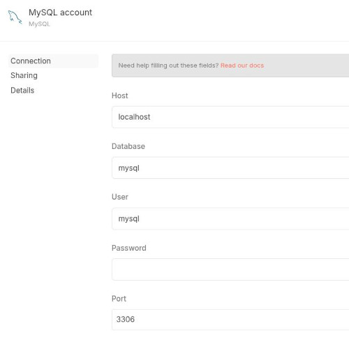

El node MySQL permet connectar i interactuar amb bases de dades MySQL/MariaDB. Quan seleccionem el node MySQL, ens demana quina operació volem executar.

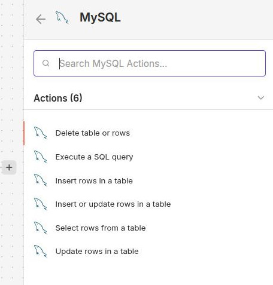

Després internament en el node ja podem especificar més clarament quines operacions volem realitzar.

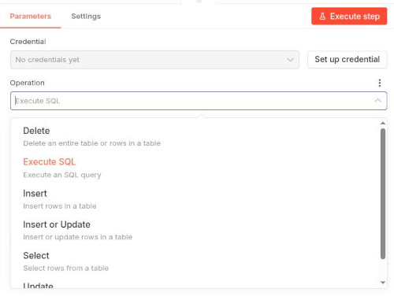

### Connexió amb Elasticsearch

El node Elasticsearch permet indexar, cercar i gestionar documents a Elasticsearch.

Igual que amb MySQL, necessitarem unes credencials. També hem de triar una operació quan seleccionem el node.

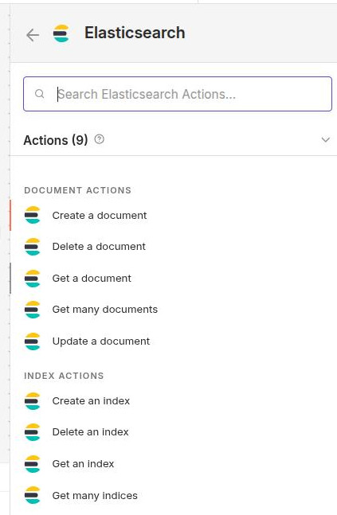

Una vegada tenim el node en el workflow, podem fer modificacions més específiques segons l'operació que hàgim triat.

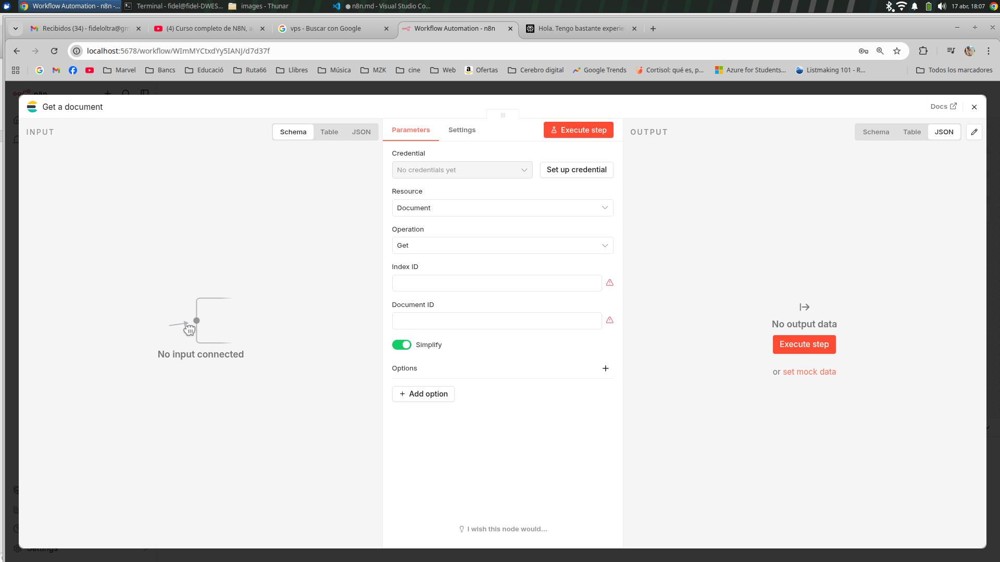

Veurem també algun exemple pràctic a classe on integrarem Elastic amb altres funcions de n8n.

>M'HE QUEDAT ACÍ. FALTARIA TOTA LA PART D'INTEGRACIÓ AMB IA. TAMBÉ AFEGIR INTEGRACIÓ AMB GMAIL I ALGUNA EINA MÉS.

## Integració amb IA

Una de les opcions més potents que té n8n és que ofereix nodes natius per treballar amb els principals models d'IA:

| Proveïdor | Model | Ús principal |
|-----------|-------|--------------|
| **Anthropic** | Claude 3 | Conversació, anàlisi, classificació |
| **OpenAI** | GPT-4, DALL-E, Whisper | Generació text, imatges, àudio |
| **Google** | Gemini | Multimodal, codi |

### Claude Node

Permet utilitzar Claude 3 d'Anthropic per a tasques d'IA.

<!-- IMG: n8n13.jpg -->
*Figura 30.1: Node Claude configurat amb prompt i paràmetres*

#### Credencials

1. Creeu un compte a [console.anthropic.com](https://console.anthropic.com)
2. Obteniu la clau API
3. Configureu-la a n8n

#### Configuració bàsica

```yaml
Resource: Chat
Operation: Complete
Model: claude-3-5-sonnet-20241022
Messages:
  - Role: system
    Content: Eres un assistent que classifica missatges
  - Role: user
    Content: "{{ $json.missatge }}"
```

#### Paràmetres avançats

| Paràmetre | Descripció | Valor típic |
|-----------|------------|-------------|
| Temperature | Creativitat (0-1) | 0.7 |
| Max Tokens | Màxim de tokens | 1024 |
| System Message | Instruccions de rol | Depèn de la tasca |

#### Output Format

Podeu demanar que l'eixida siga en format JSON:

```
Al final del teu missatge, inclou un JSON amb el format:
{"categoria": "incident|consulta|altre", "prioritat": "alta|mitjana|baixa"}
```

---

### OpenAI Node

#### Models disponibles

| Model | Ús |
|-------|-----|
| gpt-4 | Millor qualitat, més lent |
| gpt-4-turbo | Qualitat amb velocitat |
| gpt-3.5-turbo | Ràpid, menor cost |
| dalle-3 | Generació d'imatges |
| whisper-1 | Transcripció d'àudio |

#### Exemple: Classificar text

```yaml
Model: gpt-3.5-turbo
Messages:
  - Role: system
    Content: Classifica este email en una paraula (spam|normal)
  - Role: user
    Content: "{{ $json.email_body }}"
```

---

### Exemple Pràctic

#### Workflow: Classificar incidències amb IA

```
Telegram Trigger → Claude (classificar) → IF (bifurcar) → ...
```

**Pas 1: Trigger de Telegram**

Configureu el bot per rebre missatges del grup de monitorització.

**Pas 2: Classificar amb Claude**

```yaml
System: |
  Ets un sistema de classificació d'incidències.
  Classifica cada missatge com:
  - "incident": Problema urgent que necessita atenció
  - "consulta": Pregunta o sol·licitud d'informació
  - "altre": Qualsevol altre missatge
  
  Respon NOMÉS amb JSON:
  {"categoria": "...", "explicacio": "..."}

User: {{ $json.text }}
```

**Pas 3: Bifurcar segons classificació**

```yaml
IF: {{ $json.categoria }}
Conditions:
  - Value: incident
    Output: Output 1
  - Value: consulta
    Output: Output 2
  - Value: altre
    Output: Output 3
```

---

## AI Agents amb LangChain

### Conceptes fonamentals

Un **AI Agent** és un sistema que utilitza un model d'IA per prendre decisions i executar accions de manera autònoma. A diferència d'una simple crida a un model, un agent pot:

- **Razonar** sobre les dades rebudes
- **Decidir** quines accions fer
- **Utilitzar eines** (tools) per completar tasques
- **Mantindre estat** mitjançant memòria

#### Components d'un agent

```
┌─────────────┐
│    Agent    │◀── Utilitza un model d'IA
└──────┬──────┘
       │
       ├───▶ Tools (eines: cerques, càlculs, APIs)
       │
       └───▶ Memory (memòria: conversa, fets)
```

| Component | Descripció |
|-----------|------------|
| **Agent** | Coordina tot, pren decisions |
| **Model** | El cervell: Claude, GPT-4, Gemini |
| **Tools** | Funcions que l'agent pot cridar |
| **Memory** | Emmagatzema estat i context |

---

### Nodes d'Agents a n8n

n8n ofereix diversos nodes per crear agents:

<!-- IMG: agent_nodes.jpg -->
*Figura X.1: Nodes d'agent disponibles a n8n*

| Node | Descripció |
|------|------------|
| **Chat Agent** | Agent conversacional amb eines |
| **Conversational Agent** | Similar, orientat a chatbots |
| **LangChain Agent** | Agent complet amb configuració avançada |

---

### Chat Agent

El node **Chat Agent** és l'opció més senzilla per crear agents conversacionals amb eines.

<!-- IMG: chat_agent_config.jpg -->
*Figura X.2: Configuració del Chat Agent*

#### Configuració bàsica

```yaml
Model: Claude
System Message: Ets un assistent útil que ajuda amb tasques de dades.
Memory: Buffer Memory
Tools: Calculator, Wikipedia, HTTP Request
```

#### System Message

El missatge del sistema defineix el comportament de l'agent:

```yaml
System Message: |
  Ets un analista de dades expert.
  Quan et demanen analitzar dades:
  1. Verifica que les dades siguen completes
  2. Identifica patrons i tendències
  3. Proporciona recomanacions clares
  
  Sempre sigues precís i cites les teues fonts.
```

---

### Tools (Eines)

Les eines permeten a l'agent actuar sobre el món real.

#### Tools predefinides

| Tool | Funció |
|------|--------|
| **Calculator** | Realitzar càlculs |
| **Wikipedia** | Cercar informació |
| **HTTP Request** | Fer peticions web |
| **Search API** | Cercar a serveis externs |

#### Crear una tool personalitzada

Podeu crear les vostres pròpies eines amb el **Custom Tool** node:

```yaml
Tool Name: get_sensor_data
Description: Obté les dades actuals d'un sensor. 
             Input: sensor_id (string)
             Output: dades del sensor en JSON
```

#### Exemple: Tool per consultar Elasticsearch

```javascript
// Custom Tool: Elasticsearch Search
const fetch = require('node:https');

// Configuració de la tool
const toolConfig = {
  name: "elasticsearch_search",
  description: "Cerca documents a Elasticsearch. Input: query en JSON",
};

// Codi de la tool
async function execute(query) {
  const response = await fetch('http://elasticsearch:9200/missatges/_search', {
    method: 'POST',
    headers: { 
      'Content-Type': 'application/json',
      'Authorization': 'Basic ' + Buffer.from('elastic:tavernes').toString('base64')
    },
    body: JSON.stringify(query)
  });
  return await response.json();
}
```

---

### Chain: Router

Un **Chain** permet encadenar múltiples passos de processament.

#### Exemple: Chain de classificació

```
User Input → Classifier → [Consultes | Incidents | Altres]
                           ↓            ↓            ↓
                        Respond     Processar    Ignorar
```

```yaml
Chain: Router Chain
Routes:
  - Condition: "{{ $json.intent }}" equals "consulta"
    Chain: Resposta Consulta
  - Condition: "{{ $json.intent }}" equals "incident"  
    Chain: Processar Incident
  - Default: Respondre genèric
```

---

### Exemple: Agent cercador de dades

En este exemple, crearem un agent que pot cercar dades a Elasticsearch.

<!-- IMG: data_agent_workflow.jpg -->
*Figura X.3: Workflow de l'agent cercador*

#### Configuració del workflow

```
Chat Trigger
     ↓
Chat Agent (amb Elasticsearch tool)
     ↓
Telegram (respondre)
```

#### System Message

```yaml
System Message: |
  Ets un assistent especialitzat en consultar bases de dades Elasticsearch.
  
  Pots cercar incidències, missatges i altres dades indexades.
  Quan l'usuari pregunta per dades:
  1. Identifica què busca
  2. Construeix la query adequada
  3. Retorna els resultats de manera clara
  
  Si no trobes res, indica'l honestament.
```

#### Tools configurades

1. **Elasticsearch Search**: Cerca documents
2. **Calculator**: Càlculs sobre dades
3. **Date Parser**: Processar dates

---

### Execució d'un agent

Quan executes un agent:

1. **L'usuari envia un missatge**
2. **L'agent analitza** el missatge
3. **Decideix quina tool usar** (o cap)
4. **Executa la tool** si cal
5. **Genera la resposta** final

<!-- IMG: agent_execution_flow.jpg -->
*Figura X.4: Flux d'execució d'un agent*

#### Logs de l'agent

Podeu veure el raonament de l'agent als logs:

```
🎯 Analitzant pregunta: "Quantes incidències hem tingut esta setmana?"
🤔 Decidint: Necessite consultar Elasticsearch
🔧 Executant tool: elasticsearch_search
📊 Resultats: 15 incidències
💬 Resposta: "Esta setmana hem tingut 15 incidències..."
```

---

### Bones pràctiques amb agents

1. **System Message clar**: Defineix bé el paper de l'agent
2. **Tools limitades**: No sobrecarregueu amb eines innecessàries
3. **Memòria adequada**: Trieu el tipus de memòria segons la tasca
4. **Fallback**: Preveu respostes quan l'agent no sap què fer
5. **Testing**: Proveu l'agent amb múltiples casos

#### Evitar bucle infinit

```yaml
Max Iterations: 5
Timeout: 30 seconds
```

#### Gestió d'errors

```yaml
On Error:
  - Log error
  - Return: "No he pogut completar la teua sol·licitud"
```

---

### Integració amb Memòria

Els agents poden mantindre memòria de la conversa:

```
Conversació:
  User: "Cercа incidents de dilluns"
  Agent: "He trobat 5 incidències"
  
  User: "I de dimarts?"  (recorda el context anterior)
  Agent: "He trobat 3 incidències de dimarts"
```

Configureu la memòria al Chat Agent:

```yaml
Memory: Buffer Memory
Window Size: 10  # Últims 10 missatges
Session Key: "{{ $json.session_id }}"
```

---

## Pràctica Guiada

### Sistema de Monitorització Intelligent amb Telegram, IA i Elasticsearch

En esta pràctica construirem un sistema complet de monitorització que:

1. Rep missatges d'un grup de Telegram
2. Classifica automàticament si és una incidència, consulta o altre
3. Indexa tots els missatges a Elasticsearch
4. Envia alertes a Slack quan es detecta una incidència
5. Respon automàticament a les consultes

<!-- IMG: n8n14.jpg -->
*Figura 32.1: Flux complet del Sistema de Monitorització Intelligent*

---

**Pas 1: Crear el Bot de Telegram**

**1.1 Obtenir el token del bot**

1. Obriu Telegram i busqueu **@BotFather**
2. Envieu el comandament `/newbot`
3. Indiqueu el nom del bot (p. ej., `MonitoritzacioBot`)
4. Indiqueu el nom d'usuari (ha d'acabar en `bot`, p. ej., `monitoritzacio_test_bot`)
5. BotFather us facilitarà un **token** com este:

```
1234567890:ABCdefGHIjklMNOpqrsTUVwxyz123456789
```

**Important:** Compartiu este token de manera segura i mai el publiqueu.

**1.2 Configurar el bot**

1. Obriu una conversa amb el vostre bot
2. Envieu qualsevol missatge (p. ej., "Hola")
3. Això activa el webhook del bot

---

**Pas 2: Configurar el Trigger de Telegram**

**2.1 Afegir el trigger**

1. Creeu un nou workflow
2. Afegiu el node **Telegram Trigger**
3. Seleccioneu **Message** com a Updates

**2.2 Credencials**

1. Feu clic a **"Create New Credential"**
2. Seleccioneu **Telegram Api**
3. Introduïu el token del bot

**2.3 Activar el workflow**

1. Deseu el workflow
2. Activeu-lo amb el commutador de la cantonada superior dreta

<!-- IMG: n8n04.jpg -->
*Figura 32.2: Node Telegram Trigger configurat*

---

**Pas 3. Integrar Claude per Classificar**

**3.1 Afegir el node Claude**

1. Afegiu el node **Claude** després del trigger
2. Connecteu-lo

**3.2 Configurar credencials**

1. Creeu credencials d'Anthropic
2. Obteniu la clau API a console.anthropic.com

**3.3 Prompt de classificació**

```yaml
Model: claude-3-5-sonnet-20241022
Messages:
  - Role: system
    Content: |
      Ets un sistema de classificació per a un canal de monitorització d'incidències informàtiques.
      
      Classifica cada missatge en una d'estes categories:
      - "incident": Error, fallada, problema urgent, incident de seguretat
      - "consulta": Pregunta, sol·licitud d'informació, petició d'ajuda
      - "altre": Tot la resta
      
      Per a incidents, assessora la prioritat:
      - "alta": Servei caigut, dades en perill
      - "mitjana": Degradació del servei, problemes parcials
      - "baixa": Incidències menors, optimitzacions
      
      Respon EXACTAMENT en este format JSON, sense cap altre text:
      {"categoria": "incident|consulta|altre", "prioritat": "alta|mitjana|baixa", "resum": "breu descripció"}
      
  - Role: user
    Content: "{{ $json.text }}"
```

**3.4 Configurar eixida**

```yaml
Response Format: JSON
```

---

**Pas 4: Parsejar la Resposta de Claude**

**4.1 Afegir node Code**

Utilitzeu un node Code per extraure les dades del JSON:

```javascript
// Obtenir la resposta de Claude
const resposta = $input.first().json.message.content;

// Buscar el JSON a la resposta
const jsonMatch = resposta.match(/\{[^}]+\}/);

if (jsonMatch) {
  const dades = JSON.parse(jsonMatch[0]);
  return {
    json: {
      text: $input.first().json.text,
      chat_id: $input.first().json.chat.id,
      categoria: dades.categoria,
      prioritat: dades.prioritat,
      resum: dades.resum,
      data: new Date().toISOString()
    }
  };
} else {
  // Si no es pot parsejar, marcar com altre
  return {
    json: {
      text: $input.first().json.text,
      chat_id: $input.first().json.chat.id,
      categoria: "altre",
      prioritat: "baixa",
      resum: "No es pot classificar",
      data: new Date().toISOString()
    }
  };
}
```

---

**Pas 5: Crear Branca Condicional**

**5.1 Afegir node IF**

```yaml
Name: Classificar per categoria
Conditions:
  - Value: {{ $json.categoria }}
    Operation: equals
    Compare Value: incident
```

**5.2 Connectar eixides**

- **Output 1 (true)**: Branca per a incidents
- **Output 2 (false)**: Continuar amb més condicions

**5.3 Afegir segona condició**

Després de la branca d'incidents, afegiu una altra condició per a consultes:

```yaml
Conditions:
  - Value: {{ $json.categoria }}
    Operation: equals
    Compare Value: consulta
```

---

**Pas 6: Branca d'Incidències**

**6.1 Indexar a Elasticsearch**

Afegiu un node **Elasticsearch** connectat a la branca d'incidents:

```yaml
Operation: Index Document
Index: incidencies-{{ $now.toFormat('yyyy.MM.dd') }}
Document: "{{ $json }}"
```

**6.2 Enviar alerta a Slack**

1. Afegiu el node **Slack** → **Send Message**
2. Configureu les credencials de Slack
3. Indiqueu el canal d'alertes

```yaml
Channel: "#incidencies"
Message: |
  🚨 *INCIDÈNCIA DETECTADA*
  
  *Prioritat:* {{ $json.prioritat }}
  *Resum:* {{ $json.resum }}
  *Hora:* {{ $now.toFormat('HH:mm') }}
  
  > {{ $json.text }}
```

**6.3 Diagrama de la branca**

```
IF (categoria=incident)
    ↓
Elasticsearch (indexar)
    ↓
Slack (alerta)
```

---

**Pas 7: Branch de Consultes**

**Generar resposta amb IA**

Utilitzeu un altre node **Claude** per generar una resposta:

```yaml
System: |
  Ets un assistent de suport tècnic amable i professional.
  Respon a les consultes de manera clara i concisa.
  Si no tens suficient informació, indica que cal més detalls.
  
Messages:
  - Role: user
    Content: "{{ $json.text }}"
```

**7.2 Enviar resposta per Telegram**

1. Afegiu el node **Telegram** → **Send Message**
2. Configureu:

```yaml
Chat ID: {{ $json.chat_id }}
Message: "{{ $json.message.content }}"
```

---

**Pas 8: Verificar a Kibana**

**8.1 Crear Índex Pattern**

1. Obriu Kibana a `http://localhost:5601`
2. Aneu a **Stack Management** → **Index Patterns**
3. Feu clic a **Create index pattern**
4. Introduïu `incidencies-*`
5. Seleccioneu `data` com a camp de temps

**8.2 Cercar incidències**

1. Aneu a **Discover**
2. Cerqueu per categoria:

```json
{
  "query": {
    "match": {
      "categoria": "incident"
    }
  }
}
```

<!-- IMG: n8n15.jpg -->
*Figura 32.3: Dashboard de Kibana mostrant les incidències indexades*

**8.3 Crear visualitzacions en Kibana**

1. Creeu un **Lens** per veure incidències per prioritat
2. Creeu un **Markdown** amb un resum
3. Guardeu el dashboard

---

#### Flux Complet

El flux complet quedaria així:

```
Telegram Trigger
       ↓
  Claude (classificar)
       ↓
  Code (parsejar JSON)
       ↓
    IF / Switch
    /     |     \
   ↓      ↓      ↓
Incidents Consultes Altre
   ↓        ↓       ↓
Elastic  Claude  Elasticsearch
   ↓        ↓       ↓
Slack   Telegram  (indexar)
 (alerta) (resposta)
```

<!-- IMG: n8n14.jpg -->
*Figura 32.4: Flux complet amb tots els nodes*

---

## Pràctiques Modulars

### Pràctica 1: Recollida de Dades de Formulari

#### Objectiu

Crear un sistema que reculla dades d'un formulari web i les emmagatzeme a Google Sheets.

#### Flux

```
Form Trigger → Set (formatejar) → Google Sheets (afegir fila)
```

#### Passos

1. **Form Trigger**: Creeu un formulari amb:
   - Nom (text)
   - Email (email)
   - Missatge (textarea)

2. **Set Node**: Formategeu les dades

3. **Google Sheets**: Configureu el node per afegir una fila

#### Preguntes d'ampliació

- Com farieu per verificar si l'email ja existeix?
- Com enviarieu un email de confirmació?

---

### Pràctica 2: Sincronització de Dades amb MySQL

#### Objectiu

Sincronitzar productes des d'una API externa a una base de dades MySQL local.

#### Flux

```
Schedule (cada hora) → HTTP Request (API) → Code (transformar) → MySQL (upsert)
```

#### Passos

1. **Schedule**: Cada hora

2. **HTTP Request**: Obtenir productes
   ```yaml
   URL: https://api.exemple.com/productes
   Method: GET
   ```

3. **Code**: Preparar per a upsert
   ```javascript
   return $input.all().map(item => ({
     json: {
       external_id: item.json.id,
       nom: item.json.name,
       preu: parseFloat(item.json.price),
       stock: item.json.quantity,
       actualitzat: new Date().toISOString()
     }
   }));
   ```

4. **MySQL**: Upsert
   ```sql
   INSERT INTO productes (external_id, nom, preu, stock, actualitzat)
   VALUES ("{{ $json.external_id }}", "{{ $json.nom }}", {{ $json.preu }}, {{ $json.stock }}, "{{ $json.actualitzat }}")
   ON DUPLICATE KEY UPDATE
     nom = VALUES(nom),
     preu = VALUES(preu),
     stock = VALUES(stock),
     actualitzat = VALUES(actualitzat)
   ```

---

### Pràctica 3: Alertes de Monitorització de Web

#### Objectiu

Monitoritzar l'estat d'un lloc web i enviar alertes si cau.

#### Flux

```
Schedule (cada 5 min) → HTTP Request (health check) → IF (és healthy?) → Slack (alerta)
                                        ↓
                              (tot bé) → No Operation
```

#### Passos

1. **Schedule**: Cada 5 minuts

2. **HTTP Request**:
   ```yaml
   URL: https://meullocweb.com/api/health
   Method: GET
   Timeout: 10000
   ```

3. **IF**: Verificar estat
   ```yaml
   Conditions:
     - Value: {{ $json.status }}
       Operation: equals
       Compare Value: "ok"
   ```

4. **Slack**: Alertar
   ```json
   {
     "text": "⚠️ El lloc web no respongui correctament",
     "attachments": [{
       "color": "danger",
       "fields": [
         {"title": "URL", "value": "https://meullocweb.com"},
         {"title": "Estat", "value": "{{ $json.status }}"},
         {"title": "Hora", "value": "{{ $now }}"}
       ]
     }]
   }
   ```

---

### Pràctica 4: Processament de Fitxers amb FTP

#### Objectiu

Monitoritzar una carpeta FTP i processar automàticament els fitxers nous.

#### Flux

```
Schedule (cada 10 min) → FTP (llistfitxers) → Loop → Code (processar) → FTP (moure)
```

#### Passos

1. **Schedule**: Cada 10 minuts

2. **FTP** → **List Files**:
   ```yaml
   Path: /entrada
   ```

3. **Loop Over Items**: Per a cada fitxer

4. **Code**: Processar contingut
   ```javascript
   // Llegir i processar el fitxer
   const fitxer = $input.first().binary.data;
   const contingut = Buffer.from(fitxer, 'base64').toString('utf-8');
   
   // Processar (exemple: llegir CSV)
   const linies = contingut.split('\n');
   const dades = linies.slice(1).map(linia => {
     const [nom, email] = linia.split(',');
     return { json: { nom, email } };
   });
   
   return dades;
   ```

5. **FTP** → **Move File**:
   ```yaml
   Source Path: /entrada/{{ $json.filename }}
   Destination Path: /processats/{{ $json.filename }}
   ```

---

## APÈNDIXS

### A. Referència Ràpida de Nodes

#### Nodes Core Més Utilitzats

| Node | Funció | Ús |
|------|--------|-----|
| Manual Trigger | Iniciar manualment | Proves |
| Schedule Trigger | Planificar execucions | Tasques periòdiques |
| Webhook Trigger | Rebre peticions HTTP | APIs, integracions |
| HTTP Request | Fer peticions HTTP | APIs externes |
| Code | Executar JavaScript | Transformacions |
| Set | Assignar camps | Modificar dades |
| Filter | Filtrar elements | Condicionals |
| IF/Switch | Bifurcar flux | Lògica condicional |
| Merge | Unir branques | Combinar execucions |
| Loop Over Items | Iterar elements | Processament en bucle |
| Wait | Pausar execució | Esperar temps/condició |

#### Nodes de Base de Dades

| Node | Funció |
|------|--------|
| MySQL | Bases de dades MySQL/MariaDB |
| PostgreSQL | Bases de dades PostgreSQL |
| MongoDB | Bases de dades MongoDB |
| Elasticsearch | Cercador/search engine |
| Redis | Cache i cues |

#### Nodes de Comunicació

| Node | Funció |
|------|--------|
| Gmail | Enviar/rebre emails |
| Telegram | Bot de missatgeria |
| Slack | Notificacions a Slack |
| Discord | Notificacions a Discord |

---

### B. Referència d'Expressions

#### Variables Globals

```javascript
{{ $json.camp }}              // Camp de l'item actual
{{ $input.all() }}            // Tots els items
{{ $input.first() }}          // Primer item
{{ $vars.variable }}         // Variable de workflow
{{ $node "NomNode" }}         // Dades d'un node
{{ $workflow.id }}            // ID del workflow
{{ $execution.id }}          // ID de l'execució
{{ $now }}                    // Data/hora actual
{{ $today }}                  // Data d'avui
```

#### Funcions de Data

```javascript
{{ $now.toISO() }}                           // ISO 8601
{{ $now.toFormat('dd/MM/yyyy') }}            // Format personalitzat
{{ $now.minus({ days: 7 }).toISO() }}        // Fa 7 dies
{{ $now.plus({ hours: 2 }).toISO() }}       // D'aquí 2 hores
```

#### Funcions de String

```javascript
{{ $json.nom.toUpperCase() }}               // Majúscules
{{ $json.nom.toLowerCase() }}               // Minúscules
{{ $json.cadena.trim() }}                    // Sense espais
{{ $json.cadena.length }}                   // Longitud
{{ $json.email.split('@')[0] }}              // Part abans de @
```

#### Operador Ternari

```javascript
{{ $json.edat >= 18 ? 'Adult' : 'Menor' }}
```

---

### C. Recursos

#### Documentació Oficial

- [n8n.io](https://n8n.io) - Web oficial
- [docs.n8n.io](https://docs.n8n.io) - Documentació completa
- [community.n8n.io](https://community.n8n.io) - Fòrum de la comunitat

#### Nodes i Integracions

- [n8n.io/integrations](https://n8n.io/integrations) - Catàleg de nodes
- [docs.n8n.io/integrations](https://docs.n8n.io/integrations/) - Documentació de nodes

#### IA amb n8n

- [docs.n8n.io/advanced-ai](https://docs.n8n.io/advanced-ai/) - Integració amb IA
- [docs.n8n.io/advanced-ai/langchain/langchain-n8n](https://docs.n8n.io/advanced-ai/langchain/langchain-n8n) - LangChain

#### Cursos i Tutorials

- [n8n.io/learn](https://n8n.io/learn) - Tutorials oficials
- [YouTube: n8n](https://www.youtube.com/@n8n_io) - Vídeos tutorials

---

*Manual creat per al curs de Big Data Aplicat*
*IES Jaume II El Just - Curs 2025-2026*
