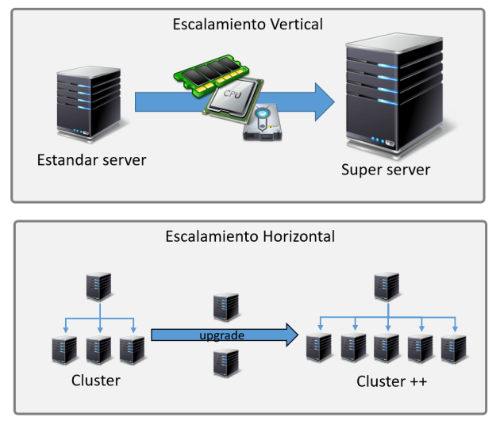
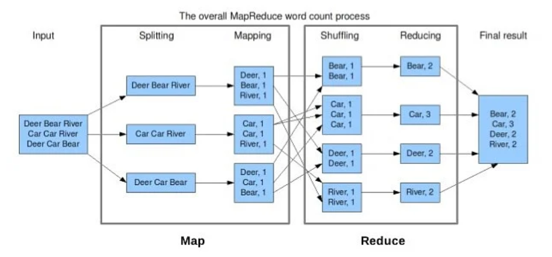
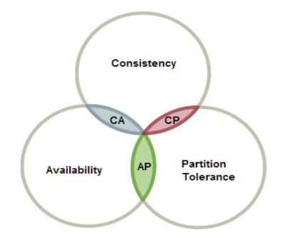
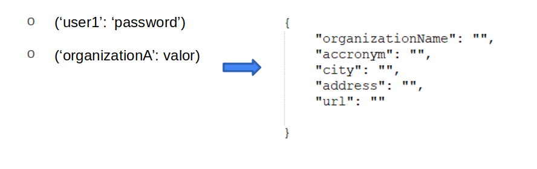
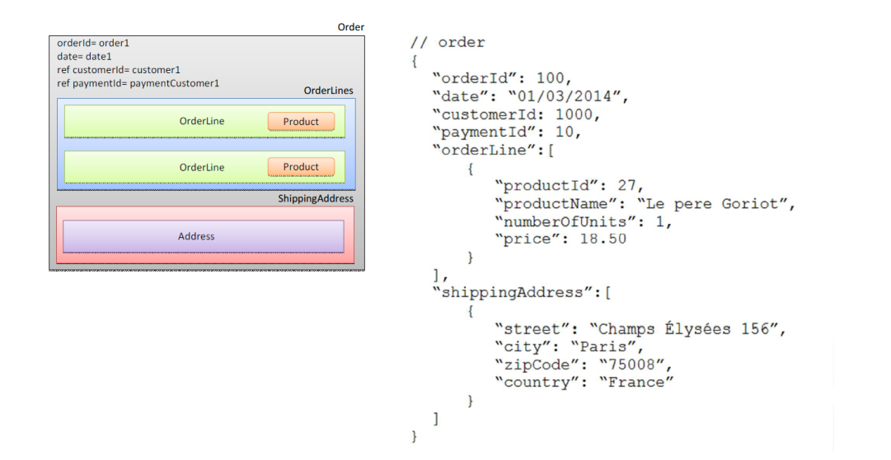
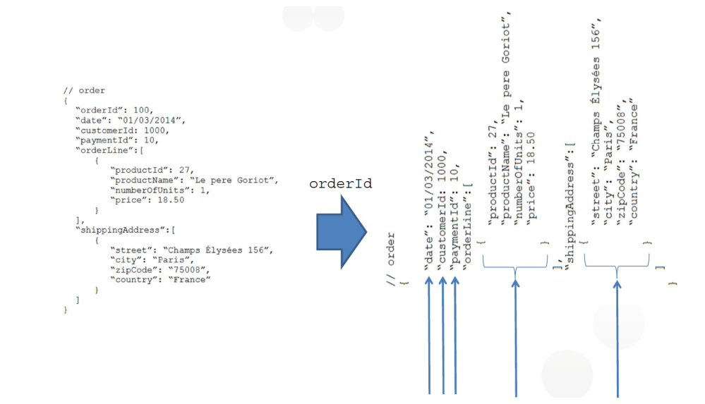

---
# Informació general del document
title: Introducció a Big Data
subtitle: 
authors: 
    - Departament d'informàtica
lang: ca
page-background: img/bg.png

# Portada
titlepage: true
titlepage-rule-height: 0
# titlepage-rule-color: AA0000
# titlepage-text-color: AA0000
titlepage-background: img/portada.png
# logo: img/logotext.png

# Taula de continguts
toc: true
toc-own-page: true
toc-title: Continguts

# Capçaleres i peus
header-left: Unitat 01 - Introducció a Big Data
header-right: Curs 2025-2026
footer-left: IES Jaume II El Just
footer-right: \thepage/\pageref{LastPage}

# Imatges
float-placement-figure: H
caption-justification: centering

# Llistats de codi
listings-no-page-break: false
listings-disable-line-numbers: false

header-includes:
     - \usepackage{lastpage}
---

# Introducció a Big Data

## Què és Big Data?

Big Data és un terme que fa referència a la gestió i anàlisi de volums de dades que, pel seu tamany, complexitat o velocitat d'entrada, no poden ser tractats de manera convencional amb eines tradicionals. Aquestes dades poden ser de diferents tipus, com ara text, imatges, àudio, vídeo, etc. 

El terme **Big Data** s'associa normalment a les anomenades "tres V" (que de vegades són 4):

- **Volum**: Fa referència a la quantitat de dades que es generen i emmagatzemen. A més quantitat, més necessitem de sistemes diferents als tradicionals.
  
- **Velocitat**: Fa referència a la rapidesa amb què es generen i es processen les dades. Amb el creixement de l'anomenat IOT (Internet de les Coses) les dades arriben quasi de manera instantània i s'han de llegir i tractar de manera igualment ràpida.
  
- **Varietat**: Fa referència a la diversitat de formats en què es poden presentar les dades. La informació pot arribar des de fonts molt diferents i amb formats diversos: text no estructurat, imatges, àudio, correus electrònics, etc.
  
- **Veracitat**: Fa referència a la qualitat de les dades. Les dades poden ser incorrectes, incompletes o no actualitzades. Això pot ser un problema a l'hora de prendre decisions basades en aquestes dades.

## Per què és important el Big Data?

El Big Data és important perquè permet a les empreses i organitzacions millorar la seva presa de decisions, ja que permet analitzar grans quantitats de dades i extreure'n coneixement. Això pot ser útil per a moltes coses, com ara:

- **Millorar la presa de decisions**: Les empreses poden utilitzar les dades per prendre decisions més informades i basades en evidències.
- **Millorar la relació amb els clients**: Les empreses poden utilitzar les dades per entendre millor les necessitats dels clients i oferir-los productes i serveis més personalitzats.
- **Millorar l'eficiència operativa**: Les empreses poden utilitzar les dades per identificar àrees on poden millorar l'eficiència i reduir els costos.
- **Identificar oportunitats de negoci**: Les empreses poden utilitzar les dades per identificar noves oportunitats de negoci i millorar la seva competitivitat.

### Exemples de sectors o situacions on és aconsellable utilitzar Big Data

El Big Data és útil en molts sectors i situacions diferents. Algunes de les àrees on el Big Data pot ser especialment útil són:

- **Salut**: El Big Data pot ser utilitzat per millorar el diagnòstic i el tractament de malalties, així com per predir epidèmies i identificar tendències de salut.
- **Finances**: El Big Data pot ser utilitzat per predir tendències del mercat, identificar oportunitats d'inversió i detectar frau.
- **Xarxes socials**: El Big Data pot ser utilitzat per analitzar el comportament dels usuaris en les xarxes socials i millorar la segmentació dels clients, identificar oportunitats de negoci, millorar la relació amb els clients o possibles clients, etc.
- **Transport**: El Big Data pot ser utilitzat per millorar la planificació del transport, predir la congestió del trànsit, optimitzar les rutes de transport, etc.
- **IoT**: El Big Data pot ser utilitzat per analitzar les dades generades per dispositius connectats a Internet i millorar la seva eficiència i seguretat, aprofitant al màxim la informació rebuda.

Això són només alguns exemples, però el Big Data pot ser útil en molts altres sectors i situacions.

## Conceptes relacionats amb Big Data

Alguns conceptes relacionats amb els sistemes de Big Data són:

- **Escalabilitat (horitzontal vs vertical)**
- **Divideix i venceràs (MapReduce)**
- **SQL vs NoSQL**
- **Cloud Computing (on premise)**

### Escalabilitat horitzontal vs vertical

- **Escalabilitat vertical**: Consisteix en augmentar la capacitat d'un sistema afegint més recursos a un únic node. Això pot ser útil per a sistemes que no poden ser dividits en parts més petites, però té un límit en la quantitat de recursos que es poden afegir a un únic node. 
  
- **Escalabilitat horitzontal**: Consisteix en augmentar la capacitat d'un sistema afegint més nodes al sistema. Això permet augmentar la capacitat del sistema de manera més flexible i escalable, ja que es poden afegir més nodes a mesura que es necessiti.

En un sistema que escala verticalment, s'han d'ampliar els components del sistema (CPU, memòria, disc dur, etc.) per augmentar la capacitat del sistema. Esta solució és cara i té límits. En canvi, en un sistema que escala horitzontalment, podem simplement afegir o treure nodes al sistema per augmentar o disminuir la seua capacitat. L'escalabilitat vertical és més econòmica i no té límits mentre puguem continuar afegint nodes. 

En general, els sistemes de Big Data utilitzen l'escalabilitat horitzontal per aconseguir la capacitat necessària per processar grans quantitats de dades.

### Divideix i vencerás (MapReduce)

**MapReduce** és un model de programació i un sistema de processament distribuït dissenyat per processar grans quantitats de dades de manera eficient. El model de programació MapReduce consisteix en dues fases:

- **Map**: En aquesta fase, les dades són dividides en parts més petites i processades de manera paral·lela i distribuïda en diferents nodes del sistema.
- **Reduce**: En aquesta fase, els resultats de la fase Map són combinats i processats per obtenir el resultat final.

El model de programació MapReduce és molt eficient per processar grans quantitats de dades de manera distribuïda i escalable. Aquest model és utilitzat en molts sistemes de Big Data, com ara Hadoop i Spark. A més permet redistribuir les dades entre les unitats de treball en cas de fallada d'un node.

### SQL vs NoSQL

- **SQL**: SQL (Structured Query Language) és un llenguatge de programació utilitzat per gestionar bases de dades relacionals. SQL és un llenguatge molt potent i flexible que permet realitzar consultes complexes i eficients sobre les dades. En general s'utilitza la categoria "bases de dades SQL" per fer referència a les bases de dades relacionals.

Exemples de bases de dades SQL: 

    - MySQL / MariaDB
    - PostgreSQL
    - Oracle
    - SQL Server

Avantatges de les bases de dades SQL:

    - Estructura de dades clara i definida
    - Permeten relacions entre les dades
    - Suport per a transaccions ACID (Atomicitat, Consistència, Aïllament, Durabilitat)
    - Suport per a consultes SQL
    - Asseguren la integritat i consistència de les dades

- **NoSQL**: NoSQL és un terme genèric que fa referència a bases de dades no relacionals. Les bases de dades NoSQL són dissenyades per gestionar grans quantitats de dades de manera eficient i escalable. S'utilitzen sovint en sistemes de Big Data per emmagatzemar i processar grans quantitats de dades. A diferència de les bases de dades SQL o relacionals, en les bases de dades NoSQL s'ofereixen diferents models de dades i no cal un esquema predefinit per establir com s'estructuran i relaciona la informació.

Exemples de bases de dades NoSQL:

    - MongoDB
    - Cassandra
    - HBase
    - Redis
    - Elasticsearch
    - CouchDB
    - Neo4j

Avantatges de les bases de dades NoSQL:

    - Escalabilitat horitzontal
    - Flexibilitat en l'emmagatzematge de dades
    - Rendiment i velocitat
    - Suport per a dades no estructurades
    - Suport per a sistemes distribuïts

Hem de tenir en compte que en les bases de dades NoSQL les dades no tenen una estructura fixa i definida, i és més complicat establir relacions entre les dades. Això pot ser un avantatge o un inconvenient segons les necessitats del projecte.

**Teorema CAP** 

El teorema CAP és un principi fonamental en el disseny de sistemes distribuïts que estableix que és impossible garantir simultàniament Consistència, Disponibilitat i Tolerància a particions en un sistema distribuït. Això significa que en un sistema distribuït només es poden garantir dos dels tres aspectes abans esmentats.

https://www.ibm.com/es-es/topics/cap-theorem

**BBDD CP (Consistency and Partition Tolerance)**

Ofereixen consistència i tolerància a la partició sacrificant la disponibilitat. Això significa que en cas de partició de la xarxa, el sistema es manté consistent, però pot ser que no estiga disponible per a totes les peticions perquè els nodes no consistents no estaran disponibles fins que se solucione el problema. Un exemple seria MongoDB.

**BBDD AP (Availability and Partition Tolerance)**

Ofereixen disponibilitat i tolerància a la partició sacrificant la consistència. Això significa que en cas de partició de la xarxa, el sistema es manté disponible per a totes les peticions, però pot ser que no estiga consistent fins que se solucione el problema perquè uns nodes poden tornar versions més antigues de les dades. Un exemple seria Cassandra.

**BBDD CA (Consistency and Availability)**

Ofereixen consistència i disponibilitat en tots els nodes. Ara bé, no funcionarà bé si hi ha una partició entre 2 o més nodes del sistema, de manera que la tolerància a la partició no està garantida. Un exemple seria una base de dades relacional.

[https://www.genbeta.com/desarrollo/nosql-clasificacion-de-las-bases-de-datos-segun-el-teorema-cap](https://www.genbeta.com/desarrollo/nosql-clasificacion-de-las-bases-de-datos-segun-el-teorema-cap)

#### Models NoSQL

Dins de les tecnologies NoSQL hi ha diferents tipus de models:

- **Document**: Aquest model emmagatzema les dades en documents en un format similar a un JSON o XML. Cada document pot tenir diferents camps i valors, i no cal un esquema predefinit per definir com s'estructuren les dades. Exemples: MongoDB, CouchDB.
- **Clau-valor**: Aquest model emmagatzema les dades en parelles clau-valor, on cada clau està associada a un valor. Aquest model és molt eficient per recuperar dades per clau. Exemples: Redis, DynamoDB.
- **Columnar**: Aquest model emmagatzema les dades en columnes en lloc de files, el que permet recuperar dades de manera eficient. Aquest model és útil per a bases de dades analítiques. Exemples: Cassandra, HBase.
- **Graf**: Aquest model emmagatzema les dades com a nodes i relacions entre els nodes. Aquest model és útil per a bases de dades que necessiten representar relacions complexes entre les dades. Exemples: Neo4j, ArangoDB.

Els tres darrers models que hem enumerat, el **Clau-valor**, el **Columnar** i el **Graf**, són **models d'agregació**.

**Models d'agregació**

Els models d'agregació se basen en la noció d'agregació: una col·lecció d'objectes/entitats relacionats que volem tractar com una única entitat a efectes de accés, manipulació, control de la consistència i concurrència, i distribució de les dades. En les bases de dades relacionals podem fer JOIN per recuperar informació de les diferents taules on està la informació que hem repartit entre elles. En les bases de dades NoSQL, com no tenim relacions, hem de fer servir models d'agregació per aconseguir el mateix efecte. 

**Tècniques d'agregació més comuns**

- **Embedding**: En aquest model, les dades relacionades s'emmagatzemen juntes en un únic document. Això permet recuperar les dades relacionades amb una sola consulta. Aquest model és útil per dades que es consulten juntes amb freqüència.
- **Referencing**: En aquest model, les dades relacionades s'emmagatzemen en documents separats i s'estableixen relacions entre els documents mitjançant referències. Això permet gestionar les dades relacionades de manera independent i mantenir la consistència de les dades. Aquest model és útil per dades que es consulten de manera independent.

El model **Clau-valor** també se considera un model d'agregació. La clau s'extreu del domini de l'aplicació (un nom d'usuari, una adreça de correu electrònic, un NIF...), mentre que el valor associat en general pot agafar qualsevol format (pot ser un bloc de dades, una col·lecció, un objecte...) i la seua interpretació serà responsabilitat de l'aplicació.

**Model d'agregació documental** 

És com una extensió del model **Clau-valor**. Els documents tenen una estructura interna (document) que en general estarà formada per combinacions d'estructures **Clau-valor**. Una estructura així facilita l'accés a les dades des de les aplicacions, però és menys flexible que el model **Clau-valor** pur ja que les dades estan més estructurades. A més, les consultes són més complexes.

Exemples d'este model són **CouchDB** o **Elastic**.

Veiem per exemple un carro de la compra utilitzant un model documental:

**Model d'agregació per columnes**

Apareix agafant com a precursor el **model BigTable de Google**. El model té forma de matriu, però no a l'estil d'una base de dades relacional. Ací les files són agregacions de dades accessibles mitjançant una clau, i les columnes representen atributs de l'agregació en format tripleta nom-valor-timestamp. D'alguna manera és com girar 90 graus a l'esquerra un model documental. 

És un model eficient en sistemes distribuïts, ja que permet distribuir les dades per columnes i no per files. Això permet escalar les dades de manera independent i distribuïda. Un exemple d'este model és **Cassandra**.

**Avantatges dels models d'agregació**

- **Eficiència**: Permeten recuperar les dades relacionades amb una sola consulta, el que millora el rendiment de l'aplicació.
- **Escalabilitat**: Permeten escalar les dades relacionades de manera independent i distribuïda.

**Problema dels models d'agregació**

El principal problema és que poden haver objectes repartits entre diferents agregats. Hem de prendre mesures per garantir la consistència de les dades en aquests casos.

### Cloud Computing (on premise)

El **Cloud Computing** és un model de distribució de recursos informàtics que permet l'accés a serveis i recursos a través d'Internet. Aquest model ofereix una gran flexibilitat i escalabilitat, ja que els recursos es poden ajustar segons les necessitats de l'usuari.

En el context del Big Data, el Cloud Computing juga un paper important. Les empreses i organitzacions que treballen amb grans volums de dades poden utilitzar el Cloud Computing per emmagatzemar, processar i analitzar aquestes dades de manera eficient i escalable. En el cas de Cloud de tercers, el proveïdor de serveis Cloud es fa càrrec de la infraestructura i els recursos necessaris per processar les dades, la qual cosa permet a les empreses centrar-se en l'anàlisi de les dades i la presa de decisions. El cost inicial no és molt alt i l'obsolescència i la escalabilitat són responsabilitat del proveïdor.

El Cloud Computing utilitza normalment un núvol de tercers. Tot i això, una opció popular en el Cloud Computing és el model "on premise". Aquest model permet a les empreses tenir els seus propis servidors físics i infraestructura de Cloud Computing dins de les seves pròpies instal·lacions. Això ofereix un major control i seguretat sobre les dades, ja que no es depèn de tercers per gestionar-les. L'escalabilitat pot ser vertical (afegir més recursos a un únic node) o també horitzontal (comprar més servidors). El cost inicial és més alt que en el model de núvol públic, encara que a llarg termini pot ser més econòmic en certs casos perquè no se paga per ús una vegada feta la inversió inicial.

Utilitzar el Cloud Computing "on premise" en el context del Big Data permet a les empreses tenir un accés ràpid i eficient a les seves dades, així com una gran capacitat de processament i emmagatzematge. A més, aquest model permet una millor integració amb altres sistemes i aplicacions empresarials. El model ofereix flexibilitat, escalabilitat i control sobre les dades.

## Tipus de dades

Quan treballem amb tecnologies Big Data podem fer ús de dades que arriben des de diferents fonts i en diferents formats. En general, podem classificar les dades d'entrada en dues categories principals: **estructurades**, **semiestructurades** i **no estructurades**.

### Dades estructurades

Les dades estructurades són dades de les quals coneixem el format. No necessàriament han de ser bases de dades relacionals, podem ser no relacionals amb un format definit i fixe, fulls de càlcul, documents XML o JSON, etc.

### Dades semiestructurades

Les dades semiestructurades són dades que tenen certa estructura i format, però eixe format pot variar d'un element a un altre. Un exemple d'aquest tipus de dades són els documents XML o JSON, on cada element pot tenir diferents camps i valors.

### Dades no estructurades

Les dades no estructurades són dades de les quals no coneixem el format. Poden ser imatges, àudio, vídeo, text sense format fixe, etc.

## Utilització de les dades

### Hipòtesis de causalitat

Les hipòtesis de causalitat són afirmacions que estableixen una relació de causa-efecte entre dos o més variables. Aquestes hipòtesis són importants per entendre com les dades estan relacionades i com podem utilitzar-les per prendre decisions.

Les hipòtesis de causalitat s'utilitzen en estadística. Se validen o se rebutjen en funció de les anàlisis fetes a diferents mostres de dades, i dels resultats que s'hagen obtés.

Un exemple: 

### Anàlisi predictiu

L'anàlisi predictiu és una tècnica que utilitza dades històriques per predir resultats futurs. Aquesta tècnica s'utilitza en molts àmbits, com ara el màrqueting, la salut, les finances, etc. L'anàlisi predictiu es basa en algoritmes d'aprenentatge automàtic i intel·ligència artificial per predir resultats futurs a partir de dades històriques.

En Intel·ligència Artificial en general no se formulen hipòtesis, sino que se busquen correlacions, tendències o patrons. 

### Anàlisi descriptiu

L'anàlisi descriptiu és una tècnica que utilitza dades per descriure i resumir les característiques d'una població o mostra. Aquesta tècnica s'utilitza per entendre millor les dades i identificar tendències, patrons i relacions entre les dades.

## Tipus de processament

Per processar les dades tenim dos formes principals de fer-ho: **batch processing** i **stream processing**.

### Batch processing

El **batch processing** és un mètode de processament en què les dades són processades en blocs o lots. Aquest mètode és útil per processar grans quantitats de dades de manera eficient i escalable. Els processos de batch processing són normalment planificats i executats en intervals regulars, com ara cada dia o cada setmana, en forma de tasques programades.

Algunes característiques principals del **batch processing**:

- No requereix interacció amb els usuaris
- És ideal per a tasques repetitives i previsibles
- És útil per processar grans quantitats de dades
- Pot ser més eficient que el processament en temps real per a tasques que no requereixen una resposta immediata
- S'executa regularment (cada x temps, una vegada al dia, etc.)

Un exemple de **batch processing** podria ser l'enviament de correus electrònics automàtics a tots els clients que han realitzat una compra en una botiga en línia cada dia a les 12:00, una felicitació d'aniversari a tots els clients que compleixen anys cada dia a les 9:00, etc.

### Stream processing

El **stream processing** és un mètode de processament en què les dades són processades a mesura que arriben. Aquest mètode és útil per processar dades en temps real i respondre ràpidament a canvis en les dades. Els processos de stream processing són normalment continuats i en temps real, i poden ser utilitzats per a tasques com ara la detecció d'anomalies, la monitorització de sistemes, la generació de recomanacions, etc.

Característiques principals:

- Les dades són processades a mesura que arriben
- Les dades s'estan processant continuament
- És útil per a tasques que requereixen una resposta immediata

Un exemple de **stream processing** podria ser la detecció d'anomalies en temps real en un sistema de control de trànsit, la generació de recomanacions en temps real en una botiga en línia, la recepció i anàlisi d'informació que arriba via MQTT, etc.

> MQTT és un protocol de missatgeria que s'utilitza per a la comunicació entre dispositius IoT. Aquest protocol permet enviar i rebre missatges en temps real i és molt eficient per a la comunicació entre dispositius connectats a Internet. Més informació a [https://mqtt.org/](https://mqtt.org/).