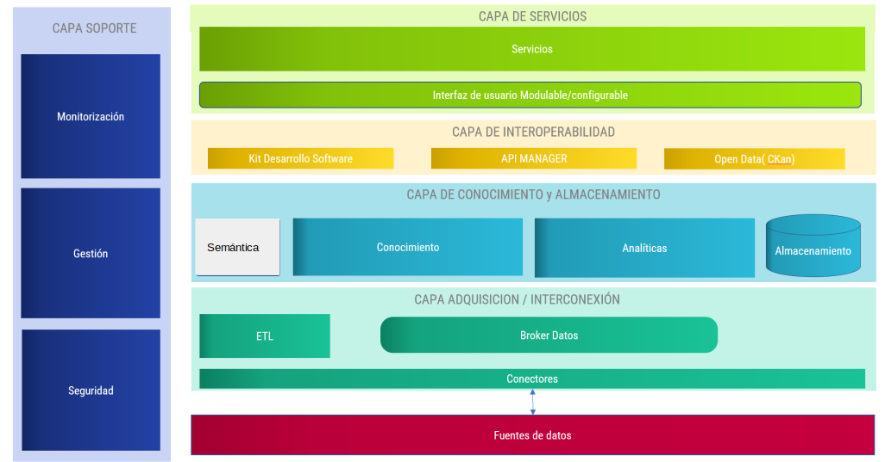
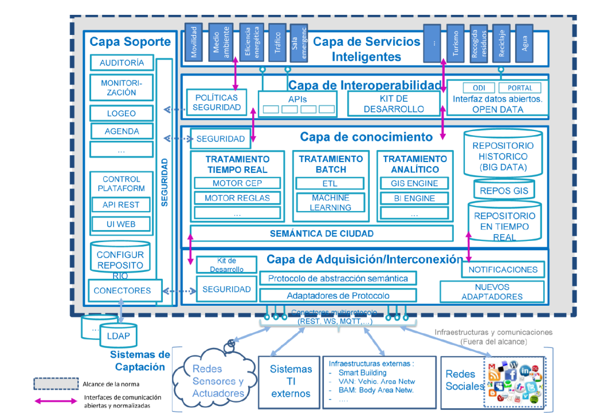
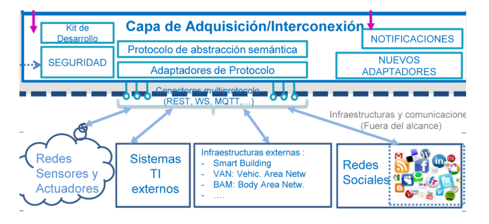
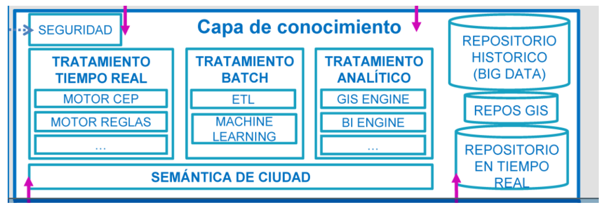
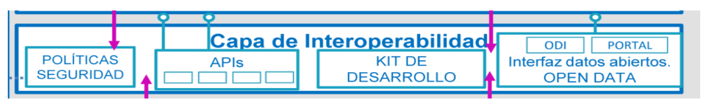
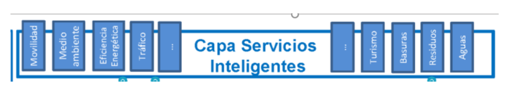
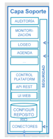
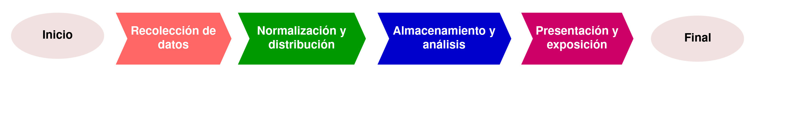

---
# Informació general del document
title: Elements i arquitectura Big Data
subtitle: 
authors: 
    - Departament d'informàtica
lang: ca
page-background: img/bg.png

# Portada
titlepage: true
titlepage-rule-height: 0
# titlepage-rule-color: AA0000
# titlepage-text-color: AA0000
titlepage-background: img/portada.png
# logo: img/logotext.png

# Taula de continguts
toc: true
toc-own-page: true
toc-title: Continguts

# Capçaleres i peus
header-left: Unitat 02 - Elements i arquitectura Big Data
header-right: Curs 2025-2026
footer-left: IES Jaume II El Just
footer-right: \thepage/\pageref{LastPage}

# Imatges
float-placement-figure: H
caption-justification: centering

# Llistats de codi
listings-no-page-break: false
listings-disable-line-numbers: false

header-includes:
     - \usepackage{lastpage}
---

# Elements i arquitectura d'una plataforma Big Data

## Plataformes Big Data

Una **Plataforma Big Data** és un sistema capaç de gestionar i processar grans volums de dades. Algunes característiques importants (encara que no imprescindibles) d'una plataforma Big Data són:

- Computació en temps real
- Escalabilitat (Cloud Computing, processament distribuït)
- Utilització de solucions de Intel·ligència Artificial per fer simulacions i predicció de resultats
- Suport de múltiples fonts i tipus de dades (estructurades, semiestructurades i no estructurades)
- En general, basada en tecnologies de codi obert i en certs estàndards

**Hadoop** està considerada com la primera plataforma Big Data generalista. Va ser creada per Yahoo! i està basada en el paper de Google sobre el sistema de fitxers distribuït **GFS** i el sistema de processament de dades **MapReduce**.

[Més informació sobre Hadoop](https://hadoop.apache.org/)

## Arquitectura Big Data

Un model informacional tradicional en una organització es basa en una arquitectura de quatre capes:

- **Sistemes operacionals**: una pàgina web, un ERP, un CRM, etc. Qualsevol font de dades de l'organització.
- **ETL**: procés d'extracció, transformació, neteja i càrrega de dades.
- **Sistemes informacionals**: datawarehouses, datamarts, etc. Bases de dades en general.
- **Eines d'anàlisi i visualització**: eines de BI, dashboards, informes, etc.

Les arquitectures Big Data venen a solucionar alguns dels problemes dels sistemes tradicionals, com ara:

- La dificultat per a gestionar grans volums de dades.
- La dificultat per a gestionar dades no estructurades.
- La dificultat per a gestionar dades en temps real.
- La dificultat per a integrar dades de múltiples fonts.

Una arquitectura **Big Data**, com veurem a continuació, està formada per diferents capes que permeten gestionar i processar grans volums de dades. El concepte de **Data Warehouse** evoluciona cap al concepte de **Data Lake**, on es poden emmagatzemar dades en el seu format original (estiguen estructurades o no), sense necessitat de transformar-les prèviament. Això permet una major flexibilitat i agilitat en el processament de les dades. El processament o la transformació de les dades se pot fer en el moment que es necessiten, i no abans.

Eixa transformació de l'emmagatzematge de les dades, juntament amb les diferents tècniques i eines de processament de dades específiques per a Big Data, permeten una gestió més eficient, àgil i escalable.

## On-premise vs Cloud

Les plataformes Big Data es poden implementar de dues maneres principals:

- **On-premise**: La plataforma es desplega en els servidors de l'organització. Aquesta opció permet un major control sobre les dades i la seguretat, però requereix una inversió inicial més gran i un manteniment continu.
- **Cloud**: La plataforma es desplega en servidors al núvol. Aquesta opció permet una major escalabilitat i flexibilitat, ja que es poden afegir o eliminar recursos segons les necessitats. A més, no requereix una inversió inicial tan gran, ja que es paga per ús.
- **Híbrida**: Una combinació de les dues opcions anteriors. Algunes dades es poden emmagatzemar i processar en els servidors de l'organització, mentre que altres dades es poden emmagatzemar i processar en el núvol. Aquesta opció permet un major control sobre les dades més sensibles, mentre que es pot aprofitar la flexibilitat i escalabilitat del núvol per a altres dades.

Segur que heu escoltat conceptes com:

- **IaaS (Infrastructure as a Service)**: Proveïment d'infraestructura informàtica (servidors, emmagatzematge, xarxes, etc.) com un servei. L'organització gestiona el sistema operatiu, les aplicacions i les dades.
- **PaaS (Platform as a Service)**: Proveïment d'una plataforma informàtica (sistemes operatius, bases de dades, entorns de desenvolupament, etc.) com un servei. L'organització només gestiona les aplicacions i les dades.
- **SaaS (Software as a Service)**: Proveïment d'aplicacions informàtiques (CRM, ERP, etc.) com un servei. L'organització només gestiona les dades.

## Capes d'una arquitectura Big Data

Una arquitectura Big Data està formada per diferents capes que permeten gestionar i processar grans volums de dades. Algunes de les capes més importants d'una arquitectura Big Data són:

- **Capa d'adquisició i interconnexió**: Capa encarregada de recollir les dades des de les seves fonts d'origen.
- **Capa de coneixement i emmagatzematge**: Capa encarregada de guardar les dades i generar analítiques a partir d'elles.
- **Capa de interoperabilitat i integració**: Capa encarregada de connectar els diferents components de la plataforma Big Data.
- **Capa de serveis**: Capa encarregada d'oferir serveis a través d'una API, generalment.
- **Capa de suport**: Capa encarregada de donar suport als diferents components de la plataforma Big Data, gestionant aspectes com ara la seguretat, la monitorització, etc.

Un esquema visual d'una arquitectura Big Data es pot veure a la figura següent:

### Capa d'adquisició i interconnexió

La **capa d'adquisició i interconnexió** és la capa encarregada de recollir les dades des de les seves fonts d'origen utilitzant protocols de comunicació comuns. En aquesta capa també se fa la transformació de les dades, si és necessari, per a que quan entren a la plataforma ho facen amb el format establert. Aquesta capa pot incloure diferents components, com ara:

- **Connectors**: Components encarregats de connectar amb les diferents fonts de dades.
- **Transformadors**: Components encarregats de transformar les dades a un format comú.
- **Validadors**: Components encarregats de validar les dades abans de ser processades.

### Capa de coneixement i emmagatzematge

La **capa de coneixement i emmagatzematge** és la capa encarregada de guardar les dades en diferents sistemes gestors d'informació, i també, si cal, de generar analítiques a partir d'elles utilitzant tècniques d'IA, regles, alertes, etc.

### Capa d'interoperabilitat i integració

La **capa d'interoperabilitat i integració** és la capa encarregada de connectar els diferents components de la plataforma Big Data, oferint interfícies o connectors que permeten l'accés a les dades de la plataforma. Així, podem construir serveis intel·ligents, connectar uns sistemes amb altres, o bé preparar les dades per exposar-les a l'exterior. 

### Capa de serveis

La **capa de serveis** ofereix diferents serveis a través d'una API, com ara serveis d'anàlisi de dades, serveis de predicció, serveis de recomanació, etc. Aquests serveis poden ser consumits per altres sistemes o per l'usuari final. Se poden fer ús de components com ara:

- **APIs**: Interfícies de programació d'aplicacions que permeten l'accés als serveis de la plataforma.
- **Dashboards**: Interfícies gràfiques que permeten visualitzar les dades i els resultats obtinguts.
- **GIS**: Sistemes d'informació geogràfica que permeten visualitzar les dades en un mapa.
- **Alarmes**: Serveis que permeten enviar alarmes en funció de regles definides.
- **Recomanadors**: Serveis que permeten fer recomanacions en funció de les dades disponibles.

### Capa de suport

La **capa de suport** és la capa encarregada de donar suport als diferents components de la plataforma Big Data, gestionant aspectes com ara la seguretat, la monitorització, la gestió de l'escalabilitat, etc. Es tracta d'una capa transversal a tota la plataforma, la qual permet gestionar i administrar. Per exemple, pot incloure funcionalitats com ara: 

- **Seguretat**: Gestió de l'accés a les dades i als serveis de la plataforma. Pot incloure la comprovació i autorització de les diferents fonts de dades i usuaris.
- **Monitorització i auditoria**: Control de l'estat dels diferents components de la plataforma. L'auditoria permet registrar les accions realitzades pels usuaris i els sistemes.
- **Gestió de l'escalabilitat**: Gestió de la capacitat de processament i emmagatzematge de la plataforma. Per exemple, pot incloure la gestió de la càrrega de treball i la distribució de les dades.
- **Gestió de l'administració**: Gestió dels usuaris, dels permisos, dels logs, etc. 

Ara que ja hem vist les diferents capes i les seues funcions, podem mostrar un esquema més detallat d'una plataforma Big Data:

Les diferents capes:

**Capa d'adquisició**

**Capa de coneixement i emmagatzematge**

**Capa d'interoperabilitat i integració**

**Capa de serveis**

**Capa de suport**

## Flux i qualitat de les dades

El flux de dades en el context de Big Data es refereix al moviment de dades des del seu origen fins al seu destí. Les dades, i el seu processament, és la part més important d'un sistema Big Data. La qualitat de les dades és imprescindible per a obtenir resultats fiables, correctes i útils.

### Fases del flux de dades

1. **Ingestió de dades**: Procés d'adquisició de dades des de les seves fonts d'origen. Aquestes dades poden ser estructurades, semiestructurades o no estructurades.

2. **Normalització de dades**: Procés de transformació de les dades per a que siguin compatibles amb el sistema de gestió de dades. Dins del procés de normalització podem també trobar la neteja de dades. La neteja consisteix en la identificació i correcció d'errors en les dades. La normalització de dades també pot incloure la transformació de les dades a un format comú.

3. **Distribució de dades**: Procés de distribució de les dades en els diferents nodes del sistema de processament.

4. **Emmagatzenament i anàlisi de les dades**: Procés de guardar les dades en un sistema de fitxers distribuït i processar-les per a obtenir resultats.

5. **Presentació i exposició de les dades**: Procés de visualització i exposició de les dades per a que siguin comprensibles pels usuaris i/o accessibles per altres sistemes.

Un esquema resumit de les diferents fases del flux de dades es pot veure a la figura següent:

#### Ingesta de dades

La **ingesta de dades** és el procés d'adquisició de dades des de les seves fonts d'origen. Les dades poden ser, com hem vist, estructurades, semiestructurades o no estructurades. Les dades poden provenir de diferents fonts, com ara:

- Bases de dades relacionals
- Fitxers de text
- Fitxers de logs
- Sensors
- Xarxes socials
- etc.

La **ingesta de dades** ha de complir amb els protocols de seguretat i privacitat establerts en les diferents fonts de dades. S'han de seguir els protocols de comunicación definits en cada cas. La ingesta de dades pot ser en temps real o en batch, com s'ha comentat abans.

#### Normalització de dades

Les dades recollides s'han de normalitzar per a que siguin compatibles amb el sistema de gestió de dades. La normalització de dades pot incloure la neteja de dades, la transformació de dades a un format comú i la identificació de dades duplicades.

Hi ha estàndars, com ara **NGSI**, que defineixen com s'han de normalitzar les dades per a que siguin compatibles amb els sistemes de gestió de dades. **NGSI** és un protocol que utilitzen les APis dels components **FIWARE** per a normalitzar les dades. **FIWARE** és una plataforma d'arquitectura oberta que permet la creació de solucions ***IoT*** i ***Smart City***.

#### Distribució de dades

Les dades normalitzades s'han de distribuir en els diferents nodes del sistema de processament. La distribució de dades es pot fer de forma centralitzada o distribuïda. En sistemes distribuïts, com ara **Hadoop**, les dades es distribueixen en els diferents nodes del sistema de processament.

#### Emmagatzematge i anàlisi de dades

Les dades, una vegada normalitzades, s'emmagatzemen en el repositori de la plataforma corresponent. Diferents sistemes analítics poden processar les dades per a obtenir resultats. Els resultats poden ser guardats en el repositori o exposats a través d'una API. En el processament se poden buscar anomalies en funció de regles definides, alarmes, tendències, etc. Aplicant models de IA es poden fer prediccions, recomanacions, o generar nou coneiximent.

#### Presentació i exposició de les dades

Els resultats obtinguts en el procés d'anàlisi de dades es poden visualitzar i exposar a través d'una interfície gràfica. Les dades també es poden exposar a través d'una API per a que altres sistemes puguin accedir-hi. La presentació i exposició de les dades ha de ser el més intuïtiva possible, clara i comprensible per a l'usuari final. L'objectiu éś facilitar la presa de decisions basada en les dades i la gestió dels diferents serveis que s'ofereixen a partir de les dades resultants de l'anàlisi.

### Qualitat de les dades

La qualitat de les dades es pot mesurar en funció de diferents aspectes:

- **Precisió**: Les dades són correctes i exactes?
- **Integritat**: Les dades són coherents i consistents?
- **Consistència**: Les dades són uniformes i homogènies?
- **Actualitat**: Les dades són actuals i vigents?
- **Completitud**: Les dades són completes i no hi ha valors en blanc?
- **Usabilitat**: Les dades són fàcils d'entendre i utilitzar?