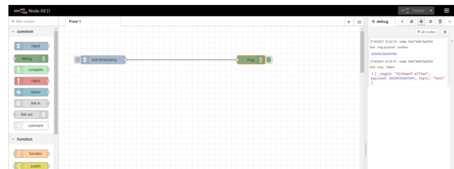
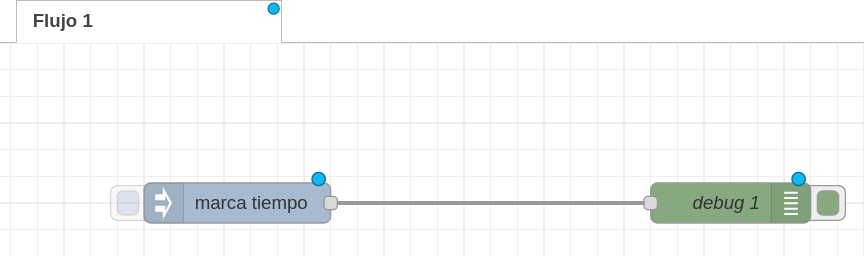
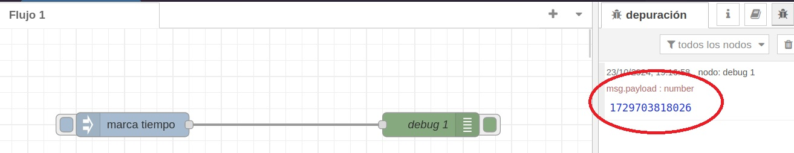
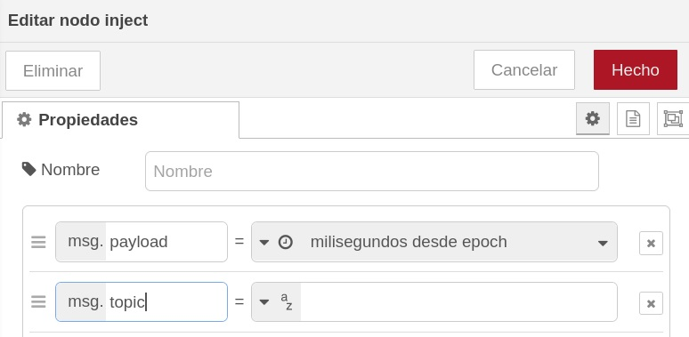
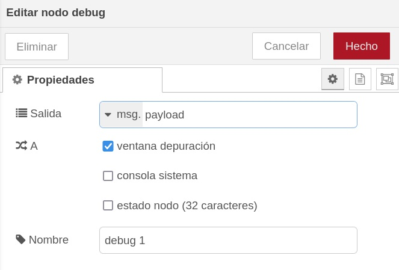
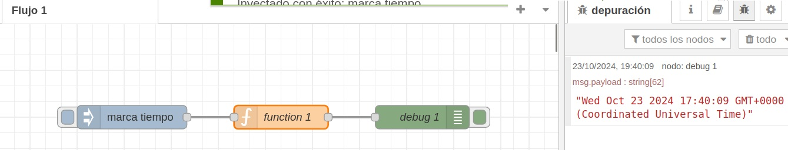
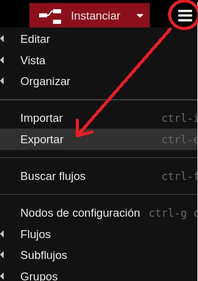
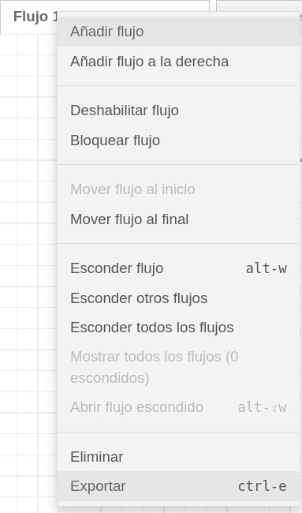
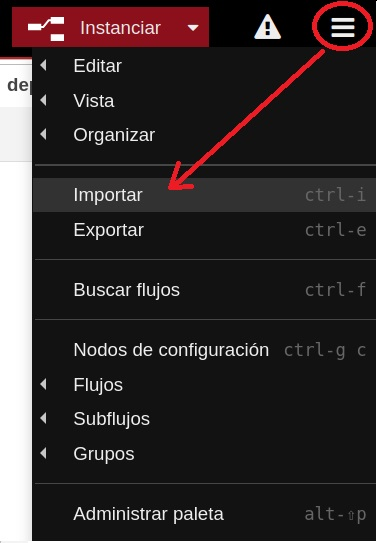
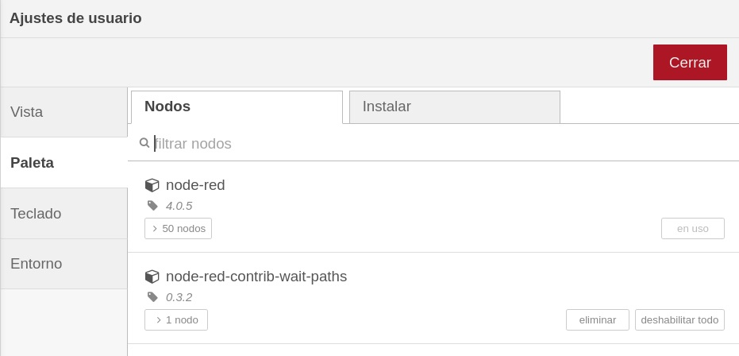

---
# Informació general del document
title: Introducció a Node-RED
subtitle: 
authors: 
    - Departament d'informàtica
lang: ca
page-background: img/bg.png

# Portada
titlepage: true
titlepage-rule-height: 0
# titlepage-rule-color: AA0000
# titlepage-text-color: AA0000
titlepage-background: img/portada.png
# logo: img/logotext.png

# Taula de continguts
toc: true
toc-own-page: true
toc-title: Continguts

# Capçaleres i peus
header-left: Unitat 04.1 - Introducció a Node-RED
header-right: Curs 2025-2026
footer-left: IES Jaume II El Just
footer-right: \thepage/\pageref{LastPage}

# Imatges
float-placement-figure: H
caption-justification: centering

# Llistats de codi
listings-no-page-break: false
listings-disable-line-numbers: false

header-includes:
     - \usepackage{lastpage}
---


# Node-RED

**Node-RED** es una eina de programació visual (de les anomenades "no-Code", encara que en este cas seria millor "low-Code") que permet connectar dispositius de hardware, APIs i serveis en línia. Es basa en la programació amb blocs, on cada bloc realitza una tasca específica. Aquests blocs són anomenats **nodes** i es poden connectar entre ells per crear un flux de dades. És open-source i està desenvolupat inicialment per IBM.


Informació en GitHub: [Node-RED en GitHub](https://github.com/node-red/node-red)

Pàgina oficial: [Pàgina oficial de Node-RED](https://nodered.org/)

Documentació: [Documentació de Node-RED](https://nodered.org/docs/)

## Instal·lació en Linux

Anem a veure els passos per instal·lar Node-RED en un sistema Linux. De totes formes en principi anem a treballar amb un Node-RED en Docker per evitar problemes de compatibilitat, versions, etc.

Per a instal·lar Node-RED, primer cal tenir instal·lat **Node.js**. Si no el tenim instal·lat, podem descarregar-lo des de la pàgina oficial: [Descarregar Node.js](https://nodejs.org/es/download)

Podem comprobar si tenim NodeJS instal·lat, així com el gestor de paquets ***npm***, amb les següents comandes:

```bash
node -v
npm -v
```

Una vegada tenim instal·lat ***node*** i ***npm***, podem instal·lar Node-RED amb la següent comanda:

```bash
sudo npm install -g --unsafe-perm node-red
```

Per a executar Node-RED, simplement cal executar la comanda:

```bash
node-red
```

## Instal·lació en Windows

Podeu trobar les instruccions per instal·lar Node-RED en Windows en la pàgina oficial de l'aplicació.

[Node-RED en Windows](https://nodered.org/docs/getting-started/windows)

## Instal·lació en Docker

Per a instal·lar Node-RED en un contenidor Docker, tenim 2 opcions:

- directament:

```bash
docker run -it -p 1880:1880 -v node-red-data:/data --name nodeRED nodered/node-red
```

- utilitzant docker-compose, crearem un arxiu `docker-compose.yml` amb el següent contingut:
   
```yaml
services:
   node-red:
      image: nodered/node-red:latest
      container_name: nodeRED
      restart: unless-stopped
      networks:
         - net
      ports:
         - "1881:1880"
      volumes:
         - "./node-red-data:/data"

networks:
   net:
      driver: bridge
```

(per evitar problemes de tabulacions, espais, etc. quan copieu i pegueu, teniu l'arxiu `docker-compose.yml` pujat a Aules)

Ara, com ja sabeu, per crear i alçar el contenidor haurem de fer, la primera vegada i en la mateixa carpeta on tenim el `docker-compose.yml`:
   
```bash
docker-compose up -d
```

A partir d'ahí, podem parar el contenidor i tornar-lo a iniciar amb `docker start nodeRED` i `docker stop nodeRED`.

## Interfície de Node-RED

Una vegada feta la instal·lació, per comprovar que tenim Node-RED funcionant intentarem accedir amb el navegador al port que hem mapejat, en este cas el 1881:

**En Linux**:
   
```
http://localhost:1881
```
o també:

```
http://172.17.0.1:1881
```

**En Windows**:

```
http://<IP_del_PC>:1881
```

o també:

```http://localhost:1881
```

i si no funciona amb localhost en Windows, recordeu que podeu provar:

```
http://host.docker.internal:1881
```

Si tot ha anat bé, ens hauria de mostrar la interfície de Node-RED.



Si Node-RED no arranca i ens mostra errors de permisos, mireu amb quin usuari ha creat la carpeta compartida. Potser ho ha fet com a root, i després el vostre usuari no té permisos per a escriure en ella. En aquest cas, caldrà canviar els permisos de la carpeta o modificar el nostre fitxer `docker-compose.yml` perquè l'usuari siga el nostre i no root:
   
   ```yaml
   services:
      node-red:
         image: nodered/node-red:latest
         container_name: nodeRED
         restart: unless-stopped
         networks:
            - net
         ports:
            - "1881:1880"
         volumes:
            - "./node-red-data:/data"
         user: "1000:1000"
   ```

La línia `user: "1000:1000"` significa que l'usuari que crearà la carpeta compartida serà el que tinga l'ID 1000 i el grup també 1000. Per a saber quin és el vostre ID d'usuari, podeu fer `id -u` i per al grup `id -g`.


## Components de Node-RED

Node-RED es basa en 3 components principals:

- **Flows**: Són els programes que creem amb Node-RED. Estan formats per nodes connectats entre ells.
- **Nodes**: Són els blocs que realitzen tasques específiques. Podem trobar nodes per interactuar amb dispositius de hardware, per connectar-se a serveis en línia, per realitzar càlculs, per afegir funcions en JavaScript, per connectar a bases de dades, etc.
- **Dashboard**: És un node especial que ens permet crear una interfície web per a controlar els nostres programes.

En la pantalla principal podem veure 3 seccions:

- a la part esquerra, una paleta on trobem tots els nodes disponibles per a ser utilitzats.
- a la part central, la zona de treball on podem crear els nostres programes. És l'anomenat **Flow Editor**, i allí crearem els nostres fluxes.
- a la part dreta, tenim la informació dels nodes seleccionats, així com la consola de debug i altres opcions de configuració.

## Nodes

Un **node** es un bloc bàsic que fa una tasca específica i, moltes vegades, predeterminada. Els nodes se connecten entre ells per a crear un flux de dades. Com hem comentat, els nodes disponibles podem trobar-los en la paleta de la part esquerra de la interfície. De totes formes, més endavant veurem que podem instal·lar més nodes per a ampliar les funcionalitats de Node-RED.

Els nodes poden posar-se en funcionament per algun event extern, o perquè reben un missatge d'un altre node. A la seua vegada, poden generar un nou missatge que serà enviat a un altre node. Un node pot tindre un port d'entrada i un o més ports d'eixida. 

En general crearem els nodes arrosegant-los des de la paleta fins a la zona de treball, i connectant-los entre ells amb les fletxes que apareixen quan arrossegem una fletxa des d'un port d'eixida a un port d'entrada.

Per exemple, anem a fer un flux amb un node de tipus "inject", i un altre de tipus "debug". Després els connectarem entre ells. 



Si se fixeu, veureu un xicotet punt blau en cada node. Això vol dir que el flux no està guardat (desplegat). Per a guardar el flux, cal fer clic en el botó de la part superior dreta, on diu "Deploy" o "Instanciar". Veureu que els punts blaus desapareixen.

Alguns nodes, com el de tipus "inject", tenen un botó a l'esquerra que serveix per posar-lo en marxa si no està associat a cap event extern o a cap altre node. En el nostre exemple, si fem clic en el botó de l'inject, se posa en marxa el flux. En principi no veurem que haja passat res, però si en la part de l'esquerra anem al botó de debug i fem clic, veurem el resultat del flux. En este cas, un número que representa el timestamp del moment en què s'ha executat el flux.



### Missatges i Payload

Els nodes de Node-RED es comuniquen entre ells enviant missatges. Un missatge està compost per 3 parts principals:

- **msg.payload**: És la informació continguda en el missatge
- **msg.topic**: És el tema del missatge
- **msg.*any other property***: Podem afegir altres propietats al missatge

El **payload** és la informació principal que es transmet entre els nodes. Per exemple, si tenim un node que llegeix un sensor de temperatura, el valor de la temperatura seria el payload. El **topic** és una cadena de text que ens permet classificar els missatges. Per exemple, si tenim un node que llegeix un sensor de temperatura, el topic podria ser "temperatura".

Si fem clic en el node d'injecció, veurem que podem modificar el tipus de missatge que envia. Per defecte, envia un timestamp amb la data i hora actuals, que eś el número que ens mostra al fer el debug. Però podem canviar-ho per a que envie un missatge de tipus string, un número, un booleà, etc. modificant el camp "Payload" del missatge.



Si fem  clic en el node de debug, veurem que té una propietat ***Salida*** que per defecte mostrarà el payload que li passa el node anterior.



Si en lloc de mostrar el timestamp tal qual volem mostrar la data i hora en format llegible, podem afegir un node de tipus **function** entre l'inject i el debug. Aquest node ens permetrà modificar el missatge abans de passar-lo al node de debug. Per exemple, podem utilitzar el següent codi per a convertir el timestamp en una data i hora llegible:

```javascript
var date = new Date(msg.payload);
msg.payload = date.toString();
return msg;
```

Si torneu a fer el deploy i executeu el flux, haurieu de veure la data en un format més llegible.




## Importar i exportar fluxos

Node-RED ens permet importar i exportar els nostres fluxos. Això ens permet compartir els nostres programes amb altres persones, així com fer còpies de seguretat dels nostres programes. Els fluxos són exportats en format JSON, i podem importar-los des de la interfície de Node-RED.

Per a exportar un flux, cal fer clic en el botó de la part superior dreta, i seleccionar ***Exportar***. Això ens mostrarà una finestra on podem seleccionar què volem exportar. Podem exportar tot el flux, només la selecció actual, o només un node.



També podem exportar un flux fent clic amb el botó dret del ratolí sobre el flux, el grup o el node que volem exportar, i seleccionant ***Exportar***.



Per a importar un flux prèviament guardat en format JSON, fem clic en el menú de la part superior dreta i seleccionem l'opció ***Importar***. Haurem de seleccionar el fitxer JSON que conté el flux que volem importar i ens crearà un flux nou en la zona de treball amb els nodes importats.



## Nodes addicionals

Node-RED permet instal·lar nodes addicionals per a ampliar les funcionalitats de l'aplicació. Per a fer-ho, cal anar a la paleta de la part esquerra de la interfície i fer clic en el botó de la part superior dreta, on diu ***Manage palette*** o ***Administrar paleta***. Això ens obrirà una finestra on podem veure els nodes que tenim instal·lats (pestanya ***Nodos***), així com els que podem instal·lar (pestanya ***Instalar***). Per a instal·lar un node, cal anar a la pestanya ***Install*** o ***Instalar*** i buscar el node que volem instal·lar. Un cop trobat, fem clic en el botó ***Install*** i el node serà instal·lat. A partir d'ara, el node estarà disponible en la paleta de nodes que tenim a la part esquerra de la pantalla de treball.




### Exercici 01

Intenteu fer un "Hola, mundo!". Recordeu que per veure el missatge haureu de tindre un node de debug, fer clic en el botó de debug que teniu a la part dreta de la pantalla, i llançar el primer node manualment. 

Modifiqueu el flux anterior per a que mostre també, a més del "Hola, mundo!" la data actual. 


### Exercici 02

* Descarregueu el flux ***Basic nodes operations*** que trobareu a Aules i importeu-lo al vostre NodeRED.

* Intenteu fer el desplegament del flux. Vos donarà un error perquè el flux importat inclou nodes que no teniu instal·lats.

* Intenteu instal·lar els nodes que falten i torneu a fer el desplegament a veure si ja no dona error.