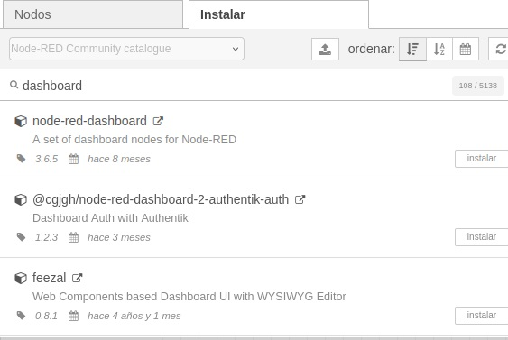
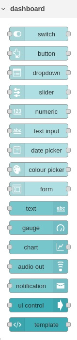
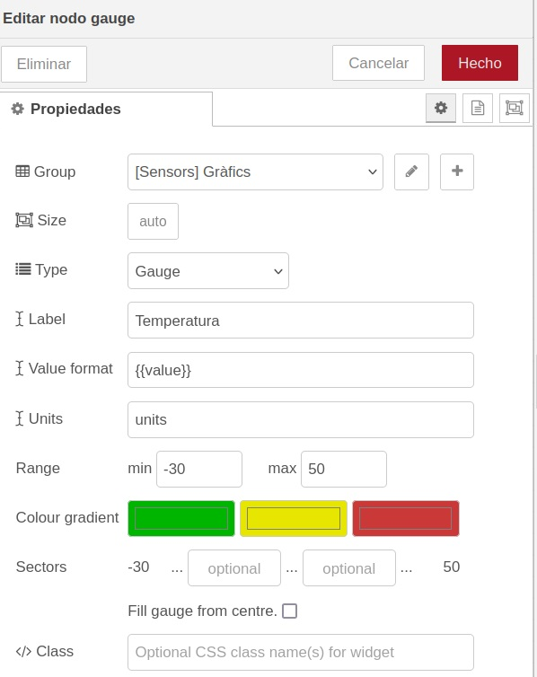
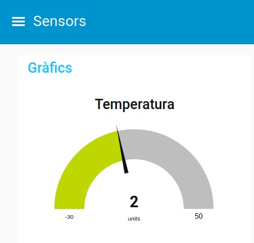
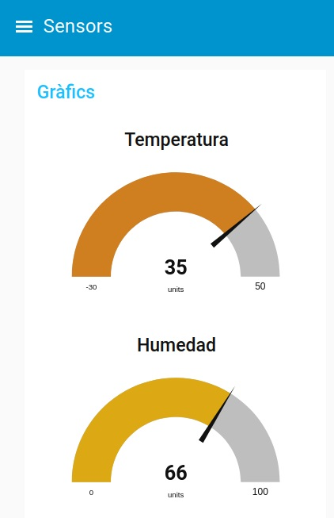
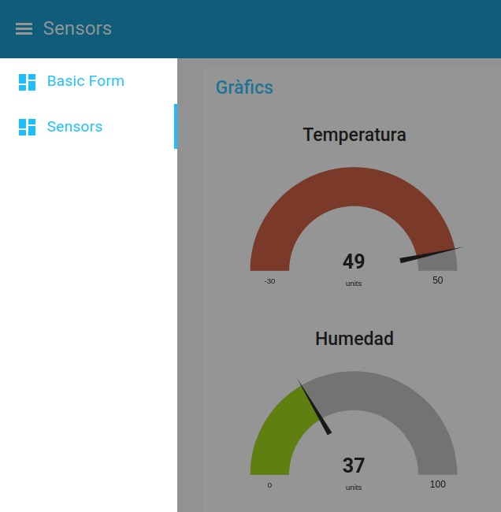

---
# Informació general del document
title: Dashboards en Node-RED
subtitle: 
authors: 
    - Departament d'informàtica
lang: ca
page-background: img/bg.png

# Portada
titlepage: true
titlepage-rule-height: 0
# titlepage-rule-color: AA0000
# titlepage-text-color: AA0000
titlepage-background: img/portada.png
# logo: img/logotext.png

# Taula de continguts
toc: true
toc-own-page: true
toc-title: Continguts

# Capçaleres i peus
header-left: Unitat 04.4 - Dashboards en Node-RED
header-right: Curs 2025-2026
footer-left: IES Jaume II El Just
footer-right: \thepage/\pageref{LastPage}

# Imatges
float-placement-figure: H
caption-justification: centering

# Llistats de codi
listings-no-page-break: false
listings-disable-line-numbers: false

header-includes:
     - \usepackage{lastpage}
---

# Node-RED Dashboards

En aquesta unitat veurem com crear interfícies gràfiques amb Node-RED. Això ens permetrà crear panells de control per a dispositius IoT, per a sistemes de monitoratge, per a sistemes de control, etc.

## Introducció

Un ***dashboard*** és una interfície gràfica que ens permet interactuar amb una aplicació o simplement mostrar elements gràfics. Aquesta interfície pot ser molt senzilla o més complexa. En el cas de Node-RED, els dashboards ens permeten crear interfícies gràfiques per a les nostres aplicacions per a interactuar amb elles de forma més visual, crear gràfics o veure estadístiques o dades en temps real.

## Instal·lació dels nodes de Node-RED Dashboard

Per a poder utilitzar els dashboards de Node-RED, primer cal instal·lar els nodes necessaris. Per a fer-ho, anem a la pestanya de configuració de Node-RED i seleccionem la opció de ***Administrar paleta*** o ***Manage palette***. A la finestra que ens apareix, busquem el paquet ***node-red-dashboard*** i el seleccionem per a instal·lar-lo.

Una vegada feu clic en el botó d'instal·lar, es descarregarà i instal·larà el paquet amb els nodes necessaris per a poder crear dashboards.A la part esquerra vos hauria d'aparèixer una nova secció de nodes anomenada ***dashboard***.

## Creació d'un dashboard

Per a crear un dashboard, hem de copiar al flux els nodes que volem que se mostren. Cada node pertany a un ***tab*** i a un ***grup***. Els ***tabs*** són les pestanyes que apareixen a la part esquerra del dashboard i els ***grups*** serveixen per agrupar certs nodes d'una pestanya en un únic element visual.

Anem a fer un exemple senzill creant un node de tipus ***gauge*** per mostrar els valors que van entrant al flux, per exemple amb un node ***random***.

### Exemple amb un gràfic tipus gauge (medidor)

1 - Creem un node ***inject*** per posar en marxa el flux. Injectarà el ***timestamp*** cada segon.

2 - Creen un node ***random*** per a generar un valor aleatori entre -30 i 50. En el nom posarem "Temperatura" per poder-lo diferenciar quan tinguem més nodes ***random***. El connectarem amb el node ***inject***.

3 - Creem un node ***gauge*** per a mostrar el valor de la temperatura. El connectarem amb el node ***random*** i li posarem en el camp ***Label*** el text "Temperatura" i en el tipus seleccionarem ***Gauge***.

4 - Hem de definir en quin ***tab*** i en quin ***grup*** volem que aparega el node ***gauge***. Anem a la secció de propietats i en el camp ***Group*** tenim un botó per editar i un altre per afegir un grup nou. Anem a crear un ***tab*** que s'anomene **Sensors** i dins un grup que s'anomene **Gràfics**. Les propietats del node quedarien tal com se veu en la següent imatge.

5 - Ara ja podem desplegar el flux. Ho fem i no se veu res. Això és perquè per a veure el ***dashboard*** hem d'anar a la URL [http://localhost:1881/ui].

> Recordeu canviar el vostre port si no és el 1881, així com la IP si no és localhost.

6 - A la URL que hem posat, en el menú de l'esquerra seleccionem el tab **Sensors** i ens apareixerà el gràfic. Podem veure com en temps real ens va mostrant les temperatures que van entrant. 

### Afegint més gràfics al dashboard

Si agafem el flux que hem creat, seleccionem tots els nodes i fem copiar-pegar, tindrem un altre flux exactament igual. Ara anem a modificar el node ***random*** per generar un valor entre 0 i 100 i li posarem el nom "Humedad". També modificarem el node ***gauge*** per posar-li el nom "Humedad" i dir-li que els valors estaran entre 0 i 100. El nou node ***gauge*** tindrà el mateix tab i el mateix grup que el primer. 

El resultat si despleguem i tornem a mostrar el ***dashboard*** serà el següent.

Si provem a posar els dos nodes ***gauge*** en grups diferents, se mostrarien en columnes diferents dins del tab **Sensors**.

Si els posàrem en dos tabs diferents, tindríem cada gauge en una pestanya diferent del ***dashboard***.

## Més nodes de dashboard

Per explorar més nodes de tipus ***dashboard*** podeu descarregar d'Aules els arxius JSON que trobareu a la carpeta ***Exemples dashboard***. Una vegada carregats en la vostra instància de NodeRED, els examinarem i comentarem a classe.

