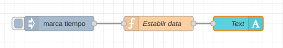
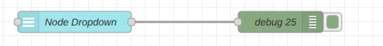
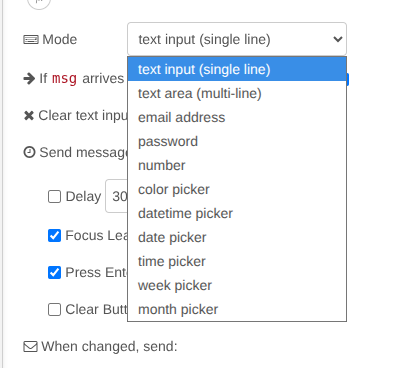
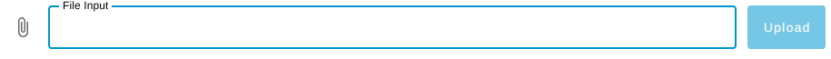
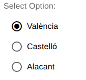
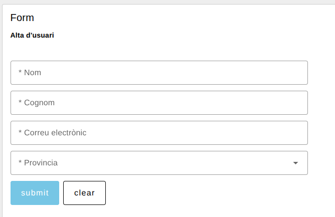
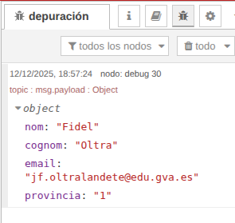

---
# Informació general del document
title: Formularis en Node-RED
subtitle: 
authors: 
    - Departament d'informàtica
lang: ca
page-background: img/bg.png

# Portada
titlepage: true
titlepage-rule-height: 0
# titlepage-rule-color: AA0000
# titlepage-text-color: AA0000
titlepage-background: img/portada.png
# logo: img/logotext.png

# Taula de continguts
toc: true
toc-own-page: true
toc-title: Continguts

# Capçaleres i peus
header-left: Unitat 04.5 - Formularis en Node-RED
header-right: Curs 2025-2026
footer-left: IES Jaume II El Just
footer-right: \thepage/\pageref{LastPage}

# Imatges
float-placement-figure: H
caption-justification: centering

# Llistats de codi
listings-no-page-break: false
listings-disable-line-numbers: false

header-includes:
     - \usepackage{lastpage}
---


# Node-RED Formularis

En aquesta unitat veurem més possibilitats per a crear Dashboards. Seguirem repassant els nodes més importants per a Dashboards, en veurem algun nou, i també aprendrem a crear formularis i elements interactius dins dels nostres Dashboards.

Primer anem a veure alguns nodes més de Dashboards que encara no hem utilitzat.

## Més nodes per a Dashboards

Ja hem vist alguns nodes per a representar gràfics i dades en els nostres Dashboards, com ara el **Gauge**, el **Chart** o **Table**. Anem a veuren alguns més:

- **Text**: ens permet mostrar text estàtic o dinàmic en el nostre Dashboard. Podem utilitzar-lo per a mostrar missatges, instruccions o qualsevol altra informació que vulguem compartir amb l'usuari.

En l'exemple tenim un node **Inject** que envia un timestamp a un node **Function** que converteix el timestamp en una cadena de text amb la data actual. La cadena es passa al node **Text**, que la mostra en el Dashboard.

 

- **Show Notification**: este node ens permet mostrar notificacions emergents en el Dashboard. Podem utilitzar-lo per a alertar als usuaris sobre esdeveniments importants o canvis en les dades. Per defecte la notificació se mostra en la part superior dreta del Dashboard, però amb la propietat ***Position*** ho podem canviar. 

Amb la propietat ***timeout*** podem definir quant de temps es mostrarà la notificació abans de desaparèixer. Amb la propietat ***Allow Manual Dismissal*** podem permetre que l'usuari tanque la notificació manualment amb un botó.

Per exemple, podem mostrar una notificació quan una propietat supere un cert valor. En l'exemple tenim un node **Inject** que activa un node **Random** que genera un valor aleatori entre 0 i 10. El node **Switch** comprova si el valor és major que 5. Si ho és li passa el payload a un node ***Template*** que crea un missatge que s'envia al node **Show Notification** per a mostrar la notificació en el Dashboard.


- **Template**: ens permet crear contingut HTML personalitzat per al nostre Dashboard. Podem utilitzar-lo per a dissenyar elements visuals més complexos o per a integrar components externs en el nostre Dashboard. També per a crear estils que s'aplicaran (a tots els Dashboards o a una pàgina concreta).

- **Markdown**: permet mostrar contingut en format Markdown en el nostre Dashboard, convertint-lo automàticament a HTML. Això és útil per a mostrar documentació, instruccions o qualsevol altre contingut formatat de manera senzilla.

- **Audio**: ens permet reproduir fitxers d'àudio en el nostre Dashboard. Podem utilitzar-lo per a proporcionar retroalimentació sonora o per a reproduir sons específics en resposta a esdeveniments.

- **Progress**: mostra una barra de progrés en el Dashboard. Agafa el valor numèric del payload i el representa com un percentatge en una barra de progrés.

- **ui Control**: permet controlar diversos aspectes del Dashboard, com ara canviar la pàgina actual, mostrar o ocultar elements, o actualitzar el títol del Dashboard.

## Layout

Abans de continuar, és important entendre com funciona el layout (disposició) en els Dashboards de Node-RED. El layout es basa en una estructura de pàgines i grups que ens permet organitzar els elements del nostre Dashboard de manera clara i accessible. Com hem vist, cada Dashboard pot incloure múltiples pàgines, cada pàgina pot incloure diversos grups, i en cada grup podem incloure diversos elements: gràfics, taules, formularis, etc.

A banda d'això, si fem doble clic en un component del Dashboard, anem a editar el grup, i en les propietats del grup anem a editar la pàgina, trobarem que dins de les propietats de la pàgina (on posem el seu nom i el seu path) hi ha una pestanya anomenada ***Layout***. Podem triar entre:

- **Grid**: és el layout per defecte. Els elements es col·loquen en una quadrícula, i s'ajusten automàticament segons la mida de la finestra del navegador. Divideix la pàgina en 12 columnes del mateix ample, i els grups ajusten el seu ample ocupant un nombre definit d'estes columnes. Això permet flexibilitat i adaptació a diferents mides i resolucions de pantalla.
- **Fixed**: ens permet definir una mida fixa per als elements del Dashboard. Utilitza unes mides anomenades ***unitats***, on cada unitat són 90px, per oferir un control més exacte de les posicions de cada element. Normalment s'utilitza en interfícies industrials.
- **Tabs**: ens permet organitzar els elements del Dashboard en pestanyes. Això és útil si tenim molts elements i volem mantenir el Dashboard net i organitzat.
- **Notebook**: ens permet crear un format de llibre de notes amb un ample màxim de 1024px i centrat, on els elements es poden organitzar en seccions i subseccions. Això és útil per a presentacions o informes més complexos.

## Theme

També podem, en les propietas de la pàgina, editar el tema (theme) del Dashboard. El tema defineix l'aparença visual del Dashboard, incloent colors, fonts i estils dels elements. Node-RED ofereix diversos temes predefinits, però també podem crear els nostres propis temes personalitzats. Directament des d'este apartat podem modificar colors de fons del dashboard, les pàgines i grups, així com l'alt de les files, el padding, els bordes, etc.


## Formularis en Node-RED

Els formularis són una part essencial de molts Dashboards, ja que permeten als usuaris introduir dades i interactuar amb l'aplicació. En Node-RED, podem crear formularis utilitzant diversos nodes de Dashboards que faciliten la creació d'elements interactius. Podem utilitzar els components per separat, o crear formularis que integren diferents components.

### Components de formulari

- **Dropdown**: ens permet crear un desplegable amb opcions predefinides. L'usuari pot seleccionar una opció de la llista, i el valor seleccionat es passa com a payload al següent node.

En l'exemple veureu un node **Dropdown** que permet triar una província entre València, Castelló i Alacant, i torna el valor que associem a l'opció seleccionada. En l'exemple la mostrem en un node **Debug**, però podríem fer qualsevol altra cosa amb el valor seleccionat.



- **Switch**: ja l'hem vist en altres exemples. Ens permet crear un botó d'encesa i apagada que l'usuari pot utilitzar per a activar o desactivar una funció. El valor del payload serà `true` quan el botó estiga activat i `false` quan estiga desactivat.

- **Slider**: ens permet crear un control lliscant que l'usuari pot utilitzar per a seleccionar un valor dins d'un rang específic. El valor seleccionat es passa com a payload al següent node. Podem definir el valor mínim, el màxim, i el pas del control (d'un en un, de dos en dos, etc.).


- **Button**: ens permet crear un botó que l'usuari pot clicar per a activar una acció. Quan polsem el botó, s'envia un missatge amb un payload predefinit al següent node. Per exemple, podem utilitzar un botó per netejar un component de text o un gràfic enviant un payload buit. 

Algunes dades del botó (i d'altres components) es poden canviar en temps d'execució mitjançant missatges. Per exemple, podem canviar l'etiqueta del botó enviant un missatge amb la propietat `msg.label` que continga el nou text. També podem canviar l'estat del botó (habilitat o deshabilitat) enviant un missatge amb la propietat `msg.enabled` amb valor `true` o `false`. També podem canviar propietas com `label`, `buttonColor`, `textColor` o fins i tot aplicar una classe al botó utilitzant `msg.ui_update` i la propietat corresponent. En l'exemple teniu uns botons que canvien l'estat, el label i el color d'un altre botó.


En el node **change** d'activació, modifiquem les següents propietats del botó principal:

```
msg.enabled = true
msg.ui_update.label = Activat"
msg.ui_update.buttonColor = "blue"
```

En el node **change** de desactivació, modifiquem les següents propietats del botó principal:

```
msg.enabled = false
msg.ui_update.label = "Desactivat"
msg.ui_update.buttonColor = "grey"
```

També se pot enviar un únic missatge a un botó amb més d'una propietat amb:

```
msg.ui_update = {
    label: "Nou Label",
    buttonColor: "red",
    textColor: "white"
}
```

> Amb `msg.ui_update` podem canviar moltes propietats de quasi tots els components d'un Dashboard. Pots consultar l'ajuda en línia de Node-RED per a saber quines propietats es poden canviar en cada component. Són les que apareixen com a ***Dynamic properties***.


- **Text input**: ens permet crear un camp de text on l'usuari pot introduir dades. El text introduït es passa com a payload al següent node. Podem utilitzar-lo per a recollir informació com noms, correus electrònics, o qualsevol altra dada textual.

- **Number input**: similar al **Text input**, però només permet introduir valors numèrics. Això és útil quan necessitem que l'usuari introduïsca nombres, com edats, quantitats o valors mesurats. Podem definir límits mínims i màxims, així com el pas entre valors.


> No hi ha nodes especials, com en HTML, per introduir textos específics com correus electrònics, dates, contrasenyes, *color pickers*, etc. De totes formes, en les propietas del node **Text input** podem definir el tipus de dades que volem introduir en la propietat ***Mode***. En la figura següent podeu veure els diferents tipus que podem triar.



- **File input**: ens permet crear un camp on l'usuari pot seleccionar i pujar un fitxer des del seu dispositiu. El contingut del fitxer es passa com a payload al següent node, permetent-nos processar o analitzar el fitxer pujat.




- **Radio group**: ens permet crear un grup de botons d'opció on l'usuari pot seleccionar una única opció d'una llista predefinida. El valor seleccionat es passa com a payload al següent node. És el ***radio button*** d'HTML.



### El node form

Per a crear formularis més complexos, podem utilitzar el node **Form**. Este node ens permet agrupar diversos components de formulari en un únic formulari que l'usuari pot omplir i enviar. Quan l'usuari envia el formulari, tots els valors dels components s'envien com un objecte JSON en el payload.


Si definim controls de tipus ***dropdown*** en el formulari, les hem de declarar en la pestanya ***Dropdown options*** del node **Form**. Allí hem d'afegir les opcions que tindrà cada desplegable, amb el seu valor i la seua etiqueta.


En el Dashboard el formulari se veurà així:



Quan enviem el formulari, el payload que rep el següent node és un objecte JSON amb les propietats corresponents a cada camp del formulari:


