---
# Informació general del document
title: Node-Red Intermedi
subtitle: 
authors: 
    - Departament d'informàtica
lang: ca
page-background: img/bg.png

# Portada
titlepage: true
titlepage-rule-height: 0
# titlepage-rule-color: AA0000
# titlepage-text-color: AA0000
titlepage-background: img/portada.png
# logo: img/logotext.png

# Taula de continguts
toc: true
toc-own-page: true
toc-title: Continguts

# Capçaleres i peus
header-left: Unitat 04.2 - Node-RED intermedi
header-right: Curs 2025-2026
footer-left: IES Jaume II El Just
footer-right: \thepage/\pageref{LastPage}

# Imatges
float-placement-figure: H
caption-justification: centering

# Llistats de codi
listings-no-page-break: false
listings-disable-line-numbers: false

header-includes:
     - \usepackage{lastpage}
---


# Node-RED intermedi

Ara que ja sabem com funcionen els nodes i com podem crear un flux de dades senzill, anem a veure com podem fer coses més complexes amb Node-RED. Per fer-ho, analitzarem alguns exemples de fluxos que heu important des d'Aules amb l'arxiu `Basic nodes operations`.

## Nodes de seqüències

Els nodes de seqüencies permeten actuar sobre una seqüència de missatges, o crear-ne una de nova. Això ens permet fer coses com filtrar missatges, dividir-los en parts, o afegir-los a una llista.

### Split

El node `split` permet dividir un missatge en parts. Per exemple, si tenim un missatge amb un text que conté diverses paraules, podem dividir-lo en tantes parts com paraules hi hagi si especifiquem l'espai en blanc com a separador. Això ens permetrà actuar sobre cada paraula de forma independent.

A més de l'espai en blanc, podem utilitzar qualsevol altre caràcter com a separador en l'apartat `Split using` o `Dividir usando` del node.

A banda de text, també podem dividir un array en les seues parts, o un objecte en les seues propietats, tal com podeu veure a la imatge.

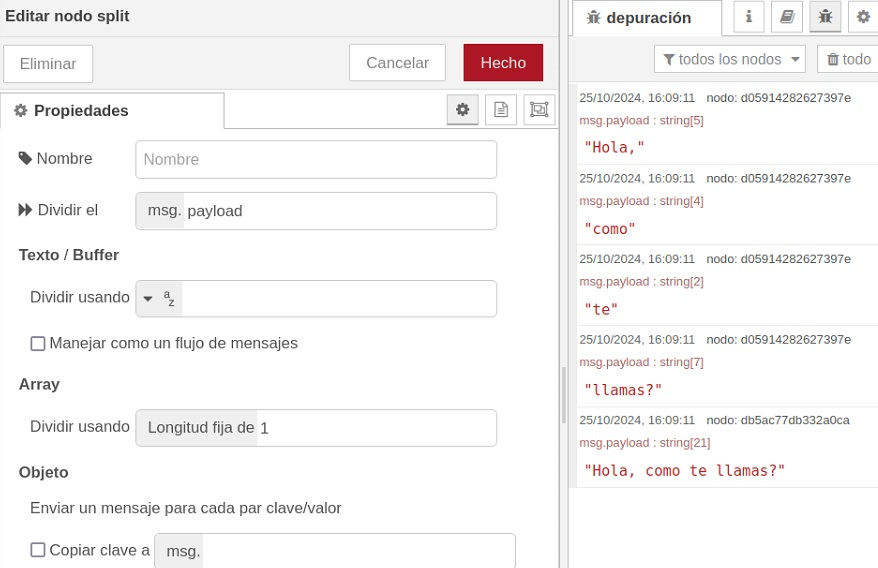

### Join

El node `join` permet unir les parts d'un missatge en un únic missatge d'eixida. Per exemple, si tenim un array amb diverses parts, podem unir-les en un sol missatge.

També podem treballar amb `msg.parts`. El funcionament de `msg.parts` en NodeRED és similar al de `msg.payload`, però en lloc de contenir el valor del missatge, conté informació sobre la part del missatge que estem tractant. Això ens permet, per exemple, unir les parts d'un missatge en un ordre diferent al que tenien inicialment. També podem fer que el receptor del missatge espere a que li arriben totes les parts per executar alguna acció.

Ací teniu un exemple d'ús de `split` i `join`. El que fa el flux és agafar una cadena, dividir-la en paraules, i enviar el resultat per un costat a un node `debug` que mostrarà per pantalla els diferents missatges que li arriben (les diferents paraules), i per altre costat li envia el mateix resultat a un node `join` que torna a juntar les paraules i les envia a un altre `Debug` que mostra la frase reconstruïda. 

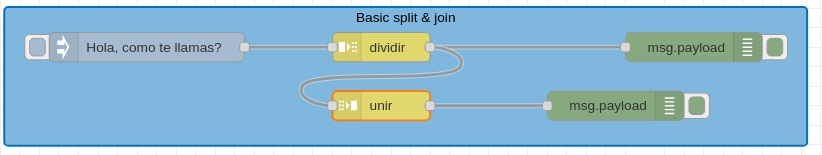

Una altra utilitat de `join`, com hem comentat, és unificar diferents missatges en un únic missatge. Se pot fer de manera automàtica o manual. Per exemple, si tenim un sensor que ens envia la temperatura i la humitat en dos missatges diferents, podem utilitzar `join` per unir-los en un sol missatge. Veiem un exemple:

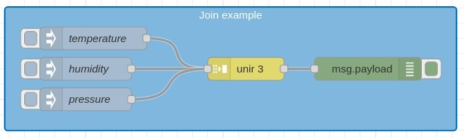

En este flux, tres nodes `inject` envien una dada diferent cadascun. Amb la etiqueta `topic` definim el nom de la propietat del missatge que contindrà la dada. Després, el node `Join` uneix els tres missatges en un sol missatge, i el node `debug` mostra el resultat. Fixeu-vos que el node `join` sap que ha d'esperar fins que li arriben els 3 missatges abans d'unir-los i enviar-los al node `debug`.

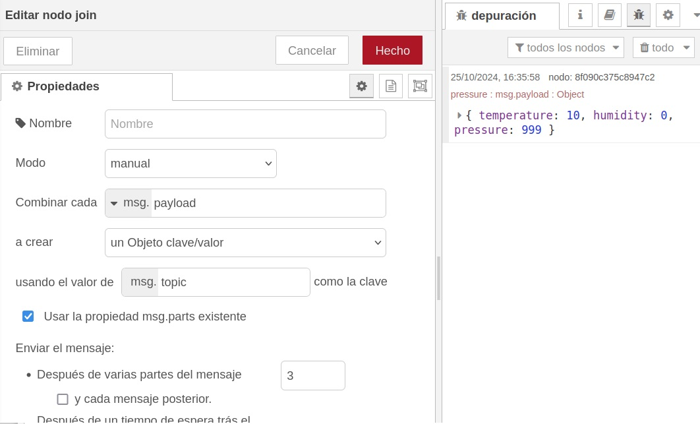

### Sort

El node `sort` permet ordenar les propietats d'un missatge, o una seqüència de missatges. L'ordre pot ser ascendent o descendent. Se poden definir molts criteris d'ordenació diferents, o també utilitzar `msg.parts` per ordenar els missatges. Veiem un exemple molt senzill on el node `inject` envia un JSON amb un array de números, i el node `sort` els ordena. En les propietats del node `sort` podem veure com estem utilitzant com a clau d'ordenació el valor de l'element. 

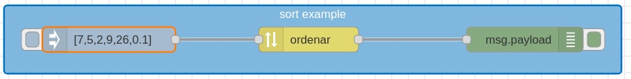

### Batch

El node `batch` permet crear seqüències de missatges seguint certes regles. Hi ha tres formes de seqüenciar els missatges:

* per quantitat de missatges: agrupa missatges en seqüències d'una longitud determinada
* per intervals de temps: agrupa els missatges que arriben en un determinat interval de temps
* concatenar seqüències: agrupa distintes seqüències en una sola

A continuació podeu veure un exemple on els nodes `join`, `batch`, `split` i `sort` treballen de manera conjunta amb unes seqüències de números que envien dos nodes `inject`.

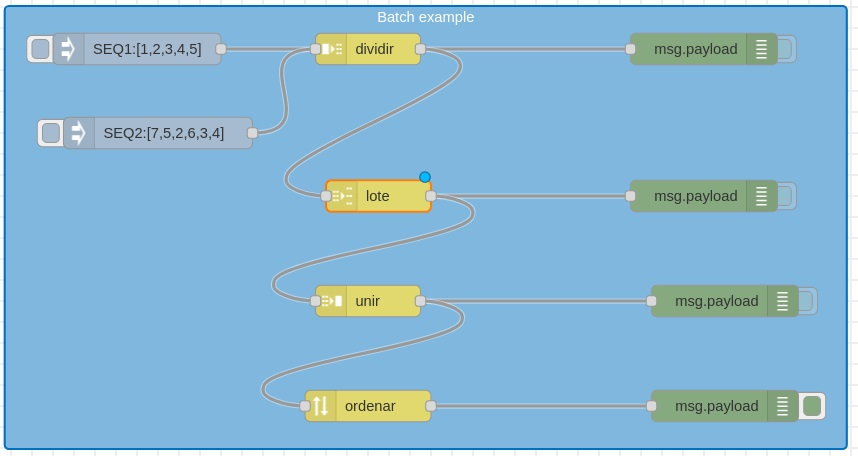

## Nodes de funció

Els nodes de funció ens permeten executar codi JavaScript o fer altres operacions sobre els missatges que passen pel flux. Això ens permet fer moltes coses, com modificar el missatge, filtrar-lo, o crear-ne de nous. Hem vist abans un exemple amb el qual convertiem un `timestamp` en una data llegible. Això ho hem fet amb el node `function`

Exemple igualment senzill: tenim un sensor que ens envia la temperatura i la humitat en dos missatges diferents. Volem que si la temperatura és superior a 30ºC, s'envie un missatge d'alerta. Per fer-ho, utilitzarem un node `function` que comprovarà si la temperatura és superior a 30ºC, i si ho és, enviarà un missatge d'alerta.

La funció seria així:
    
```javascript
if (msg.payload.temperature > 30) {
    return {payload: "Alerta: temperatura superior a 30ºC"};
}
```

De totes maneres, a banda del node `function` hi ha altres dins del grup ***Función***. Anem a veure alguns dels més importants.

### Switch

El node `switch` ens permet fer bifurcacions en el flux segons el valor d'una propietat del missatge. Per exemple, si tenim un sensor que ens envia la temperatura i la humitat, podem utilitzar `switch` per enviar un missatge d'alerta si la temperatura és superior a 30ºC, i un altre si la humitat és superior al 70%.

Per fer això anem a necessitar també el node `Change`.

### Change

El node `change` ens permet canviar les propietats d'un missatge. Per exemple, el nostre cas anterior, podem afegir una propietat `alert` al missatge si la temperatura és superior a 30ºC o si la humitat és superior al 70%. També podem canviar el valor d'una propietat, o eliminar-la. Fins i tot podem, si ens interessa, modificar el valor de `Payload`.

El node `Change` del nostre exemple quedaria així:

Ara podem combinar els nodes `Switch` i `Change` per enviar un missatge d'alerta si la temperatura és superior a 30ºC o si la humitat és superior al 70%, o simplement mostrar els valors si són normals. 

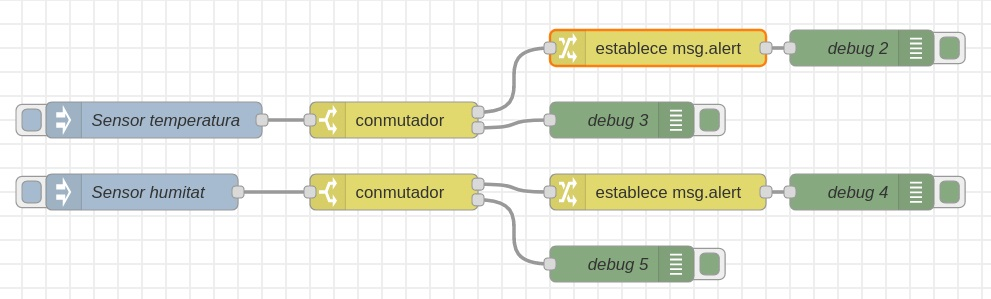

El `Switch` de la temperatura té dues eixides: 

* la 1 si el valor és major que 30, i la 2 si no ho és. La 1 porta al node `Change` que afegeix la propietat `alert` al missatge, i finalment el node `debug` mostra l'alerta. La 2 porta directament al node `debug` que mostra el missatge transformat en un JSON llegible.

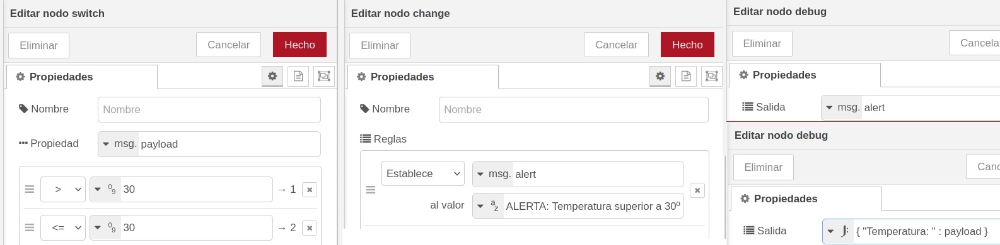

El `Switch` de la humitat té dues eixides:

* la 1 si el valor és major que 70, i la 2 si no ho és. La 1 porta al node `Change` que afegeix la propietat `alert` al missatge, i finalment el node `debug` mostra l'alerta. La 2 porta directament al node `debug` que mostra el missatge transformat en un JSON llegible.

L'esquema és el mateix que hem vist per la temperatura.

### Random

El node `random` ens permet generar valors aleatoris. Això pot ser útil per simular sensors, o per fer proves, com anem a fer a continuació. 

En l'exemple anterior de la temperatura i la humitat, si volem saber què passa al canviar els valors d'entrada hem d'editar el node `inject` cada vegada. Utilitzant un node `random`, podem fer que el node d'injecció li envie una senyal al `random` i que este genere els valors aleatòriament. A més, com sabem, podem saber que el node `inject` envie una senyal cada cert temps per a que se generen els valors.

El nostre exemple anterior, utilitzant nodes `random` per generar els valors, quedaria així:

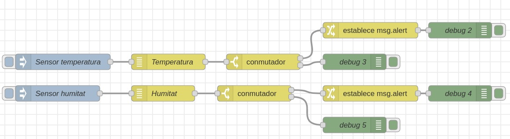

El node `random` només genera valors numèrics. Per a generar altres tipus de valors, podem utilitzar el node `data-generator`, que segurament haurem d'instal·lar des de la paleta de la dreta. 

Amb `data-generator` podem generar dades amb sentit, textos que tinguen un significat. Per exemple, li podem dir que genere noms ficticis, adreces i poblacions inventades, i també numeros que estiguen dins d'un rang determinat. Ací teniu un exemple de generador de dades d'una persona:

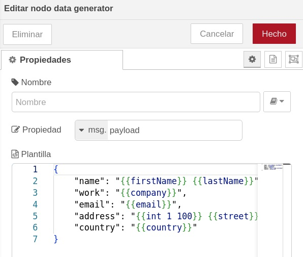

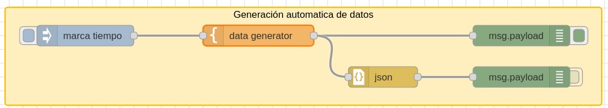

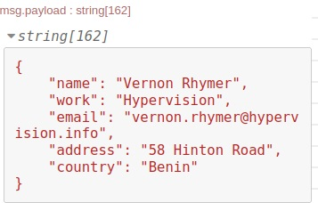

