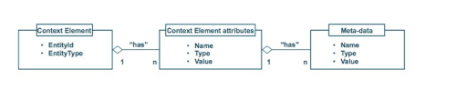

---
# Informació general del document
title: Fiware. Conceptes bàsics.
subtitle: 
authors: 
    - Departament d'informàtica
lang: ca
page-background: img/bg.png

# Portada
titlepage: true
titlepage-rule-height: 0
# titlepage-rule-color: AA0000
# titlepage-text-color: AA0000
titlepage-background: img/portada.png
# logo: img/logotext.png

# Taula de continguts
toc: true
toc-own-page: true
toc-title: Continguts

# Capçaleres i peus
header-left: Unitat 05.01 - Fiware. Conceptes bàsics.
header-right: Curs 2025-2026
footer-left: IES Jaume II El Just
footer-right: \thepage/\pageref{LastPage}

# Imatges
float-placement-figure: H
caption-justification: centering

# Llistats de codi
listings-no-page-break: false
listings-disable-line-numbers: false

header-includes:
     - \usepackage{lastpage}
---

# Introducció

En esta unitat veurem què és **Fiware**, com funciona i com podem utilitzar-lo per a desenvolupar aplicacions que utilitzen dades obertes. En primer lloc, anem a veure alguns conceptes bàsics que necessitem conèixer o repassar.

## Broker de dades

Un **broker de dades** és un component de software que permet als desenvolupadors de software accedir a dades de diferents fonts. El broker de dades actua com a intermediari entre la font on estan les dades que necessitem i les aplicacions que volen accedir a elles.

Exemples de brokers de dades són **Orion** o **Kafka**. **Orion** és un broker de dades que permet als desenvolupadors accedir a dades obertes de diferents fonts, com ara sensors, xarxes socials o bases de dades. **Kafka** és un altre broker de dades que permet als desenvolupadors accedir a dades en temps real. 

El funcionament d'un **broker de dades** se basa, en general, en la **subscripció** a les fonts de dades a les quals volem tindre accés. Podrem accedir a les dades de vàries formes: 

- **Subscripció a dades en temps real**: el broker de dades ens notificarà quan hi haja noves dades disponibles.
- **Consulta de dades**: el broker de dades ens permetrà realitzar consultes a les dades que estan disponibles, o descarregar-les.

En el nostre mòdul estudiarem com utilitzar **Orion** per a accedir a dades obertes. En el mòdul de **Sistemes Big Data** veureu **Kafka**, encara que potser nosaltres també farem alguna pràctica per entendre com funciona.

## Tòpic

Un **tòpic** és una categoria o un canal al qual es poden subscriure els usuaris per rebre missatges o dades relacionades amb aquest tema. Els tòpics s'utilitzen en sistemes de missatgeria i brokers de dades per organitzar i distribuir la informació de manera eficient. Per exemple, en un sistema de monitoratge ambiental, podríem tenir diferents tòpics per a cada tipus de sensor, com ara un tòpic per a sensors de temperatura, un altre per a sensors d'humitat, etc. El tòpic podria també estar relacionat amb una ubicació geogràfica específica, com ara una ciutat concreta.

## API. Repàs ràpid.

Com ja sabeu, una **API** (Application Programming Interface) és un conjunt d'eines que permeten als desenvolupadors de software interactuar amb un sistema de software. Les **APIs** poden ser de molts tipus, però en general permeten als desenvolupadors realitzar les operacions bàsiques (***CRUD***: Create, Read, Update, Delete) sobre un repositori de dades, oferint-les en forma de serveis web.

### NGSIv2 i NGSI-LD

**NGSI** (Next Generation Service Interface) és un estàndard per a la gestió de dades de context en sistemes d'informació. Hi ha dues versions principals d'este estàndard: **NGSIv2** i **NGSI-LD**. 

- **NGSIv2** és la versió original i es basa en el model de dades **JSON**. Esta versió és àmpliament utilitzada en moltes aplicacions i sistemes d'informació. La informació està organitzada en entitats, atributs i metadades opcionals. Té suport per GEOJSON per a la representació de dades geoespacials, i també per a la gestió de temps.



- **NGSI-LD** és una versió més recent que es basa en el model de dades **JSON-LD** (JSON for Linked Data).Esta versió està dissenyada per a ser més flexible i representar relacions entre les entitats utilitzant grafs. Això permetre la integració amb altres sistemes d'informació basats en dades enllaçades.

En Orion Context Broker es pot utilitzar tant **NGSIv2** com **NGSI-LD** per a gestionar les dades de context. La tria entre una versió o una altra dependrà dels requisits específics de l'aplicació que estem desenvolupant.

## Ontologia de les dades

Una **ontologia de les dades** és una descripció formal de les dades que permet als desenvolupadors de software entendre què representen les dades i com estan relacionades entre elles. És un concepte similar al de esquema o model en bases de dades relacionals, però més flexible i pot descriure relacions més complexes entre les dades. 

La ontologia de les dades, en contextos on la informació és compartida, permet establir un llenguatge comú entre diferents sistemes i aplicacions. Això facilita la interoperabilitat i la integració de dades de diferents fonts. Principalment una ontologia defineix un model semàntic que inclou:

- **Entitats**: els objectes o conceptes que es volen representar.
- **Atributs**: les propietats o característiques de les entitats.
- **Relacions**: les connexions entre les entitats.
- **Regles**: les restriccions o condicions que s'apliquen a les entitats, atributs i relacions.

## FIWARE

**FIWARE** és una plataforma de codi obert, impulsada per la Unió Europea, per al desenvolupament i el desplegament global d'aplicacions relacionades amb **IoT** (***Internet of Things***). 

[Pàgina web de FIWARE](https://www.fiware.org/)

Es tracta d'una iniciativa que defineix un conjunt universal de estàndards per a la gestió de dades de context. Això implica definir, com hem comentat abans, una ***ontologia*** de les dades. Així se facilita el desenvolupament de solucions per a diferents dominis, com per exemple **Smart Cities**, **Smart Industry**, **Smart Agrifood** i **Smart Energy**.


### Arquitectura de FIWARE

La plataforma **FIWARE** està formada per diferents components que permeten als desenvolupadors accedir a dades de context de diferents fonts. Aquests components es poden agrupar en tres capes:

- **Capa de dades**: en aquesta capa es troben els **brokers de dades** que permeten als desenvolupadors accedir a dades de context de diferents fonts. Com a broker de dades de **FIWARE** es fa servir **Orion Context Broker (OCB)**.
- **Capa de processament**: en aquesta capa es troben els components que permeten als desenvolupadors processar les dades de context. Aquests components poden ser **Cygnus** o **Stardog**.
- **Capa d'aplicació**: en aquesta capa es troben els components que permeten als desenvolupadors desenvolupar aplicacions que utilitzen les dades de context. Aquests components poden ser **Wirecloud** o **Keyrock**.
- **Capa de gestió**: en aquesta capa es troben els components que permeten als administradors gestionar la plataforma **FIWARE**. Aquests components poden ser **Orion-LD** o **Keyrock**.


### Exemples d'arquitectures FIWARE


## Smart Data Models

Els **Smart Data Models** són una part fonamental de **FIWARE**. Es tracta d'una col·lecció de models de dades que defineixen com representar les dades de context en diferents dominis. Aquests models de dades estan definits en forma de **ontologies**, un concepte que, com hem vist, permet als desenvolupadors entendre el significat de les dades.

Les ontologies dels **Smart Data Models** se basen en un llenguatge anomenat **JSON Schema**, que permet descriure l'estructura de les dades i les restriccions que han de complir. En el context de **FIWARE** i **Smart Data Models**, un **JSON Schema** defineix els atributs i les propietats que han de tenir les entitats que formen part del model de dades. En certs casos, cal definir dos atributs obligatoris per a les entitats:

- **id**: un identificador únic per a l'entitat.
- **type**: el tipus d'entitat

Cada element dins de l'entitat pot tindre diversos atributs que venen definits, si volem utilitzar estàndars validats per **Fiware**, per una ontologia. En general se demanen els següents atributs bàsics:

- **name**
- **type**
- **description**
- **value** 
- **location** (ubicació geogràfica)
- **dateObserved** (data i hora d'observació)

De totes formes, si volem utilitzar un model de dades estàndar hem de seguir les seues especificacions. No cal utilitzar-les totes, només les que necessitem (a banda de les obligatòries). La idea és que qualsevol informació que compartim seguint un model de dades estàndar siga comprensible per a qualsevol altre desenvolupador que utilitze el mateix model. I el mateix quan nosaltres actuem com a consumidors.

La definició d'un model de dades intel·ligent inclou quatre elements: 

- l'**esquema** o representació tècnica del model que defineix els tipus de dades tècniques i l'estructura. Se poden afegir propietats noves, pròpies, a un esquema que ja existeix.
- l'**especificació** d'un document escrit per a lectors humans
- una URI amb una **URL de treball** amb dades bàsiques sobre l'atribut o l'entitat
- **exemples** de les càrregues útils per a les versions **NGSIv2** i **NGSI-LD**

Tots els models de dades són públics i de naturalesa lliure de drets d'autor. La modalitat de llicència atorga 3 drets als usuaris:

- Ús gratuït
- Modificació gratuïta
- Compartició gratuïta de les modificacions

[Catàleg de Smart Data Models](https://www.fiware.org/smart-data-models/)

[Fiware Data-Models actualitzats](https://fiware-datamodels.readthedocs.io/en/stable/)

### Estructura d'un Smart Data Model

Els **Smart Data Models** s'agrupen en **temes**. Cada tema pot pertànyer a un **domini** o a més d'un. Els dominis representen **sectors** o contexts on s'utilitzen els models de dades. 

Un **Smart Data Model** està format per diferents elements:

- **Context Model**: es una descripció formal de les entitats que formen part del model de dades.
- **Data Model**: és una descripció formal dels atributs que formen part de les entitats, incloent un identificador únic, el seus tipus, valors i possibles restriccions.

Els **Data Model** estan codificats, com hem comentat, seguint un **JSON Schema**. Un esquema ens permet descriure l'estructura de les dades i les restriccions que han de complir. Els models estan normalment disponibles en repositoris de GitHub. 

Per exemple, des del següent enllaç podem accedir al **Smart Data Model** de **Vehicle**:

[Vehicle Smart Data Model](https://github.com/smart-data-models/dataModel.Transportation/blob/master/Vehicle/schema.json)

Des d'este enllaç podem accedir al **Smart Data Model** de **Weather Observed**:

[Weather Observed Smart Data Model](https://fiware-datamodels.readthedocs.io/en/stable/Weather/WeatherObserved/doc/spec/index.html)

## Orion Context Broker (OCB)

**Orion Context Broker (OCB)** és un **broker de dades** que permet als desenvolupadors accedir a dades de context de diferents fonts. **OCB** és un dels components més importants de **FIWARE** i es fa servir en moltes aplicacions que utilitzen dades de context. Com qualsevol ***broker***, **OCB** permet als desenvolupadors subscriure's a les dades de context que els interessen i rebre notificacions quan hi haja noves dades disponibles.

**OCB** permet la publicació d'informació de context per part de entitats *productores* (per exemple, sensors IoT o aplicacions que els facen servir). Altres entitats *consumidores* poden consultar esta informació mitjançant subscripcions per rebre notificacions quan hi haja canvis en la informació de context, o amb una freqüència determinada.


### Funcionament específic d'Orion

**Orion** utilitza un model de dades anomenat **NGSI** (Next Generation Service Interface). Este model de dades defineix com representar les dades de context i com accedir a elles. Permet realitzar operacions com ara:

- registrar aplicacions de productors de context (per exemple, un nou sensor IoT)
- actualitzar la informació de context
- consultar la informació de context
- subscriure's a canvis en la informació de context

Un principi fonamental d'**OCB** és la separació entre productors i consumidors. És a dir, els productors publiquen dades de context sense preocupar-se de qui les consumirà, i els consumidors accedeixen a les dades de context sense preocupar-se de qui les ha publicat. El principal avantatge és que **l'emisor i el receptor de les dades no han d'estar connectats directament**.

El servidor OCB sempre està escoltant, generalment a través del port **1026**. Per a interactuar amb ell, podem fer servir eines com **Postman**, **cURL** o qualsevol altre client HTTP que ens permeta realitzar peticions **RESTful**. Així, si tenim el broker en funcionament podem accedir a veure llistats d'entitats, crear noves entitats, realizar consultes, etc.

> **OCB** no és una base de dades, sinó un broker de dades. Això significa que les dades que s'hi emmagatzemen poden ser temporals i poden ser esborrades quan el broker es reinicia, a menys que s'utilitze un connector per a una base de dades externa com **MongoDB**. En general només se guarda l'estat actual de les dades de context d'una entitat, no els canvis al llarg del temps. Per exemple, si actuem com a productors, **no és bona pràctica crear entitats noves per a cada lectura d'un sensor, sinó actualitzar l'entitat existent amb les noves dades**.

Per exemple, si alcem un servidor **OCB** de forma local i volem veure totes les entitats que tenim en el broker, podem fer una petició **GET** a la següent URL:

```
http://localhost:1026/v2/entities
```

> Recordeu canviar el vostre port si no és el 1026, així com la IP si no és localhost.

Ens dirà, lògicament, que no hi ha cap entitat encara. Podem provar
Esta petició ens retornarà un llistat de totes les entitats que tenim en el broker. Podem crear noves entitats fent una petició **POST** a la mateixa URL, enviant les dades de l'entitat en format **JSON**.

Fins fa uns mesos se podien fer proves utilitzant el núvol de Fiware, pero ara l'adreça no està disponible i no he trobat alternatives només que amb màquines virtuals en el núvol. Per tant, instal·larem **Orion** de forma local utilitzant **Docker** amb un fitxer **docker-compose.yml** que trobareu a Aules.

Després veurem com utilitzar **Orion** amb **MongoDB** i **Node-RED** amb un exemple pràctic. 

# Enllaços d'interès

[https://www.esmartcity.es/comunicaciones/i-congreso-ciudades-inteligentes-fiware](https://www.esmartcity.es/comunicaciones/i-congreso-ciudades-inteligentes-fiware)

[https://www.ciudadesdelfuturo.org.ar](https://www.ciudadesdelfuturo.org.ar)

[https://www.fiware.org/smart-data-models/](https://www.fiware.org/smart-data-models/)

[https://github.com/smart-data-models](https://github.com/smart-data-models)

[https://telefonicaiotcb.docs.apiary.io/#](https://telefonicaiotcb.docs.apiary.io/#)

[https://oriontourguide.docs.apiary.io/](https://oriontourguide.docs.apiary.io/#)
