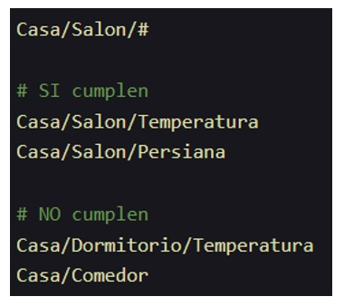

---
# Informació general del document
title: MQTT. Conceptes bàsics.
subtitle: 
authors: 
    - Departament d'informàtica
lang: ca
page-background: img/bg.png

# Portada
titlepage: true
titlepage-rule-height: 0
# titlepage-rule-color: AA0000
# titlepage-text-color: AA0000
titlepage-background: img/portada.png
# logo: img/logotext.png

# Taula de continguts
toc: true
toc-own-page: true
toc-title: Continguts

# Capçaleres i peus
header-left: Unitat 06 - MQTT. Conceptes bàsics.
header-right: Curs 2025-2026
footer-left: IES Jaume II El Just
footer-right: \thepage/\pageref{LastPage}

# Imatges
float-placement-figure: H
caption-justification: centering

# Llistats de codi
listings-no-page-break: false
listings-disable-line-numbers: false

header-includes:
     - \usepackage{lastpage}
---

# Introducció

**MQTT** és un protocol de missatgeria lleugera que es va desenvolupar per a dispositius amb recursos limitats, com ara sensors. Aquest protocol és molt popular en el món de l'**Internet of Things** (IoT) perquè permet als dispositius enviar i rebre missatges de forma eficient i fiable. 

El seu avantatge respecte a altres protocols similars és que és molt senzill i consumeix molt pocs recursos, cosa que el fa ideal per a dispositius amb poca potència de processament i poca memòria. A més, **MQTT** utilitza un model de comunicació **Pub/Sub** (Publicar/Suscribir), que permet una gran flexibilitat i escalabilitat en la comunicació entre dispositius.

No hem de confondre **MQTT**, que és un protocol de missatgeria, amb **Orion**, que és un broker de dades. **MQTT** és un protocol que defineix com es comuniquen els dispositius, mentre que **Orion** és una plataforma que pot utilitzar diferents protocols de comunicació, inclòs **MQTT**, per a gestionar i processar les dades dels dispositius.

A més, **MQTT** no sap res d'entitats ni del context, només envia i rep missatges per tòpics. És el broker, com per exemple **Orion**, el que s'encarrega de gestionar les entitats i el context associat a cada missatge.

Anem a veure primer alguns conceptes associats als protocols de comunicació / missatgeria.

## Protocols de comunicació IOT

**IoT** (Internet of Things) és un concepte molt d'actualitat en els darrers anys. Fa referència a la interconnexió digital d'objectes quotidians amb Internet. Aquests objectes poden ser des de electrodomèstics fins a vehicles, passant per qualsevol tipus de sensor o dispositiu electrònic.

Els **protocols de comunicació** són els encarregats de definir com s'han de comunicar els dispositius. Un protocol de comunicació estableix les regles que han de seguir els dispositius per a comunicar-se entre ells i poder intercanviar informació.

Algunes característiques desitjables per a un protocol de comunicació són:

- **Eficiència**: que siga ràpid, que permete gran quantitat de comunicacions simultànies i minimitze tant les dimensions dels missatges com el consum de recursos.
- **Escalabilitat**: que se puguen afegir o retirar dispositius sense que el comportament del sistema es veja afectat.
- **Escasa dependència**: que la dependència entre els dispositius siga la menor possible.
- **Interoperabilitat**: que siga compatible amb diferents dispositius i sistemes.
- **Seguretat**: hem de tindre en compte que tant els dispositius com les comunicacions entre ells funcionen a través de la xarxa i per tant poden ser vulnerables a atacs.
- **Accés senzill als dispositius**: ha de ser fàcil connectar-se als dispositius i controlar-los. S'han de preveure problemes amb adreces dinàmiques, DHCP, poc ample de banda, etc.

Hi ha molts protocols de comunicació com per exemple un que ja coneixeu, **HTTP**. Un dels més populars en l'àmbit de l'IoT és **MQTT** (Message Queuing Telemetry Transport).

## Solucions a la comunicació IoT

Una possible solució als problemes que ens podem trobar al treballar en un entorn IoT és utilitzar un servei de notificacions centralitzat. Això ho hem vist, per exemple, al parlar de **Brokers de dades**, d'**Orion** i també de **Kafka**, però que pot ser també un element físic del sistema. Se tracta d'externalitzar la infraestructura més costosa, cosa que cada vegada és més comú en les empreses. 


En este esquema un servidor central s'encarrega de rebre els missatges de tots els dispositius emisors i lliurar-los als receptors. El servidor té una adreça / domini conegut per tots els dispositius, que només se comuniquen amb ell. Així assegurem l'escalabilitat del sistema i la independència entre els dispositius.

## Metodologies de comunicació: Publish/Subscribe

El patró **Publish/Subscribe**, o **Pub/Sub**, se basa en l'esquema que acabem de veure: els diferents agents (***emisors/publisher*** i ***receptors/subscriber***) no es coneixen entre ells, sinó que es comuniquen a través d'un intermediari (broker). Els receptors informen al broker dels missatges que volen rebre i el broker s'encarrega de lliurar-los. Els emisors són els que publiquen els missatges que després el broker distribueix als receptors.

La forma en què se distribueixen els missatges pot ser de diferents maneres.

### Cua de missatges (message queue)

El broker genera una cua de missatges única per cadascun dels clients (receptors/subscribers). Els missatges se discriminaran utilitzant l'identificador únic de cada client. La cua manté els missatges fins que són lliurats als clients. Això permet que els clients puguen rebre missatges encara que no estiguen connectats en el moment que es produeixen. Exemple d'este tipus de comunicació serien serveis com ara **Telegram** o **WhatsApp**. 


### Servei de missatgeria (message service)

El broker distribueix directament als clients connectats. Els missatges se filtren per diferents criteris. Els missatges que s'han enviat mentre el client està desconnectat se perden. Un exemple seria un xat en temps real, on quan entrem a la sala no rebem els missatges que s'han enviat abans de connectar-nos.


**MQTT** és un exemple de protocol Pub/Sub que utilitza la metodologia ***message queue***. Un altre protocol similar seria **AMQP** (Advanced Message Queuing Protocol), encara que no seria tan lleuger com MQTT i per tant s'utilitza menys en IoT i més en entorns empresarials.

# MQTT

**MQTT** (Message Queuing Telemetry Transport) és, com hem comentat, un protocol de missatgeria lleugera que es va desenvolupar per a dispositius amb recursos limitats, com ara sensors. Funciona seguint el protocol M2M2 (Machine to Machine), que se basa en el model de comunicació **Pub/Sub** i en la pila TCP/IP. És de tipus ***Message Queue***. **MQTT** va ser creat per IBM en 1999, i posteriorment (2010) se va alliberar i finalment s'ha convertit en un estàndar obert.

## Com funciona MQTT

Com hem vist, el funcionament de **MQTT** se basa en el patró **Pub/Sub** i en l'existència d'un broker central que rep, selecciona i distribueix els missatges. 

Els missatges s'organitzen en **tòpics** disposats de forma jeràrquica. Un client envia missatges a certs tòpics, i uns altres se poden subscriure a aquests tòpics per a rebre els missatges. **MQTT** utilitza, per defecte, el port 1883. Si funciona sobre **TLS** (MQTTs amb claus de comunicació segura) utilitza el port 8883. 

### Tòpics

Un **tòpic** és un filtre que utilitza **MQTT** per a distribuir els missatges. Cada tòpic s'identifica per una cadena UTF-8 amb una longitud màxima de 65536 caràcters. Els noms dels tòpics són ***case sensitive***, que com ja sabeu vol dir que distingeix entre majúscules i minúscules. Per tant els tòpics **casa** i **Casa** serien diferents.

Els tòpics s'organitzen de forma jeràrquica, separats per barres inclinades (/). Per exemple, el tòpic `casa/sensor/temperatura` indica que el missatge es refereix a la temperatura d'un sensor d'una casa. Els tòpics poden tindre molts subtòpics, i cada subtòpic també pot dividir-se en altres subtòpics.


El broker accepta qualsevol tòpic. Si no existeix, se crea en eixe instant. Cada publicació s'envia a un tòpic, però els clients se poden subscriure a un o més tòpics (fins i tot si no exiteix el tòpic, en funció de com ho tenim configurat). Per a subscriure's a múltiples tòpics a la vegada s'utilitzen els comodins o ***wildcards***. Hi ha dos opcions:

- **+**: substitueix un nivell del tòpic. Per exemple, `casa/sensor/+/temperatura` permet subscriure's a qualsevol sensor de temperatura d'una casa. Un altre exemple: `casa/sala/+` permet subscriure's a qualsevol subtòpic dins de `casa/sala`, però no als subtòpics de nivell inferior, perquè **+** només substitueix un nivell.
  


- **#**: substitueix tots els nivells del tòpic. Per exemple, `casa/#` permet subscriure's a qualsevol tòpic de la casa, siga del nivell que siga. El símbol **#** només es pot utilitzar al final del tòpic.

> Lògicament no se pot posar **+** al principi, perquè no tendria sentit. Si no sabem el tòpic inicial no es podem subscriure. En cas de posar **#** al principi ens subscriuriem a tots els tòpics, i això pot ser un problema de seguretat, ineficència i rendiment.



## MQTT i QoS

**MQTT** permet especificar el nivell de qualitat de servei (**QoS**) que es vol per a cada missatge. Això permet adaptar la comunicació a les necessitats de cada aplicació i gestionar la tolerància a errors.

Hi ha tres nivells de QoS:

- **QoS 0**: **At most once**. El missatge es lliura com a molt una vegada. No es garanteix que el missatge arribe al receptor, en cas d'errades. És el més ràpid i menys fiable.
- **QoS 1**: **At least once**. El missatge es lliura com a mínim una vegada. Es garanteix que el missatge arribe al receptor, però pot arribar més d'una vegada amb la qual cosa certs missatges estaran duplicats. És més lent i més fiable que QoS 0.
- **QoS 2**: **Exactly once**. El missatge es lliura exactament una vegada. És el més lent però també el més fiable.

## Seguretat

Per a garantir la seguretat de les comunicacions, **MQTT** disposa de:

- Transport SSL/TLS (MQTTs) per a xifrar les comunicacions.
- Autenticació per usuari i contrasenya, o amb certificat. 

## Avantatges de MQTT

Com hem vist abans, els protocols que utilitzen el patró **Pub/Sub** tenen avantatges comuns:

- **Escalabilitat**: es poden afegir o retirar clients sense afectar el sistema.
- **Asincronia**: els clients (l'emisor i el receptor) no han d'estar connectats al mateix temps.
- **Desacoblament**: els clients no es coneixen entre ells.

Altres avantatges de **MQTT**:

- És senzill i lleuger, fàcil d'implementar i utilitzar.
- Baix consum.
- No necessita un ample de banda elevat.

## Principals brokers MQTT de codi obert

Hi ha molts brokers MQTT de codi obert. Alguns dels més populars són:

- **Mosquitto**: desenvolupat per la **Eclipse Foundation**. És un dels més populars i utilitzats. És lleuger i s'utilitza per a servidors de baixa potència.
- **Mosca**: desenvolupat per a **Node.js** en **JavaScript**. Se pot utilitzar com a mòdul de Node.js.
- **Aedes**: està escrit en Python i utilitza la biblioteca **Asyncio**.
- **RabbitMQ**: no és exactament MQTT sino que funciona més com un protocol de missatgeria **AMQP**.

## Exemple d'ús de MQTT

Per a veure un exemple d'ús de **MQTT** podem utilitzar el broker **Mosquitto**. Per a això, primer hem d'instal·lar-lo. En distribucions basades en Debian (com ara Ubuntu) es pot fer amb la comanda:

```bash
sudo apt-get install mosquitto
```

Un cop instal·lat, podem iniciar el broker amb la comanda:

```bash
sudo systemctl start mosquitto
```

A continuació, podem utilitzar el client de línia de comandes **mosquitto_pub** per a publicar missatges i **mosquitto_sub** per a subscriure'ns a tòpics i rebre missatges. Per exemple, per a publicar un missatge al tòpic `casa/sensor/temperatura`:

```bash
mosquitto_pub -h localhost -t casa/sensor/temperatura -m "25.5"
```
I per a subscriure'ns al mateix tòpic i rebre els missatges:

```bash
mosquitto_sub -h localhost -t casa/sensor/temperatura
```
Amb això, cada vegada que publiquem un missatge al tòpic `casa/sensor/temperatura`, el client subscrit rebrà el missatge i el mostrarà per pantalla.

Si no voleu o no podeu instal·lar el broker localment, ho feu en el contenidor que teniu penjat a Aules. A classe veurem el procés complet.

Lògicament, també podem treballar amb el protocol **MQTT** des de qualsevol llenguatge de programació, utilitzant les biblioteques adequades. Per exemple, en Python podem utilitzar la biblioteca **paho-mqtt** per a publicar i subscriure'ns a tòpics MQTT. En **Node-RED** també tenim nodes específics per a treballar amb MQTT, que ens permeten integrar fàcilment aquest protocol en els nostres fluxos de dades. Veurem exemples de tot això a classe.


