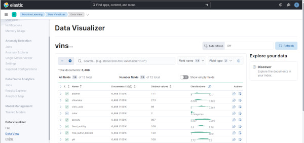
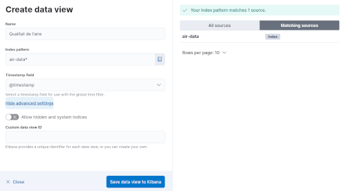
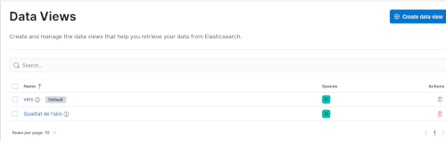
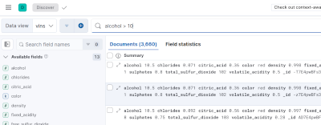
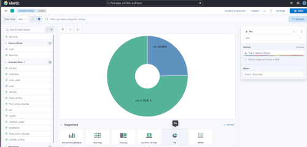
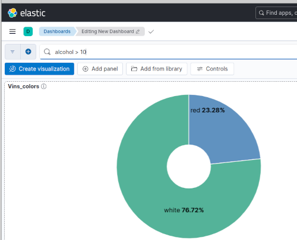
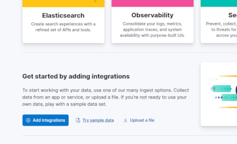
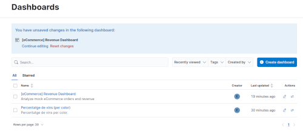
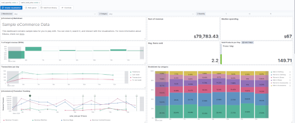

# Creació de Dashboards en Kibana

Anem a veure com podem crear **dashboards** en **Kibana** per a visualitzar i monitoritzar les dades que tenim emmagatzemades a **Elasticsearch**. 

Hem de tindre en compte que des de Kibana només podem visualitzar les dades que tenim a Elasticsearch. De forma nativa no pot connectar amb altres fonts de dades. Si necessitem visualitzar dades que no estan en Elasticsearch, primer les hauríem d'importar amb **Logstash**, **Beats** o el **File Data Visualizer** de Kibana.

Diverses maneres de treballar amb dades que, en principi, no tenim a Elasticsearch:

- **Logstash** la forma més habitual, com hem vist en classe. Pots fer ingesta de diferents fonts i passar les dades a Elastic de forma senzilla.
- **Beats** són agents lleugers per mètriques de sistema, logs, dades de xarxa, etc.
- **Elastic Agents** una versió moderna dels Beats
- **File Data Visualizer** permet pujar arxius CSV o logs directament des de Kibana (*Machine Learning → Data Visualizer*), indexant-los de forma automàtica en Elasticsearch.
- **Elasticsearch REST API** pots indexar dades des de qualsevol API
- **Connectors d'Elasticsearch** connectors natius per a MongoDB, MySQL, PostgreSQL, S3, SharePoint, etc.

Més endavant veurem alternativas com **Grafana**, que sí que permet connectar a múltiples fonts de dades, però de moment ens centrarem en les capacitats de visualització de Kibana amb les dades que tenim a Elasticsearch.

## Introducció

Com ja sabeu, **Kibana** es la capa de visualización del stack ELK. De moment només l'hem utilitzat per fer consultes i llançar instruccions sobre els indexs d'Elasticsearch, pero també permet crear **dashboards interactius** amb gràfics, mètriques i mapes.

Per accedir a Kibana, ho fem des del navegador en `http://localhost:5601`. Comproveu si el port és correcte segons el vostre ***docker-compose***.

En el menú lateral esquerre (☰), a banda de l'apartat ***Management -> Dev Tools***, on hem estat treballant per fer peticions directament a les API d'Elasticsearch, tenim altres seccions interesssants:

  - **Analytics -> Discover**: exploració de dades
  - **Dashboards**: panels de control
  - **Visualize Library**: llibreria de visualitzacions
  - **Machine Learning**: anàlisi amb ML de les dades d'Elasticsearch o directament d'arxius logs/CSV (inclou opcions de pagament que no estan actives però se poden activar amb una llicència de prova de 30 dies)

Per exemple, des de **Machine Learning → Data Visualizer** podem pujar el nostre arxiu CSV de dades de vins, i convertir-lo en un índex d'Elasticsearch.

Automàticament ens ha creat l'índex en Elasticsearch, i també un Data View a Kibana, que és el que ens permetrà crear visualitzacions i dashboards a partir d'estes dades.

### Crear un Data View (Index Pattern) manualment

El **Data View** connecta Kibana amb un índex d'Elasticsearch. Si importem les dades com hem vist en l'apartat anterior, ja tindrem un Data View creat automàticament. Però si volem crear-lo manualment, els passos són:

1. Anar a **Management → Stack Management → Kibana → Data Views** (veureu que ja tenim el de vins, si heu fet l'importació)
2. Fer clic en **Create data view** (dalt a la dreta)
3. Omplir els camps ***Name*** (nom del data view), ***index-pattern*** (nom de l'índex o un patró per connectar a més d'un índex), i ***Timestamp field*** (camp on tenim el timestamp, també podem dir que no hi ha cap seleccionant *"I don't want to use the time filter"* ).
4. Fer clic en **Save data view to Kibana**

Si ara accediu a l'opció ***Data Views*** veureu que tenim ja dos Data Views disponibles: el que s'ha creat automàticament quan vam importar les dades dels vins, i el que hem creat manualment des de l'índex ***air-data***.

### Explorar les dades amb Discover

Abans de crear visualizatcions, podem explorar les dades disponibles.

1. Anar a **Analytics -> Discover** en el menú lateral
2. Seleccionar el Data View
3. Podem ajustar el **rang temporal** si tenim un camp de timestamp
4. Examinar els campos disponibles en el panel esquerre, i els documents en el panel central
5. Fer clic en un campo per veure la seua distribució de valors
6. Filtrar amb la barra de búsqueda ***KQL*** o el botó ***Try ES|QL***. 
7. Podem guardar els filtres i búsquedes amb un nom per a utilitzar-les més endavant en els dashboards.

### Crear Visualizatcions i Dashboards

***Kibana Lens*** es un editor visual i modern que podem utilitzar per crear gràfics en Kibana.

Ací hem de diferenciar entre **visualitzacions** i **dashboards**:

- **Visualitzacions**: són gràfics individuals que després podem utilitzar en els dashboards
- **Dashboard**: eś el panel de control on podem ensamblar diferents visualitzacions

Per crear una visualitzación anem a **Analytics → Visualize Library → Create visualization**. Podem triar com a interfície **Lens**, **Maps** o un editor personalitzat. Anem a utilitzar **Lens**.

Per crear una visualització senzilla, podem obrir el Data View dels vins i arrosegar el camp ***color*** al panel central. En la part de la dreta podem triar el tipus de visualització que volem. En la part inferior de la pantalla també tenim diverses opcions. Per exemple, podem triar el tipus de gràfic **Pie** i la mètrica percentatge.

Quan guardem la visualització li donarem un títol i una descripció. A més, podem afegir etiquetes (tags) per organitzar les visualitzacions que ja tenim. Al mateix temps que la guardem, ens dona l'opció d'afegir-la a un dashboard existent o crear-ne un de nou. També podem, simplement, guardar-la en la llibreria i utilitzar-la posteriorment.

Una vegada tenim les visualitzacions, podem anar a **Dashboard → Create dashboard** i afegir-les. També podem crear filtres i controls interactius per a fer el dashboard més dinàmic.

Per defecte, en el dashboard tenim una barra de búsqueda per fer consultes. Podem veure com, al posar filtres, els percentatges dels colors van canviant.

En el mateix dashboard hi ha opcions per afegir noves visualitzacions, crear-les directament des del dashboard, o afegir controls com desplegables per a filtrar per camps específics.

> Se pot fer tot des de l'apartat **Dashboards**, però si volem crear una visualització que anem a utilitzar en més d'un dashboard, és millor crear-la primer en la llibreria de visualitzacions. Així la tenim disponible per a altres dashboards en un futur.

## Exemple de mostra

Anem a treballar amb un arxiu d'exemple que porta Kibana. Aneu a la pàgina principal i busqueu l'apartat ***Get started by adding integrations***, i dins d'eixe apartat l'opció ***Try sample data***. Feu clic.

En l'opció ***Try sample data*** tenim vàries opcions:

- **Explore our live demo environment**: podeu provar una demo en línia 
- **Upload file**: podeu pujar un arxiu i el passarà a Elastic
- **Other sample data sets**: podeu baixar-se uns conjunts de dades de prova

En **Other sample data sets** teniu tres datasets de prova:

| Dataset | Descripció |
| :-- | :-- |
| **Sample Ecommerce Orders** | Dades de vendes d'una botiga en línia |
| **Sample Web Logs** | Dades de logs d'un servidor web |
| **Sample Flight Data** | Dades de vols i aerolínies |

Podeu fer clic en **Add data** en qualsevol d'estos conjunts de dades. Automàticament crearà un índex en Elasticsearch, el Data View a Kibana i diverses visualitzacions i un dashboard preconfigurat.

Jo, per exemple, he triat el dataset de **Sample Ecommerce Orders**. Ara tinc un índex en Elastic que se diu ***kibana_sample_Data_ecommerce*** puc utilitzar per fer proves.

També tinc un Dashboard anomenat **[eCommerce] Revenue Dashboard**.

Si fem clic en el dashboard, accedim a veure'l. També podem veure com estan fetes les visualitzacions que hi ha dins del dashboard, i modificar-les o crear-ne de noves.

En eixe dashboard podeu veure diverses visualitzacions, editar-les per veure com estan fetes, crear i afegir visualitzacions noves i fer tot tipus de proves. Si trenqueu alguna cosa no passa res, podeu eliminar el dataset i tornar-lo a importar, però de totes formes no feu **Save** al dashboard si no voleu perdre les visualitzacions que ja hi ha.
