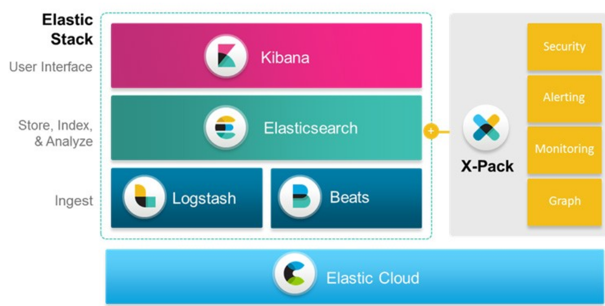
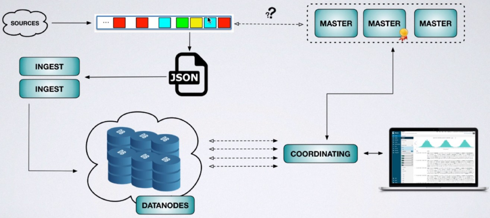

---
# Informació general del document
title: Stack ELK. Introducció.
subtitle: 
authors: 
    - Departament d'informàtica
lang: ca
page-background: img/bg.png

# Portada
titlepage: true
titlepage-rule-height: 0
# titlepage-rule-color: AA0000
# titlepage-text-color: AA0000
titlepage-background: img/portada.png
# logo: img/logotext.png

# Taula de continguts
toc: true
toc-own-page: true
toc-title: Continguts

# Capçaleres i peus
header-left: Unitat 07.01 - Stack ELK. Introducció.
header-right: Curs 2025-2026
footer-left: IES Jaume II El Just
footer-right: \thepage/\pageref{LastPage}

# Imatges
float-placement-figure: H
caption-justification: centering

# Llistats de codi
listings-no-page-break: false
listings-disable-line-numbers: false

header-includes:
     - \usepackage{lastpage}
---

# STACK ELK (ELASTICSEARCH, LOGSTASH, KIBANA)

**Elastic Stack** o també conegut com **ELK Stack** és una plataforma de codi obert desenvolupat per l'empresa **Elastic**. La plataforma permet la recopilació, l'arxivament, la visualització i l'anàlisi de dades. Per a realitzar eixes funcions **Elastic Stack** inclou un sistema d'emmagatzematge distribuït, un motor de recerca i de processament, i un sistema de visualització. 

## INTRODUCCIÓ

La plataforma **ELK** està formada per quatre components:

- **Elasticsearch**: És un motor de recerca i anàlisi de dades distribuït i altament escalable. Permet emmagatzemar, buscar i analitzar grans volums de dades en temps real.
- **Logstash**: És una eina d'ingesta, processament i transformació de dades. Permet recopilar dades de diverses fonts, transformar-les i enviar-les a **Elasticsearch**.
- **Kibana**: És una eina de visualització de dades. Permet crear gràfics, taules i mapes a partir de les dades emmagatzemades a **Elasticsearch**. També permet interactuar amb les dades directament.
- **Beats**: Són agents lleugers que recopilen dades de diverses fonts i les envien a **Logstash** o **Elasticsearch**.

Podríem dir que **Logstash** és l'eina que fa l'ingesta de dades, llegint de diferents fonts i amb diferents formats, processant les dades per guardar-les en **Elasticsearch**, i després **Kibana** accedirà a les dades per analitzar-les, representar-les gràficament, crear dashboards, etc.

Una de les principals utilitats de **Elastic Stack** és la gestió i anàlisi de `logs`, i de qualsevol fluxe de dades en general, en arquitectures de programari amb components diversos on la informació no segueix un model unificat. Amb esta solució podem implementar un sistema de gestió i de visualització de la informació senzill d'operar i eficaç. Amb **ELK** podem, per exemple, realitzar consultes en temps real per a identificar ràpidament errors o comportaments en els nostres sistemes.

En alguns esquemes, com el que veurem a continuació, trobareu un altre component anomenat **X-Pack**. **X-Pack** és una extensió de **Elastic Stack** que proporciona funcionalitats addicionals com la seguretat, la monitorització, la gestió de registres etc. fent ús en moltes ocasions d'eines de ***Machine learning***. **X-Pack** és una solució de pagament, però **Elastic** ofereix una llicència gratuïta per a ús no comercial.

## ARQUITECTURA D'ELASTIC ELK

L'arquitectura d'**Elastic ELK** està formada per:

- Nodes
- Clústers
- Índexs
- Documents
- Shards i rèpliques

### Nodes

Un **node** és una instància d'**Elasticsearch** que forma part d'un **cluster**. Cada node té un identificador únic, un nom, i pot tenir diferents rols. Els nodes en general s'encarreguen del tràfic HTTP en la capa d'aplicació i en la capa de transport per a comunicar-se amb altres nodes del cluster. 

#### Tipus de nodes

Segons les seues funcionalitats, els nodes poden ser:

- **Master-node**. 
- **Data-node**.
- **Ingest-node**.
- **Coordinating-only-node**.

#### Master-node

Els nodes **Master** són els responsables de la gestió del cluster. Aquest tipus de nodes són els encarregats de realitzar tasques com:

- Mantenir la informació dels nodes que formen el cluster.
- Mantenir la informació dels índexs i els shards.
- Crear i eliminar índexs.
- Decidir en quin node se guardarà un nou shard.

El **Master-node**, idealment, hauria d'estar en un equip dedicat amb alta disponibilitat i tolerància a fallades. 

#### Data-node

Els nodes **Data** són els encarregats de guardar les dades. Aquests nodes són els que contenen els shards i les rèpliques dels índexs. Realitzan funcions com:

- Operacions **CRUD** sobre les dades emmagatzemades
- Operacions de recerca obre les dades
- Operacions d'agregació sobre les dades

Els **Data-nodes** consumeixen molts recursos. És recomanable també, per tant, que estiguen en equips dedicats que formen un sistema distribuït amb creixement horitzontal.

#### Ingest-node

Els nodes **Ingest** són els encarregats de processar les dades abans de ser emmagatzemades. És a dir, abans d'indexar les dades. Aquests nodes poden realitzar tasques com:

- Filtrar les dades.
- Normalitzar les dades.
- Enriquir les dades.

També anem a necessitar alta capacitat de processament si treballem amb velocitats de centenars o milers de dades per segon. 

#### Coordinating-only-node

Els nodes **Coordinating-only** són els encarregats de rebre les peticions dels clients i de distribuir-les als nodes **Data**. Aquests nodes no emmagatzemen dades, per tant, no consumeixen molts recursos. Les seues tasques principals són:

- Distribuir les peticions als nodes **Data**.
- Distribuir les indexacions.

Estos nodes són balancejadors de càrrega per ajudar a descarregar de feina al **Master-node**, principalment. En principi, només serien necessaris si treballem amb grans volums de dades i molts clients.

### Documents

Un **document** és la unitat bàsica d'informació que es pot emmagatzemar en **Elasticsearch**. Un **document** és una estructura JSON que conté les dades que volem emmagatzemar en format **clau:valor** com en qualsevol document JSON. A més de les dades que anem a emmagatzemar, **Elasticsearch** també guarda metadades sobre el document. Les metadades d'un document són:

- **\_index**: L'índex on es guardarà el document.
- **\_type**: El tipus de document.
- **\_id**: L'identificador únic del document.

És una cosa semblant al que hem vist en **Fiware** amb els **data-models**, encara que ací les metadades se poden guardar explícitament en el document o indicar-les quan fem una operació amb el document, per exemple un POST per guardar-lo.

### Índexs

Un **índex** és una col·lecció de documents que tenen característiques similars (un catàleg de productes, una llista de clients, factures...) Hem de remarcar **similars** perquè no necessàriament han de tindre la mateixa estructura tots els documents d'un índex. Així, es tracta d'un concepte similar al que en MongoDB seria una col·lecció, o en SQL una taula però sense una estructura fixa.

Un índex pot contenir molts documents i cada document pot estar en un índex.

### Types

Un **type** és una manera de classificar els documents d'un índex. Un **schema** defineix els camps que formen el type, i de quin tipus són: string, integer, boolean, date... Un índex pot tindre diversos tipus.

> A partir de la versió 7.0 de **Elasticsearch** els tipus han quedat obsolets.

### Shards i rèpliques

Un **shard** és una part d'un índex. **Elasticsearch** divideix els índexs en **shards** per a poder distribuir-los en els nodes del cluster. Així les dades se poden processar de manera distribuïda i paral·lela, repartint la càrrega de computació entre diferents nodes. 

D'entrada, els **shards** no tenen redundància, per tant si en cau un perdem les dades. Això ho solucionem amb les **rèpliques**.

Una **rèplica** és una còpia d'un **shard**. **Elasticsearch** permet crear rèpliques dels shards per a garantir la disponibilitat de les dades i la tolerància a fallades. D'esta manera, els índexs estan formats pels **shards primaris** i les seues corresponents **rèpliques**. Per millorar la disponibilitat, **Elasticsearch** distribueix les rèpliques en diferents nodes del cluster on estan els shards primaris. 

En la següent imatge, vegem que si cau un node el sistema pot funcionar amb les rèpliques que tenim en els altres nodes.

El hardware recomanat per montar clústers d'**Elasticsearch** és:

- **CPU**: 16-32 cores. Millor més nuclis que CPUs més ràpides, perquè en realitat **Elasticsearch** és molt intensiu en operacions d'entrada/sortida i no tant en ús de CPU.
- **RAM**: mínim 16 GB, encara que amb 8 GB també podria funcionar amb una càrrega mitjana.
- **Disc**: recomanable SSDs amb una alta tasa d'IOPS (Operacions d'entrada i eixida per segon). 
- **Xarxa**: 1 Gbps com a mínim. Recomanable 10 Gbps. No se recomana utilitzar **NAS** (Network Attached Storage) per a emmagatzemar les dades.

Nosaltres, com hem fet fins ara, treballarem amb contenidors Docker, i per tant no necessitarem preocupar-nos per les característiques del hardware. Però és important conèixer-les per a poder dimensionar correctament el nostre cluster d'**Elasticsearch** quan el despleguem en un entorn de producció.

Més informació sobre **Elastic Stack** en la seua [web oficial](https://www.elastic.co/).