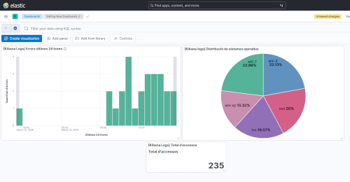
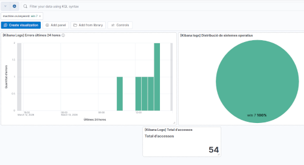
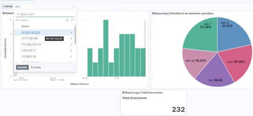

# Pràctica guiada de creació de Dashboards en Kibana

Anem a fer una pràctica guiada pas a pas per crear un dashboard a Kibana. Utilitzarem un conjunt de dades de logs web de mostra que ve integrat amb Kibana, així no necessitarem configurar Logstash ni carregar dades externes.

## Abans de començar

Alça els contenidors, comprova que estan tots funcionant.

Intenta accedir a Kibana a través de `http://localhost:5601`. Si tot està correcte, veuràs la interfície de Kibana. Si tens problemes per accedir, revisa els logs del contenidor (`docker logs kibana`) per identificar posibles errors. Si el problema és de permisos, segurament necessitaràs executar les instruccions de resetejar els passwords que tens en els apunts.

## Pas 1 – Entra en Kibana i carrega les dades de mostra

1. Obri el navegador `http://localhost:5601`
2. Ves al menú principal (☰) → **Home**
3. Localitza la secció **"Try sample data"**
4. Ves a **'Other sample data sets'**
4. Localitza el data set **Sample web logs**, fes clic en **"Add data"**
5. Espera uns segons. Kibana crearà automáticament:
    - Un índex anomenat `kibana_sample_data_logs` en Elasticsearch
    - Un Data View ja configurat
    - Un dashboard d'exemple amb diverses visualitzacions

Pots comprovar que tot ha anat bé:

- Ves a **Stack Management → Data Views** i verifica que tens un Data View per `kibana_sample_data_logs`
- Ves a **Discover** i selecciona el Data View `kibana_sample_data_logs` per veure les dades de logs web
- Ves a **Dashboard** i busca el dashboard de mostra que s'ha creat automàticament

> Pots explorar com està fet el dashboard d'exemple i anar agafant idees. Nosaltres crearem el nostre, més senzill, des de zero.

## Crear visualitzacions

Anem a crear una sèrie de visualitzacions bàsiques a partir del Data View `kibana_sample_data_logs` que després afegirem al nostre dashboard personalitzat.

### Visualització 1: Errors per hora (Gràfic de barres / Bar)

1. Ves a **Analytics → Visualize Library** 
2. Fes clic en **Create visualization**. Selecciona l'opció **Lens** (editor visual recomanat)
3. En la part superior esquerra, selecciona el Data View `Kibana Sample Data Logs`
4. Arrastra el camp `@timestamp` a la part central de la pantalla. Automàticament Kibana crearà un gràfic de barres.
5. En l'eix **Y**, si no ho ha fet per defecte, tria la mètrica **Count** (compta documents)
6. En la part superior esquerra, al costat del nom de l'índex, hi ha un botó amb un signe +. Si te situes sobre ell veuràs la legenda ***Add filter***. Crea un filtre nou amb:

- atribut: `response.keyword`
- condició: `is one of`
- valors: `404` `503`

7. Busca com canviar els títols dels eixos X i Y. Canvia el títol de l'eix X a `Últimes 24 hores` i el de l'eix Y a `Quantitat d'errors`
8. En la part superior dreta, busca el botó per seleccionar l'interval de temps i selecciona `Last 24 hours`.
9. Fes clic en **Save**. Com a títol, posa **[Kibana Logs] Errors últimes 24 hores**. En l'apartat `Add to dashboard` selecciona `None`. Fes clic en **Save and add to library**.

### Visualització 2: Distribució per Sistema Operatiu  del client (Pastel / Pie)

1. Crea una nova visualització
2. Arrastra el camp `machine.os.keyword` a la part central de la pantalla
3. Kibana lo convertirá en un **Top values** on mostrarà els 5 sistemes operatius més comuns. En la configuració del gràfic, a la dreta, pots canviar-ho i posar-ne més, si vols.
4. Canvia el tipus de gràfic a **Pie** (pastel)
5. Guarda la visualització amb el nom `[Kibana Logs] Distribució de sistemes operatius`. No l'afegisques a cap dashboard, de moment.

### Visualització 3: Métrica única (Total events')

1. Crea una nova visualització
2. Selecciona el tipus **Metric**
3. En la mètrica principal, selecciona **Count**
4. Canvia el títol de la mètrica a `Total d'accessos`
4. Guarda la visualització amb el nom `[Kibana Logs] Total d'accessos'`. Recorda no afegir-lo a cap dashboard.

## Disseny del Dashboard

Ara anem a crear el Dashboard amb les tres visualitzacions que hem creat. També afegirem la cerca guardada de Discover que mostra els logs filtrats per errors 404 i 503.

1. Ves a **Dashboard** en el menú lateral
2. Fes clic en **Create dashboard**
3. Ens dirà que està buit. Fes clic en **Add from library**
4. Selecciona las tres visualitzacions creades:
    - `[Kibana Logs] Errors últimes 24 hores`
    - `[Kibana Logs] Distribució de sistemes operatius`
    - `[Kibana Logs] Total d'accessos`
5. Pots **Organitzar els components** del dashboard canviant-los de lloc i també de tamany.

El resultat podria ser una cosa semblant a esta:

## Crear filtres i controls interactius

Els filtres i controls fan que l'usuari puga interactuar amb el dashboard i fa que tinga més valor. Anem a veure com crear diferents tipus de filtres i controls.

### Filtre temporal global

Dalt a la dreta podem modificar l'interval de temps que afecta a totes les visualitzacions del dashboard. Per exemple, podem seleccionar `Last 7 days` per veure les dades de la última setmana.

### Filtre per clic

Si vas al gràfic de pastel i fas clic sobre un secció (un sistema operatiu), automàticament tot el dashboard canvia per filtrar només els documents del sistema operatiu seleccionat. Dalt a l'esquerra apareix el filtre, si voleu tornar a mostrar totes les dades feu clic en `x` i el filtre se borra. 

Per exemple, si fem clic en Windows 7, veurem:

Fixeu-vos que dalt a l'esquerra teniu el filtre activat. El podeu eliminar fent clic en la `x` que hi ha al costat del filtre.

### Afegir un Control (selector desplegable)

1. Fes clic en **Controls → Add control**
2. Selecciona **Options list**
3. Tria un camp, per exemple `clientip`. 
4. Guarda el control i el dashboard. 

Ara teniu un desplegable per filtrar per IP del client. Si seleccioneu una IP concreta, el dashboard mostrarà només les dades d'aquesta IP.

### Búsquedes KQL global

En la part superior del dashboard teniu un quadre de text on podeu escriure consultes KQL que afecten a tots els panels. Quan feu clic en el quadre, se desplega un llistat amb tots els camps disponibles. Podeu seleccionar-ne un i posar una condició seguint la guia que vos apareix.

## Guardar i compartir

1. Per guardar el Dashboard, fem clic en **Save** (dalt a la dreta). Si és la primera vegada, li donem un nom.
2. A l'esquerra del botó **Save**, hi un botó de compartir. Vos ofereix 2 opcions:

- **Link**: URL per compartir el dashboard amb altres usuaris de Kibana
- **Embed code**: codi HTML per incrustar el dashboard en una pàgina web externa

## Exercici

Sobre el dashboard que hem dissenyat, intenta fer els següents canvis:

- Afegeix un gràfic de barres amb els codis de resposta més freqüents (`response.keyword`)
- Crea un mapa de calor o geogràfic amb el camp `geo.coordinates` per veure la distribució geogràfica dels logs

Reorganiza el dashboard per a que quede presentable i guarda-lo amb un altre nom. Per exemple,`Exercici-Dashboard`.

